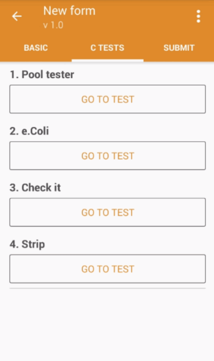
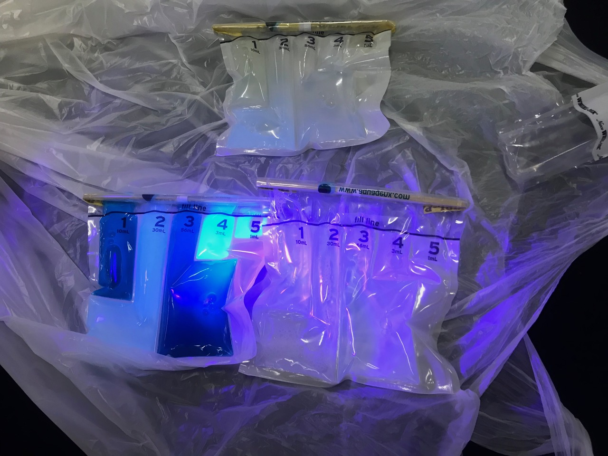

## Introduction
With Akvo Caddisfly you can test water quality parameters as part of your data collection. Simply said, Akvo Caddisfly is a question type in Akvo Flow. 

By adding Akvo Caddisfly to Akvo Flow water quality data becomes real-time accessible and shareable via the Akvo Flow online workspace. Water quality measurements can be combined with GPS-data, metadata and qualitative data, allowing for easier interpretation of testing results, seeing the water quality data in context of other data. This enables faster, better interventions to take place. 

## Why Akvo Caddisfly?

Around the globe, many organisations, companies and governments are working towards the 2030 Sustainable Development Goals (SDGs). SDG 6 focuses on ensuring access to safe water and sanitation for all. On both programme and national level, data needs to be collected in order to monitor progress. Without the right tools, efficient monitoring can be a challenge.

*www.un.org/sustainabledevelopm...*

Akvo Caddisfly contributes to solving that challenge. Caddisfly can measure the relevant water quality parameters for SDG 6 and more, in the field. With our app on your phone, you can conduct surveys to collect both water quality data and other related data that is important for your analysis. All surveys are sent to one online data platform (Akvo Flow), allowing for rapid data analysis, visualisation (Akvo Lumen) and decision-making, up to regional or national level.

Current water quality testing systems can be hard to use in the field, and lab-based tests are expensive and cause delays. Resulting data is generally difficult to share, making it hard to engage communities and quickly act upon problems in local water supplies. We believe that with available water quality parameters, combined with the use of phones and our data platform solution, Caddisfly is well placed to play a vital role in the global efforts to monitor the achievement of the SDGs. 

## Which test type in Akvo Flow matches with which piece of equipment?
When defining your Flow form you need to make sure you select the right test for your Akvo Caddisfly question. Once you are collecting data, the Flow app will open the exact test in the Caddisfly app automatically. So making sure you well define your question is important. 

To choose the right test for the question you go through four drop down menus, helping you ensure the right test is linked to the question:

- Sample - Are you going to test water or soil 
- Parameter - which parameter are you going to measure with this question 
- Brand - test methods we support to test the selected parameter
- Details - test ranges, reagent codes and other information to help you ensure you have selected the right test. 

## List of supported parameters and test methods in Akvo Caddisfly
We currently support testing of 31 parameters for water quality. These can be tested via the variety of testing methods we support, ranging from colorimetry to microbiology tests. We provide 110 different testing options depending on the test method, parameter, range and reagent. For more details check the table below.

### Parameters, Test methods, Equipment
Akvo Caddisfly can measure the following parameters, with these methods and equipment:

Please note that for multiple test methods we support a variety of ranges per parameter. For the full list of the supported tests please contact us directly. 

Equipment details
The following equipment is supported by Akvo Caddisfly. Click on the links to retrieve specifications, instruction manuals, material safety data sheets (MSDS) and more.

- [Photometer: Lovibond MD610 (Tintometer)](http://www.lovibond.com/en/PM/Water-Testing/Products/Lab-Portable-Instruments/ColorimetersPhotometers/MD-600-Photometer-Series/MD-610)
- [Lovibond Pooltester (Tintometer)](https://www.lovibond.com/en/PW/Water-Testing/Products/Test-Kits/Pooltester)
- [Lovibond SD 50 pH meter (Tintometer)](https://www.lovibond.com/en/PW/Water-Testing/Products/Lab-Portable-Instruments/Electrochemistry/Pocket-Tester/SD-50-pH)
- [Lovibond SD 70 EC meter (Tintometer)](https://www.lovibond.com/en/PW/Water-Testing/Products/Lab-Portable-Instruments/Electrochemistry/Pocket-Tester/SD-70-Con)
- [Lovibond CHECKIT Comparator (Tintometer)](https://www.lovibond.com/en/PW/Water-Testing/Products/Test-Kits/CHECKIT%C2%AEComparator)
- [Test Strips - Quantofix Series (Macherey-Nagel)](http://www.mn-net.com/Testpapers/QUANTOFIXteststrips/tabid/4928/language/en-US/Default.aspx)
- [Test Strips - Hach](https://www.hach.com/teststrips)
- [Test Strips - Merck](http://www.merckmillipore.com/NL/en/products/analytics-sample-prep/test-kits-and-photometric-methods/visual-tests-for-semi-quantitative-analyses/test-strips-mquant/q42b.qB.2.IAAAE_CBZ3.Lxj,nav)
- [Test Strips - SenSafe](https://sensafe.com/)
- [Turbidity Tube - DelAgua](http://www.delagua.org/products/details/10713-Turbidity-Tubes-pair)
- [Compartment Bag Test - Aquagenx](https://www.aquagenx.com/cbt-ectc/)

## Download the Akvo Caddisfly App
The Akvo Caddisfly app is downloaded through the [Google Playstore](https://play.google.com/store/apps/details?id=org.akvo.caddisfly&hl=en) on your phone. The app requires Android 4.4 (2013) or higher. 

## The difference between the Akvo Flow and Caddisfly app
The Akvo Caddisfly is an add-on to [Akvo Flow](app.md) in order to include water quality data in a [Akvo Flow Survey](surveys.md). The Akvo Caddisfly app has the following functions:

- Connect water quality equipment to your smartphone 
- Instruct you on how to perform a water quality test
- Analyse the test result
- Send the test result to Akvo Flow

## Recommended devices
To be able to make the most out of your Akvo Caddisfly and Akvo Flow app, we have put together a list of [minimum device requirements](devices.md) to help you choose the best device for your data collection project. 

With Akvo Caddisfly you can test water quality using different types of tests. Some connect to the app via bluetooth, some need your device to have a good camera to recognise the colour reference card and strip. 

The requirements for strip testing in combination with the colour reference card are stricter. We have drawn up a list of devices that we have successfully tested with strip tests using the Caddisfly app: 

- Samsung Galaxy J5 models and newer versions 
- Samsung On5 Pro 
- Samsung Galaxy SII Neo 
- Asus ZOOLD 
- OnePlus 3 
- Motorola Moto G 2nd generation 

## Downloading the Caddisfly app offline
What to do when you need to download the Caddisfly app to large group of users and the internet connection is shabby and downloading from Play Store is not working well enough? 

You can now use a Google approved file sharing app like ['Files by Google'](https://play.google.com/store/apps/details?id=com.google.android.apps.nbu.files). This app allows you to share Play store installed apps offline and auto updates of the app will work. 

1. Install the Files by Google app beforehand. 
2. Download Caddisfly app from Play Store. 
3. Share is offline with other users.
   
Read more [here](https://android-developers.googleblog.com/2018/10/offline-p2p-installs-beta.html)

Other approved apps are SHAREIt and Xender. However, you need to install the sharing app beforehand. 

## Testing water qualilty with Akvo Caddisfly

### What you need 
To work with Akvo Caddisfly water quality tests you need to have the Akvo Caddisfly app installed and Akvo Flow. Akvo Caddisfly is an add on to Akvo Flow and you cannot use the water quality tests outside on Akvo Flow. The only way to access Akvo Caddisfly tests is by adding an Akvo Caddisfly question to your Akvo Flow survey. Make sure to select the right test when defining your Akvo Caddisfly question type. 

## Colorimetric testing

### Testing with Lovibond MD610 Photometer
You need to have the Lovibond MD610 Photometer. We support a selected range of parameters that you can test with the tool, so make sure you also have the right reagent with you depending on the parameter you will test. For the full list of parameters check the list here. 

#### Short list: 
- Survey ready in Akvo Flow with the correct water quality test selected in the Akvo Caddisfly question
- Android smartphone (see our list or recommended devices) 
- Akvo Flow app installed with the survey ready on the app
- Akvo Caddisfly app installed 
- Lovibond MD610 Photometer
- Reagent
- Container to take the water sample 
- Place to dispose trash

#### How to test
1. Once you reach the Caddisfly question on the Flow app, select Go to test. 
2. Caddisfly app opens automatically with the correct test selected for you. 
3. Select Next. 
4. Connect the photometer to the smartphone through bluetooth.
5. Following the instructions, select the correct test method on the photometer.
6. Fill a clean vial with a sample and perform a zero measurement to determine the colour/turbidity of your water sample without the reagent.
7. Add a reagent to your sample and perform the measurement.
8. Once the Lovibond MD610 completed the test, click F3 on the Lovibond to get the result in Caddisfly. Lovibond will send the result over via bluetooth. 
9. Accept the result.
10. Caddisfly brings you back to your Flow form with the result and image saved to the question. 
11. Clean the vial and used instruments and store them

### Testing with Lovibond Checkit Comparator
You need to have Lovibond Checkit Comparator. We support a selected range of parameters that you can test with the tool, so make sure you also have the right reagent with you depending on the parameter you will test. For the full list of parameters check the list here. 

#### Short list: 
- Survey ready in Akvo Flow with the correct water quality test selected in the Akvo Caddisfly question
- Android smartphone (see our list or recommended devices) 
- Akvo Flow app installed with the survey ready on the app
- Akvo Caddisfly app installed 
- Checkit Comparator
- Reagent
- Container to take the water sample 
- Place to dispose trash

#### How to test
1. Once you reach the Caddisfly question on the Flow app, select Go to test. 
2. Caddisfly app opens automatically with the correct test selected for you. You can read the instructions on how to perform the test by selecting Instructions.  
3. Perform the test following the instructions.
4. Select Next. 
5. Take a photo for the Checkit Comparator so the result number is visible in the picture. This photo acts as a quality check.
6. Type in the result. 
7. Accept the result.
8. Caddisfly brings you back to your Flow form with the result and image saved to the question. 
9. Clean the vial and used instruments and store them

*Please note that the photos take do not represent the actual test device. They are only to show the test workflow. Each photo taken during this test should be taken of the actual test device.* 

### Testing with Lovibond Poolester
You need to have Lovibond Pool Tester. With this test method you can test Chlorine and pH in one go. For the full list of parameters check the list here. 

Short list: 
- Survey ready in Akvo Flow with the correct water quality test selected in the Akvo Caddisfly question
- Android smartphone (see our list or recommended devices) 
- Akvo Flow app installed with the survey ready on the app
- Akvo Caddisfly app installed 
- Lovibond Pool Tester
- Reagent
- Container to take the water sample 
- Place to dispose trash

#### How to test
1. Once you reach the Caddisfly question on the Flow app, select Go to test. 
2. Caddisfly app opens automatically with the correct test selected for you. You can read the instructions on how to perform the test by selecting Instructions. 
3. Perform the test following the instructions. You can always skip the instructions using 'Skip' in the top right of your screen.
4. Submit the result by selected the matching result for both parameters. 
5. Accept the result.
6. Caddisfly brings you back to your Flow form with the result and image saved to the question. 
7. Clean the vial and used instruments and store them.

## Strip testing
Strip tests follow the same principle of colorimetry. However, the reagent is already attached to a small piece of paper strip and mostly the colour change is not detected by a photometer but interpreted by the human eye. Test strips are cheaper and simpler than colorimetric tests, however, they also have a lower accuracy and function as screen tests for water quality.

### Testing with strip tests
Akvo Caddisfly reads the results of a test strip by combining software, the camera of a smartphone and a very simple piece of hardware: the Colour Reference Card. The Colour Reference Cards contains generic colours for which we know how they look in different types of light conditions. 

Last but not least, you need to have Test strips. We support a selected range of test strips and a wide range of parameters that you can test with Test strips. For more details check the list here. 

#### Short list: 
- Survey ready in Akvo Flow with the correct water quality test selected in the Akvo Caddisfly question
- Android smartphone (see our list or recommended devices) 
- Akvo Flow app installed with the survey ready on the app
- Akvo Caddisfly app installed 
- Colour reference card 
- Test strips 
- Container to take the water sample 
- Place to dispose the used strips 

#### How to test 
In general, screening water parameters is easy. You dip the strip in your water sample, compare the colour of the patch on the strip with the provided chart, and you estimate the result. With Akvo Caddisfly you do not need to estimate. The Caddisfly app calculates the result for you comparing the colour on the strip patch with the Colour reference card. 

1. Once you reach the Caddisfly question on the Flow app, select Go to test. 
2. Caddisfly app opens automatically with the correct test selected for you. You can read the instructions on how to perform the test by selecting Instructions.  
3. Select Prepare for test.
4. Hold your phone camera above the Colour Reference Card. Caddisfly is now checking if your light conditions are ok to perform the test. To learn more about this step and to understand the symbols you might see on your screen, check this article. If your light conditions are good
   Caddisfly will prompt you to start the actual test. If your light conditions are not good, move to a spot with better light. 
5. Dip the strip in the water sample and follow the instructions you see on the screen. 
6. Once done, place the strip with the colour patch facing to the left on the Colour Reference Card and click Start. 
7. Hold your phone camera again above the Colour Reference Card and adjust if instructed. 
8. Caddisfly will take a picture of the card with the strip and calculate the result. You will see both the photo and the result in the next screen. Click on Save. 
9. Caddisfly brings you back to your Flow form with the result and image saved to the question. 

### The accuracy of test strips readings

By their nature, test strips are not very precise, and should be used for screening purposes only. The colours indicated on test strip bottles define intervals of values, as shown in the illustration below. The intervals as shown are [0-1], [1-2], [2-5], [5-10], [10-20]. A result of a strip test measurement should always be understood as an indication of an interval. The Caddisfly app will display both a value, which is an interpolation inside an interval, and the relevant interval. The interval should be considered as the level of accuracy.

### To keep in mind when using Akvo Caddisfly Strip test method
When screening water quality with the Strip test method on Akvo Caddisfly, it is important to have good light conditions. To get sufficient results you need to have natural light, with an equal light distribution on the colour reference card. Improper lighting can lead to difficulties to complete the measurement, or to low quality results. 

Secondly, having a good camera on your device can affect the quality and speed of the test. Camera behaviour varies between different phone brands and versions. If you have problems with a certain phone brand, please try to use a different brand or version. We advise to use the newer Samsung smartphones. For the full list of devices we recommend to use, check here. 

#### To keep in mind
- Sufficient natural outdoor light. Light conditions outside are better than inside. Light from fluorescent lamps should be avoided.
- Homogenous light conditions on the colour reference card are important. When the app shows blue squares in the image of the colour reference card, it means the light intensity is unequal, for example because shadows are present. Make sure to have an equal light distribution.
- When used in direct sunlight, unwanted specular reflections can be present in the image. In that case, place the card in the shadow (while making sure the shadow lighting is homogenous).
- Keep the colour reference card dry and clean (free from dirt).
- Place the smartphone camera straight above the colour reference card, without tilt.
- The complete colour reference should be captured by the smartphone camera image, including the four black squares in the corners.
- Hold the phone at a fixed distance from the colour reference card until the camera focuses.
- If the ‘image quality’ bar does not proceed to green, it sometimes helps to restart the test, which forces the camera to start focusing again.
- The patch of the test strip should be facing to the left on the colour reference card.
- Make sure that the colour reference card is not placed upside down. The black square should be at the bottom and akvo.org should be readable.

### Working with the app 
When working with the strip test method the app guides you in which steps you need to take when, but also in how to old the camera or if the light conditions are good. Instructions either show in the screen directly as text or symbols show on your screen when analysing the colour reference card. 

You always need to hold the camera straight above the colour reference card. When you see the symbols shown below, it means the positioning of the smartphone is not correct. 

### Move closer to the card
When you see this square red symbol it means that Caddisfly recognised the colour reference card, but for a better reading you need to move your camera closer to it. Make sure all four black corner points are still visible in the screen. 

 

### Move in the direction of the arrow
It is key to hold your camera straight above the colour reference card. Sometimes even a slight tilt can make the measurement not succeed. In such cases Caddisfly will show you a red arrow on your screen. The direction of the arrow shows you how to move your device.

<!-- 
### The accuracy of test strips readings
By their nature, test strips are not very precise, and should be used for screening purposes only. The colours indicated on test strip bottles define intervals of values, as shown in the illustration below. The intervals as shown are [0-1], [1-2], [2-5], [5-10], [10-20]. A result of a strip test measurement should always be understood as an indication of an interval. The Caddisfly app will display both a value, which is an interpolation inside an interval, and the relevant interval. The interval should be considered as the level of accuracy. -->

### Download Strip Tests Field Guide
As you often test water in the field with no access to internet we prepared a .pdf Strip Tests Field Guide for you to download and use. You can access it [here](../flow/pdfs/Strip%20Tests%20Field%20Guide.pdf)

## Sensor testing
### Testing with Lovibond SD sensors
A sensor is a device that is placed in your water sample or directly in your water source. With Akvo Caddisfly you can use the Lovibond SD sensors. You can use Lovibond SD 50 to measure ph and Lovibond SD 70 to measure electrical conductivity and temperature. 

#### Available Parameters

#### What you need 
<!-- To work with Akvo Caddisfly water quality tests you need to have the Akvo Caddisfly app installed and Akvo Flow. Akvo Caddisfly is an add on to Akvo Flow and you cannot use the water quality tests outside on Akvo Flow. The only way to access Akvo Caddisfly tests is by adding an Akvo Caddisfly question to your Akvo Flow survey. Make sure to select the right test when defining your Akvo Caddisfly question type.  -->

You need the sensor. Make sure you have the right sensor depending on which parameter you are going to test. Both Lovibond sensors need two AAA batteries. 

##### Short list: 
- Survey ready in Akvo Flow with the correct water quality test selected in the Akvo Caddisfly question
- Android smartphone (see our list or recommended devices) 
- Akvo Flow app installed with the survey ready on the app
- Akvo Caddisfly app installed 
- Sensor 
- Two AAA batteries
- Container to take the water sample 
  

##### How to test
1. Once you reach the Caddisfly question on the Flow app, select Go to test. 
2. Caddisfly app opens automatically with the correct test selected for you. You can read the instructions on how to perform the test by selecting Instructions.  
3. Select Prepare for test.
4. Pre-rinse the sensor with your water sample.
5. Dip the sensor in your sample.
6. Take a photo of the screen of the sensor with the test result.
7. Fill in the test result in the app.
8. Submit the result. 
9. Caddisfly brings you back to your Flow form with the result and image saved to the question. 
10. Clean the sensor and store it.

### Testing with Akvo Caddisfly sensor
A sensor is a device that is placed in your water sample or directly in your water source. With Akvo Caddisfly you can use the Akvo Caddisfly sensor to test electrical conductivity and temperature. 

#### What you need 
To work with Akvo Caddisfly water quality tests you need to have the Akvo Caddisfly app installed and Akvo Flow. Akvo Caddisfly is an add on to Akvo Flow and you cannot use the water quality tests outside on Akvo Flow. The only way to access Akvo Caddisfly tests is by adding an Akvo Caddisfly question to your Akvo Flow survey. Make sure to select the right test when defining your Akvo Caddisfly question type. 

Secondly, you need the sensor. 

##### Short list: 
- Survey ready in Akvo Flow with the correct water quality test selected in the Akvo Caddisfly question
- Android smartphone (see our list or recommended devices) 
- Akvo Flow app installed with the survey ready on the app
- Akvo Caddisfly app installed 
- Sensor 
- Container to take the water sample 

##### How to test
1. Once you reach the Caddisfly question on the Flow app, select Go to test. 
2. Caddisfly app opens automatically with the correct test selected for you. You can read the instructions on how to perform the test by selecting Instructions.  
3. Select Prepare for test.
4. Pre-rinse the sensor with your water sample.
5. Dip the sensor in your sample.
6. Caddisfly will automatically calculate the result. 
7. Submit the result. 
8. Caddisfly brings you back to your Flow form with the result and image saved to the question. 
9. Clean the sensor and store it.

### Testing Dissolved oxygen with Lovibond OXI 400 L
Every species on our planet depends on water and oxygen. For aquatic species, adequate levels of dissolved oxygen (DO) are necessary for their survival and sustainability of ecosystems. Levels of DO depend on temperature, salinity, turbulence, but also the existence of aquatic fauna and flora.

Having an understanding of levels of Dissolved oxygen helps to make informed decisions concerning wastewater treatment operations, hypoxic zones, aquaculture facilities or large-scale ecosystems. In addition, it is (one of) the core parameters for Sustainable Development Goals 6.3.2 *“Proportion of bodies of water with good ambient water quality”*. 

#### What you need 
To work with Akvo Caddisfly water quality tests you need to have the Akvo Caddisfly app installed and Akvo Flow. Akvo Caddisfly is an add on to Akvo Flow and you cannot use the water quality tests outside on Akvo Flow. The only way to access Akvo Caddisfly tests is by adding an Akvo Caddisfly question to your Akvo Flow survey. Make sure to select the right test when defining your Akvo Caddisfly question type. 

Secondly, you need the sensor. Go here for more information about this sensor. 

##### Short list: 
- Survey ready in Akvo Flow with the correct water quality test selected in the Akvo Caddisfly question
- Android smartphone (see our list or recommended devices) 
- Akvo Flow app installed with the survey ready on the app
- Akvo Caddisfly app installed 
- Sensor
 

##### How to test
1. Once you reach the Caddisfly question on the Flow app, select Go to test. 
2. Caddisfly app opens automatically with the correct test selected for you. 
3. Read the instructions on how to perform the test.  
4. Dip the sensor in the water.
5. Take a photo of the sensor screen with the result.
6. Input the result in the field. 
7. Submit the result. 
8. Caddisfly brings you back to your Flow form with the result and image saved to the question. 
9. Clean the sensor and store it.

## Microbiological testing
### Testing E. coli with Aquagenx CBT
Microbiological testing involves the detection of living microorganisms in your sample that might indicate the presence of harmful pathogens, in our case, Escherichia coli bacteria (E. coli), a reliable indicator of fecal contamination in water. E. coli and can indicate faecal pollution risk according to WHO guidelines and Recreational and Irrigation Water Health Risk Categories.

#### Testing E. coli using MPN principle
There are three main testing methods to detect and measure E. coli:  Presence/Absence (PA), Most Probable Number (MPN) and Colony Forming Units (CFU) that is used in membrane filtration tests. The E. coli test that Akvo Caddisfly currently uses is based on the MPN method using the [Aquagenx Compartment Bag Test](https://www.aquagenx.com/how-to-use-the-cbt/) for E. coli (CBT). The CBT determines the MPN of E. coli between 0 and 100 in a 100 mL water sample for drinking water and by diluting the water sample (1:10 ratio) the range is between 0 and 1000 MPN in a 100 mL water sample in case of E. coli testing in surface water. 

The MPN principle is similar to the US EPA approved multiple tube fermentation method. Based on the presence or absence of E. coli in different volumes, the MPN value of E.coli is estimated by the combination of positive and negative volumes. If E. coli is only present in low volumes the MPN will be low and vice versa if E. coli is present in higher volumes the MPN will be higher. [Studies](https://www.aquagenx.com/comparative-studies-and-cbt-performance-data/) show the MPN method provides comparable, statistically indistinguishable test results compared to membrane filtration methods. 

The Aquagenx CBT simplifies water quality testing in the field. The CBT is easier to use and better suited for on-site, field level testing than membrane filtration testing, especially in low resource areas. No labs, electricity, cold chain, extra equipment or constant temperature control in an incubator are required. The CBT enables ambient temperature incubation at 25 degrees Celsius and above and works at variable temperatures. It’s easy for anyone to use with little training.

#### What you need 
<!-- To work with Akvo Caddisfly water quality tests you need to have the Akvo Caddisfly app installed and Akvo Flow. Akvo Caddisfly is an add on to Akvo Flow and you cannot use the water quality tests outside on Akvo Flow. The only way to access Akvo Caddisfly tests is by adding an Akvo Caddisfly question to your Akvo Flow survey. Make sure to select the right test when defining your Akvo Caddisfly question type.  -->

You need the Aquagenx Compartment Bag Test Kit, with all its components as the compartment bag, whirl-pack Thio bag, E. coli test bud (growth medium), seal clip and if applicable chlorine tablets. 

#### Short list: 
- Survey ready in Akvo Flow with the correct water quality test selected in the Akvo Caddisfly question
- Android smartphone (see our list or recommended devices) 
- Akvo Flow app installed with the survey ready on the app
- Akvo Caddisfly app installed 
- Aquagenx CTB kit

*UNICEF and Akvo using the CBT in Central African Republic*

#### How to test
Testing E. coli levels consists of two steps. First you need to prepare the sample that need to incubate and then you need to submit the result with the Akvo Caddisfly app. 

#### Prepare the sample
Only a few simple steps are needed for MPN testing with the Aquagenx CBT and Akvo Caddisfly. For more detailed instructions check the instructions in the app under the Prepare Sample option or the video [here](https://youtu.be/D2FbtvisoSc). Before testing make sure to put on plastic gloves. 

1. Collect 100 mL water sample (for 0-100 MPN) or 10 mL water sample + 90 mL distilled water (for 0-1000 MPN).
2. Dissolve E. coli growth medium in sample for 10-12 minutes.
3. Prepare your compartment bag by attaching a label or barcode to it. 
4. Pour sample into compartment bag. Fill evenly across bag to the black fill line. 
5. Attach the seal clip. 
6. Incubate 24 or more hours depending on ambient temperature.

#### Submit the result
1. Go to your Akvo Flow form. 
2. Once you reach the Caddisfly question on the Flow app, select Go to test. 
3. Caddisfly app opens automatically with the correct test selected for you. 
4. Select Submit result.
5. Take a photo of the incubated sample in the Akvo Caddisfly app.
6. Change the colours in the interface to match the colours of the sample bag compartments by clicking on the compartments on the app. 
7. Click Next. 
8. Caddisfly calculates the MPN and the test result score.
9. Disinfect the sample in compartment bag with chlorine tablets or bleach before disposing.

### Testing E. coli and Total Coliform with Aquagenx CBT
Microbiological testing involves the detection of living microorganisms in your sample that might indicate the presence of harmful pathogens, in our case, Escherichia coli bacteria (e.Coli), a reliable indicator of fecal contamination in water, and Total Coliforms (TC), a parameter to indicate how successful water treatment is as you can have cases where e.Coli is not present, but TC still is. With Akvo you can test e.Coli only or make use of the combined test also seeing the levels of Total Coliforms in your water sample. 

#### What you need 
<!-- To work with Akvo Caddisfly water quality tests you need to have the Akvo Caddisfly app installed and Akvo Flow. Akvo Caddisfly is an add on to Akvo Flow and you cannot use the water quality tests outside on Akvo Flow. The only way to access Akvo Caddisfly tests is by adding an Akvo Caddisfly question to your Akvo Flow survey. Make sure to select the right test when defining your Akvo Caddisfly question type.  -->

You need the [Aquagenx Compartment Bag Test Kit](https://www.aquagenx.com/cbt-ectc/), with all its components as the compartment bag, whirl-pack Thio bag, E. coli test bud (growth medium), seal clip, UV flashlight and if applicable chlorine tablets. 

#### Short list: 
- Survey ready in Akvo Flow with the correct water quality test selected in the Akvo Caddisfly question
- Android smartphone (see our list or recommended devices) 
- Akvo Flow app installed with the survey ready on the app
- Akvo Caddisfly app installed 
- Aquagenx CTB kit

#### How to test
Testing E. coli levels consists of two steps. First you need to prepare the sample that need to incubate and then you need to submit the result with the Akvo Caddisfly app. 

#### Prepare the sample
Only a few simple steps are needed for MPN testing with the Aquagenx CBT and Akvo Caddisfly. 
To understand more about the testing principle we support, the MPN principle, read this article. 
<!-- For more detailed instructions check the instructions in the app under the Prepare Sample option or the video [here](https://www.youtube.com/watch?).  -->
Before testing make sure to put on plastic gloves. 

1. Collect 100 mL water sample (for 0-100 MPN) or 10 mL water sample + 90 mL distilled water (for 0-1000 MPN).
2. Dissolve E. coli growth medium in sample for 10-12 minutes.
3. Prepare your compartment bag by attaching a label or barcode to it. 
4. Pour sample into compartment bag. Fill evenly across bag to the black fill line. 
5. Attach the seal clip. 
6. Incubate 24 or more hours depending on ambient temperature.

#### Submit the result
1. Go to your Akvo Flow form. 
2. Once you reach the Caddisfly question on the Flow app, select Go to test. 
3. Caddisfly app opens automatically with the correct test selected for you. 
4. Select Submit result.
5. Take a photo of the incubated sample in the Akvo Caddisfly app.
6. Change the colours in the interface to match the colours of the sample bag compartments by clicking on the compartments on the app. 
7. Click Next. 
8. Use the UV Flashlight to shine over the sample bag. 
9. Take a photo to the incubated sample with the flashlight shining on the bag in the Akvo Caddisfly app. 
10. Change the colours of the interface to match the colours on the sample bag compartments by clicking on the compartments on the app. Please note that the e.Coli compartments are already indicated. Now you only need to select those that shine under the light. 
11. Click Next.
12. Caddisfly calculates the MPN and the test result score for both e.Coli and Total Coliforms.
13. Disinfect the sample in compartment bag with chlorine tablets or bleach before disposing.

