# Collecting data
## Downloading survey forms to Flow app
There are three ways to get a form from the Flow server onto your phone: automatically via creating an assignment, manually knowing the form ID, and offline. 

### Automatic download 
Every time you open the Flow app (and you are connected to internet) it checks for newly assigned forms and updates to existing forms. If there are new or updated forms available, these are downloaded automatically. This is the easiest way to get a survey form to your device. 

On the online space, the project manager can assign a form or set of forms to your device, as described here: Viewing and creating survey assignments. Assigned forms are automatically downloaded from the Flow server when your phone is turned on, provided you have internet or network connectivity.

The Flow app checks regularly for new surveys assigned to your device. You can force the download of surveys by closing the app fully (that it does not run in the background anymore) and opening it again, or by going to Settings and Reloading all surveys. 

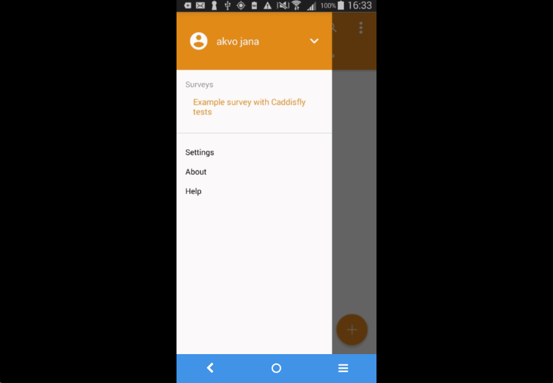

### Manual download from Settings menu
You can also manually download a form. However, because there is no assignment connecting your device to this form, you will not automatically receive the updated version of the form. Manual download of a survey form is a popular way to check your form structure before data collection starts and the form is assigned to enumerators. 

To download a specific form:

1. Before you start, you need the ID of the form. On the Flow online space, you can find this if you view the details of the form.
2. On the Flow app, open the side menu and click Settings.
3. From the list, select Download Form.
4. Enter the Authorization passcode, which is “12345” and click OK.
5. Enter the Form ID of the form you wish to download and click OK.
6. The form will be downloaded into your app and appears in the list of Surveys in the side menu.

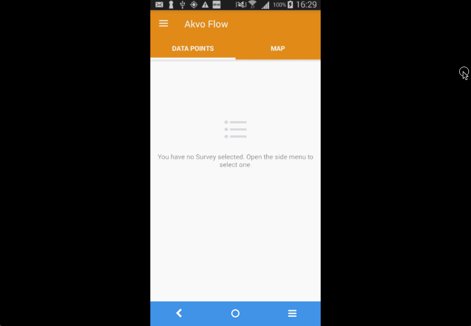

### Offline via Manual survey transfer
Manual form transfer allows you to generate a file of a Flow form and put it on the Flow device using a USB cable. This can be useful in situations with low or no connectivity.

On Flow's online space, once the form is published, you can generate a file holding the form. This file will be emailed to you. Once you download the file you can share it online, or offline with your data collectors to add to their devices. For more details on how to get the file, check this [article](devices.md).

To get the form file onto your device, follow these steps:  

1. Connect your device to a computer using a USB cable.
2. Make sure you can see the contents of the SD card.
3. Go to the folder akvoflow/inbox.
4. Copy the survey or form zip file into the inbox folder. 
5. Disconnect your device from the computer. 
6. Start the Flow app.
7. You will see a notification that the file is being read from your SD card. Once done, the survey will show in the list of survey in the app's menu. It should not take more than a few seconds.

## Select a survey to capture data
Surveys are used to capture data on a particular subject. Each survey consists of one or multiple forms. A regular survey consists of only one form. However, if monitoring is enabled, your survey will hold multiple forms. For more details on surveys check the chapters explaining surveys in the online space, [Flow's online space - Surveys](surveys.md)

Select a survey
In order to start your data collection work, you need to select a survey. In the side menu you see a list of all surveys that have been assigned to your device. To select a survey, click on its name.

If you have not captured data for the survey yet, you list of data points is empty. 

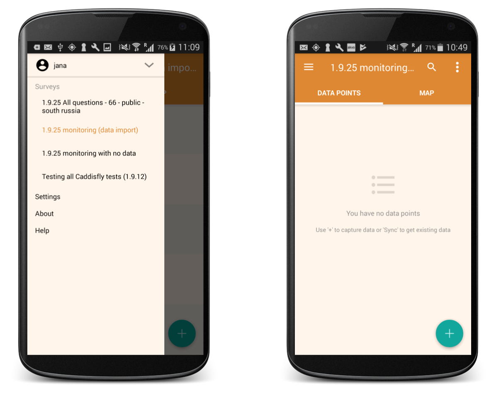

If you have captured data for this survey before, you list of data points will show all the data you have collected before. 

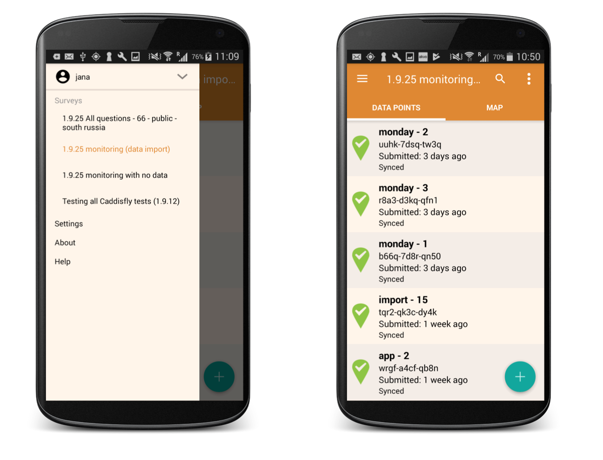

## Changing the language of your form
If you’ve created forms with translations on your Flow online space and assigned them to your devices, you can access those translations on the device. A Flow form can be translated to multiple languages at once and we also support non-Latin scrips. 

To display one or more translations for a form, select Languages in the form menu. This will display all of the available translations (i.e. the ones you entered on the online space) for the form. Select one or multiple languages you want to see when answering the questions. Next time you start filling in the form, the selected languages will display. 

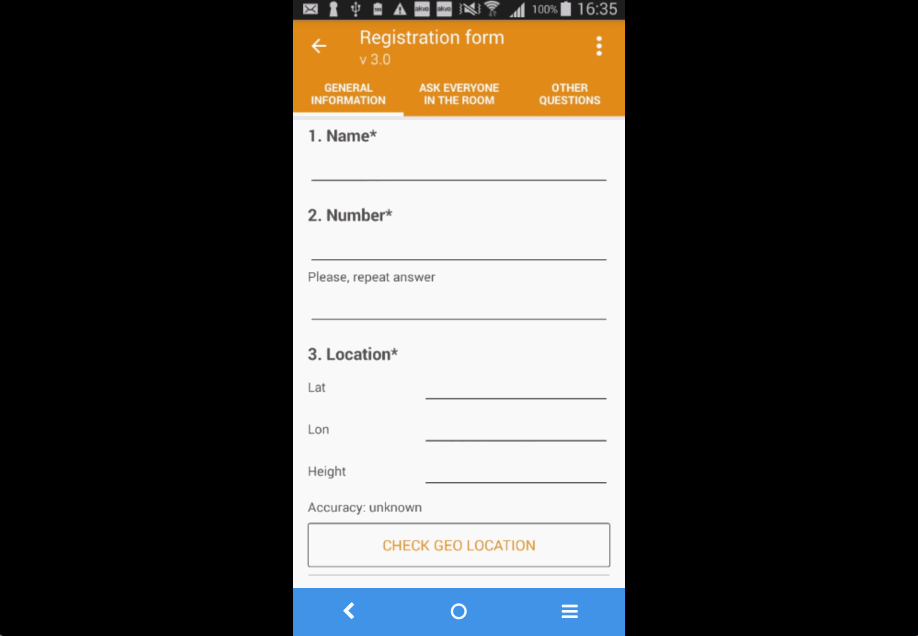

## Delete a survey from the app

### Deleting one survey 
You can always delete a survey from list of surveys. Long click on the survey you want to delete and confirm this in the pop up window. Now the survey is not in your list of surveys anymore.

Before deleting a survey from your list always make sure that all the data is submitted and synchronised.

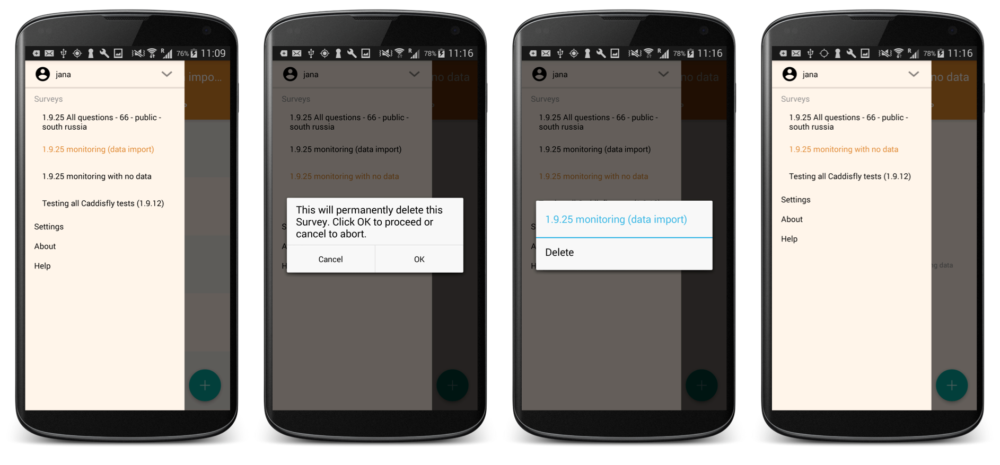

### Delete all surveys 
You can also delete all surveys from your device. In Settings use the option to Delete everything. This is a great options if you want to start fresh, with new surveys and no data or if you want to change the user and device ID all in one go. With delete everything you get a fresh new Flow app. Make sure all the data is fully synced to your Flow instance before deleting. You need to know the administrator password to run this action. 

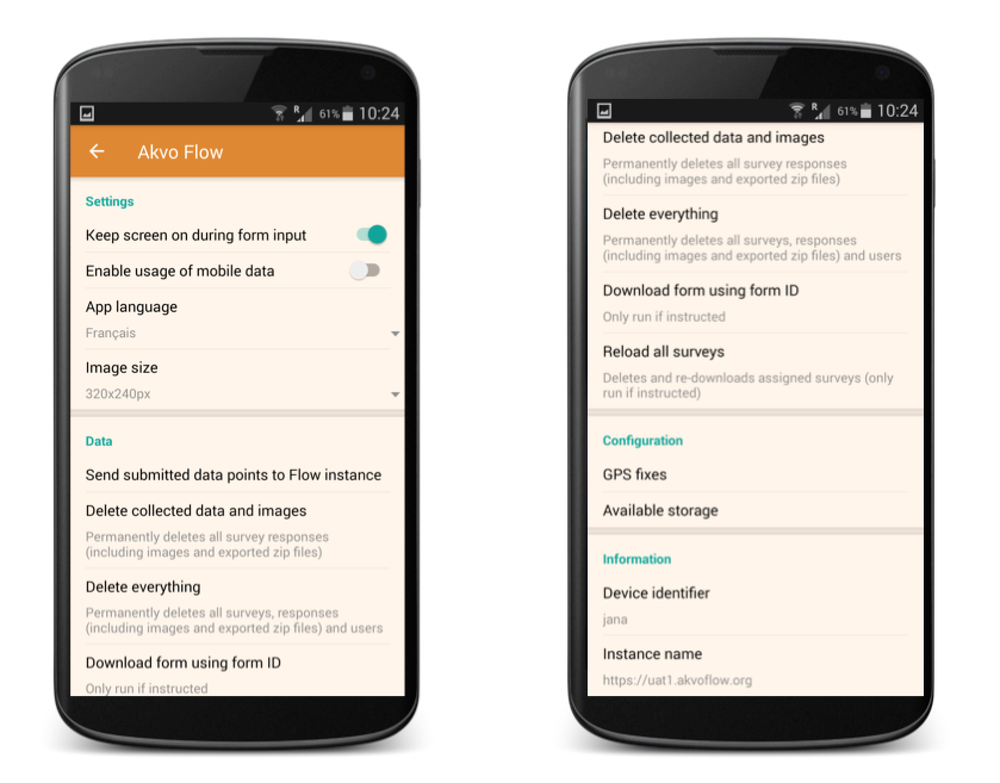

## Filling out a new form
After you have your survey form to your device and have selected the one you want to work with, it is time to capture data. 

### Filling out a new form
If you want to fill in a new form, click on the ‘+’ icon. If you have a non-monitoring survey, you will access the list of questions directly. Start answering them. For more details on how different question types appear on your device, check here. 

### Saving a form 
Form responses are automatically saved as you answer them. You can leave as many forms in a saved state as you want, and continue filling out other data points meanwhile (i.e. you might have to take the GPS location at a water point, and then walk a distance to interview someone to complete the rest of the form). In order to find back the right data point, it is important that the name of the data point is meaningful. In the online space, questions can be selected that make up that data point name.

Once you are ready to further fill out a saved form, simply select the data point from your data point list. This will open the saved form and you can immediately continue with your data collection work.

### Submitting a form 
After you have filled in all your answers you will come to the submission page. Don't forget to submit your form once you have completed it. 

If there are unanswered mandatory questions, or invalid answers, the Submit tab lists these questions. Clicking on a question in this list will take you to the right tab, so you can provide the missing information. The Submit button is disabled until all invalid questions are handled.

When you click Submit at the end of a form, the form is locked to prevent further editing, and submitted. If you are filling in the form offline or your internet connection is slow, the form is queued in the phone until connectivity is restored. The data point will be in status submitted. The data will automatically be sent to the server when the device is connected to the internet, either via Wi-Fi or over a mobile network. Then your data point's status will change to synced.

## Filling out monitoring survey forms
In Flow you can also create monitoring surveys that allow you to over a course of time come back to a data point and monitor it. Monitored surveys in Flow consist of one and more forms. Each monitored survey has a registration form, where you capture the basic information about the subject of your data collection, and monitoring forms, that you can fill in multiple times over and again. Here you can read more about our Monitoring feature. 

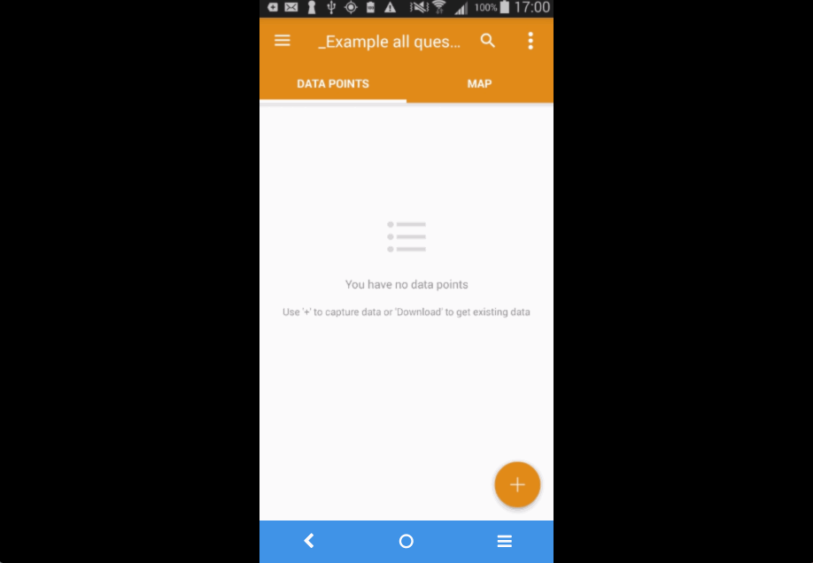

### Filling out a form for a monitored survey
If you are collecting information for a monitoring survey, after clicking on the ‘+’ icon, you will see all the forms in the survey assigned to your device. 

### Creating a new data point - Filling in the registration form
If you are creating a new data point, then only the registration form will be the one you can select. With submitting the registration form a new data point is created. Only after submitting the registration form, you can collect data using the monitoring forms.

### Capturing monitoring data - Filling in a monitoring form
If you are to submit monitoring data to an existing data point, select the data point first. Now you will see the list of forms, but the registration form is disabled and the monitoring forms are selectable. Select your monitoring form and fill in the data. 

If you have already made submissions for your selected monitoring forms before, you can make use of the Pre-fill Responses functionality when filling in the new form. This allows you to take the answers from your last submission, fill in the current one and you can edit the answers further saving you time with answering questions where the answers are the same. 

## Saving a form
Form responses are automatically saved as you answer them. You can leave as many forms in a saved state as you want, and continue filling out other data points meanwhile (i.e. you might have to take the GPS location at a water point, and then walk a distance to interview someone to complete the rest of the form). In order to find back the right data point, it is important that the name of the data point is meaningful. In the online space, questions can be selected that make up that data point name. You can also recognise the data point by the saved status icon.

Once you are ready to further fill out a saved form, simply select the data point from your data point list. 

### Saved registration form
Select the saved data point and select the registration form from the list of forms. This will open the saved form and you can immediately continue with your data collection work.

### Saved monitoring forms
If you want to continue filling out a monitoring form you previously worked on, you first need to select the data point for which the earlier data collection was done. After selecting the point, go to the History tab and select your saved form. Now you can finish your data collection work.

## Submitting a form 
After you have filled in all your answers you will come to the submission page. Don't forget to submit your form once you have completed it. 

If there are unanswered mandatory questions, or invalid answers, the Submit tab lists these questions. Clicking on a question in this list will take you to the right tab, so you can provide the missing information. The Submit button is disabled until all invalid questions are handled.

When you click **Submit** at the end of a form and then OK, the form is locked to prevent further editing, and uploaded to the Flow server. If  you are filling in the form offline or your internet connection is slow, the form is queued in the phone until connectivity is restored. The data point will be in status exported. The data will automatically be sent to the server when the device is connected to the internet, either via Wi-Fi or over a mobile network. Then your data point's status will change to synced.

## Pre-fill responses for monitoring forms
When capturing data for monitoring forms you sometimes answer the same question in the same way every time you fill in the monitoring form for your selected data point. To make your data collection work more efficient, you can make use of the Pre-fill responses functionality available in the Flow app for monitoring forms. 

Pre-fill responses takes the answers from the last submission made to the selected monitoring form to your selected data point and fills in the answers to your newly opened form submissions. You can then edit the answer and continue with submitting the data. 

Please note that this functionality is only available for monitoring survey forms. 

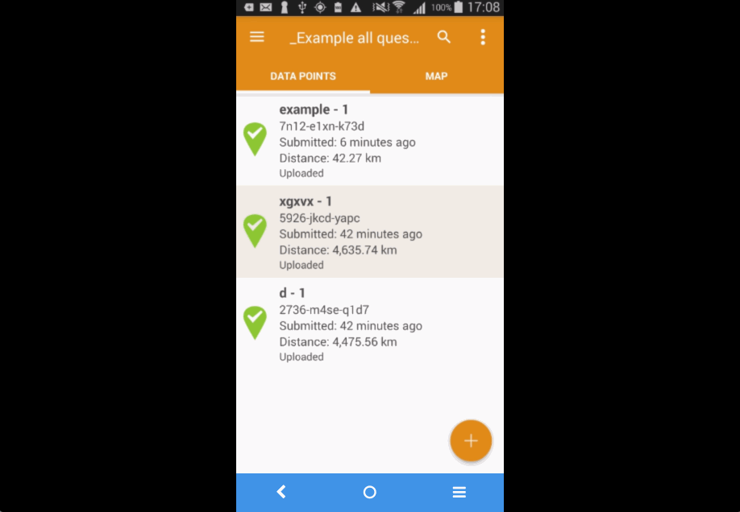

## Form status
A form can have a different status: 

- **Saved (or draft)** : This form is not submitted yet. You can open it up and continue filling in more data to it. 
- **Submitted:** This form is submitted and exported in the SD card, but the device has not synchronised it with the online space. As soon as internet connection is available, it will be uploaded.
- **Uploaded**: This form is submitted and fully synchronised with the online space. Not until all the images attached to a form are sent to the server will the status turn into Synced. You do not have to manually send any form from within the device, for all the transmissions are handled automatically as soon as the internet connection is available.

You can see this status in two places depending on what kind of survey you are working with:

For a **non-monitoring survey**, the data point status is equivalent to the form status and shown in the list of data points. For more details on data point status check Data point status. For a monitoring survey, the form status is shown once you select your data point and go to the History tab.

## Checking submitted forms
As you collect your data, you might want to review the forms you have already submitted. There are two ways of accessing your already submitted answers depending of the type of survey:

For a non-monitoring survey simply select the data point you want to review. This will open the submitted form and you can see the answers directly.

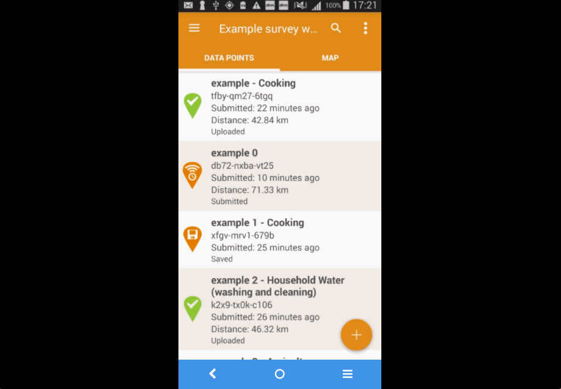

For a monitoring survey you first need to select a data point from your list and navigate to the data point’s History tab. Now select the form you want to review the answers.

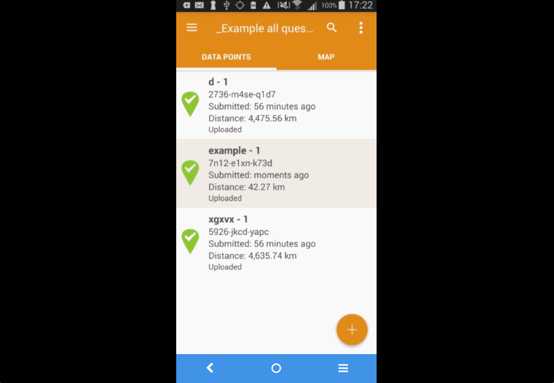

For both types of surveys, non-monitoring and monitoring, each submitted form holds its own menu. You can access it from the overflow icon when you are reviewing a form. The menu of a submitted form holds three options: **Languages**, **View map** and **Transmission History**. 

- Languages allow you to switch between survey languages that are defined for that survey. 
- View map shows you the location of that one data point. 
- Transmission History shows you the details of the submission of that particular form, as for example when the submission started and the time it was finished.

## Question groups and Questions on the Akvo Flow app
### Question groups
Each form contains a series of questions that are organised into question groups. Each group of questions appears in a separate tab on the screen. You can fill in the questions in any order, moving from tab to another tab. To switch between tabs, you can either swipe the screen, click in the tab title, or click the ‘next’ button at the bottom of the tab.

### Questions

In Flow we support a large variety of different question types to help you create a diverse survey. These are the question types available in the Flow system: Free text; Option (select one option or select many using check boxes); Cascade; Number; Geolocation; Photo; Video; Date; Barcode; Geographic shapes, Signature and Akvo Caddisfly, to add a water and soil quality test to your Flow survey. For more details on our question types check this article. 

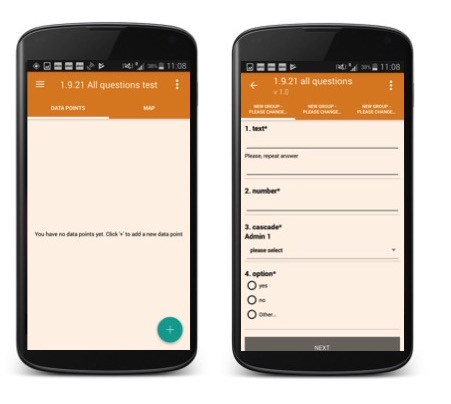

### Question Settings 
When creating a Flow survey form you can edit the behaviour of the question using multiple settings to customise your survey as much as possible to fit your needs. You can make a question mandatory, show it only if an specific answer to a previous question was selected or add some extra explanation to the question. 

### Mandatory questions
Questions marked with an asterisk (*) in the title are mandatory. This means that the form cannot be submitted if any of its mandatory questions have not been answered yet. The Submit tab will display a list with all mandatory questions that are still unanswered. Clicking on an item in that list will take you to the corresponding tab and question.

### Dependent questions
If a question is made dependent, this means that it will only show if a particular answer was selected to an option question in the form. If the answer was not selected, the question will not show. 

### Help text
Forms can be configured to include help text. If help is available for a specific question the help icon is displayed next to the question text. Click this icon to open to display the help text.

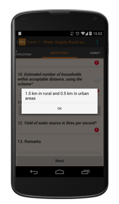

## Data points on the Akvo Flow app
A data point contains all the information collected for a particular something, such as a water point, school, or farmer. Some data points hold more than one form, and all the filled forms are part of the same data point. This is particularly useful when you want to track data changes over time, and a given point needs to be monitored periodically.

Each data point has a name created based on answers to selected questions. In the online space, you can specify which questions are used to create the data point name. Following the name you see a unique identifier. The data point identifier consists of random numbers and letters and is generated automatically. You can see when the data point was submitted or last modified. The icon represents the status of the data point. 

Data points are created by submitting a survey form. Here you can find out how to submit a form for a simple survey or for a monitored survey where the data point is created via the registration form. 

### Data point name 
When creating your survey form you can specify which question answers will be used to create the data point name. If you do not select any question "Use as data point name" then your data points will be unnamed in your list. It is especially useful to name your data points if you want to collect more data for the point when monitoring.

### Data point status
Each data point in the data point list is shown with an icon. There are three icons:

- **Saved (or draft)** - this means that a form in the data point was started, but not submitted yet. The user needs to go back to the form, finish it, and submit it.
- **Submitted** - this means that a form in the data point was submitted and exported to the memory of your device, but not synced to the server yet. The device needs to have connectivity before it can sync the data.
- **Uploaded** - all submitted forms in the data point have been synced to the Flow server correctly.

If you downloaded data points for your monitoring surveys, the newly downloaded data points will be shown in bold so you can easily recognise, which points are new on your device. 

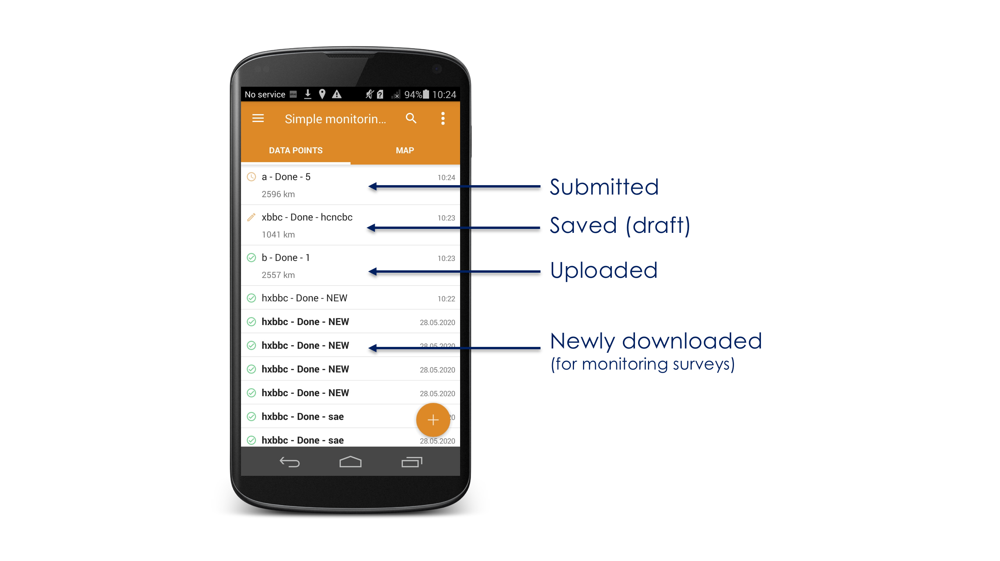

If there are multiple forms inside a data point, the icon used will display the ‘worst case’, meaning that if some of the forms are already synced, but one form is only submitted but not synced yet, it will display the Submitted icon.

You can order the data point list according to the status, by selecting the Status option in the Sort menu option under to overflow icon.

It is extremely important that you check the synchronisation status before deleting data from the device by making sure that all data has a green icon and therefore has been synced correctly. Otherwise you might lose data.

### Selecting a data point
To select a data point, click on it in the Data Points tab, or browse the Map tab to find it. Clicking on a marker on the map will show you the name and id of the datapoint. Clicking on that name will take you to the datapoint. 

### Searching for a data point 
You might have thousands of data points in your list on your device, but you only want to fill in a monitoring for, or check a submitted form for one specific data point. You can search for your data point by clicking on search icon on the top of your screen. 

Search for a data point by its name or ID. You do not need to know the exact name of the point. Type in a letter and the list of points will only show those points that have your searched letter in the points name or ID. 

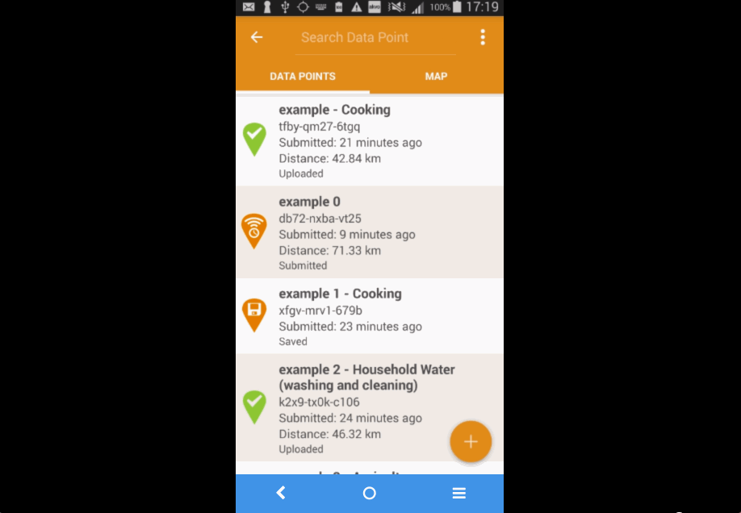

### Sorting the list of data points
You can sort the data point list as well. By default the data points are ordered by date, where the latest data point (the one with the newest form submission) is placed on the top of the list. Click on the overflow icon in the top right corner of your screen and select Sort. You can sort the data points order by date, distance from your current location, upload status and name.

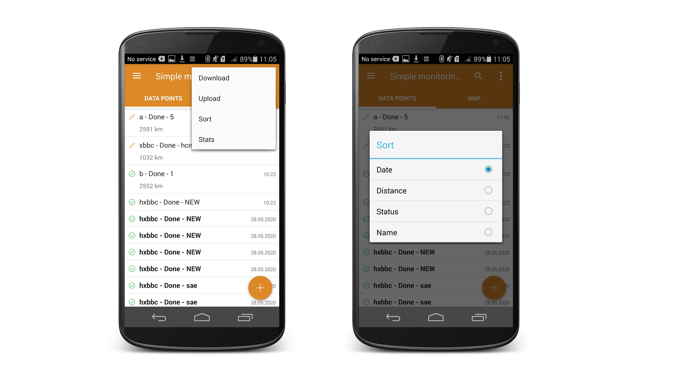

### Data point statistics
You can also see an overview of the data point statistics, by clicking on Stats located under the overflow menu icon. The stats show you:  the total number of data points on your device, 

- Total data points - The total number of data points on your device (a data point can hold one or more form submissions, if it is monitored). 
- Last 7 days - The number of data points created in the last 7 days but also updated in the last 7 days. So if a monitoring form was submitted to a data point, it will show in that number. 
- Today - The number of data points created or updated today. 

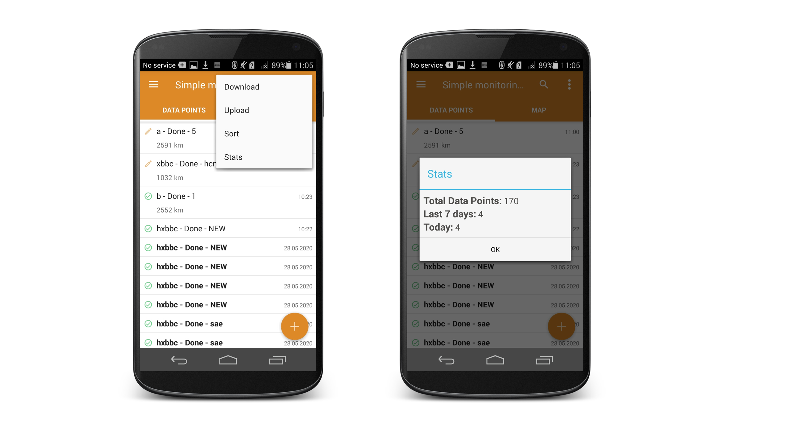

## Downloading monitored data points
Monitored data points can be downloaded. You can download all data points created under the survey from other devices and add new responses to them. This means that one device can create a new data point, add responses, and once the data is sent to the server, a different device can download the data point and keep adding data to it.

Once the download is finished, a notification will show the total amount of Data Points downloaded. New data points will be bold in the list whereas previously monitored data points will have a normal text.  If you are working with a non-monitored survey, the option to download data points will not be available.

### Downloading data points
To download all data points collected for the survey, click on the overflow icon in the upper right corner of your screen and select Download. You need to be connected to the internet to download the data.

### Updating data point names
Downloading points on the app will also trigger the recreation of the data points names. If after a data point exercise you realised, that the questions you selected do not provide you a clear data point name, you can change the settings in your survey, re-publish the survey and sync the points on the Flow app. Your points will be now named based on the new structure you have set. If you have cleaned submitted data and the answers build your data point name, downloading the points again to the phone will also ensure that names reflect the changes you have made.

## Maps in the Flow app
Maps in the Akvo Flow app allow you to locate your collected data on the map. Note that for this to happen, the registration form must have been answered, and it must contain a Geolocation question. This question needs to have 'use as data point location' turned on.

You can access the map in two different ways:

After selecting your survey you see two tabs, the Data Points tab and the Map tab. The map tab displays the location for all the data points created within this survey. You can also check the location of one particular data point. Open the data point, click on the overflow icon, and select View map.

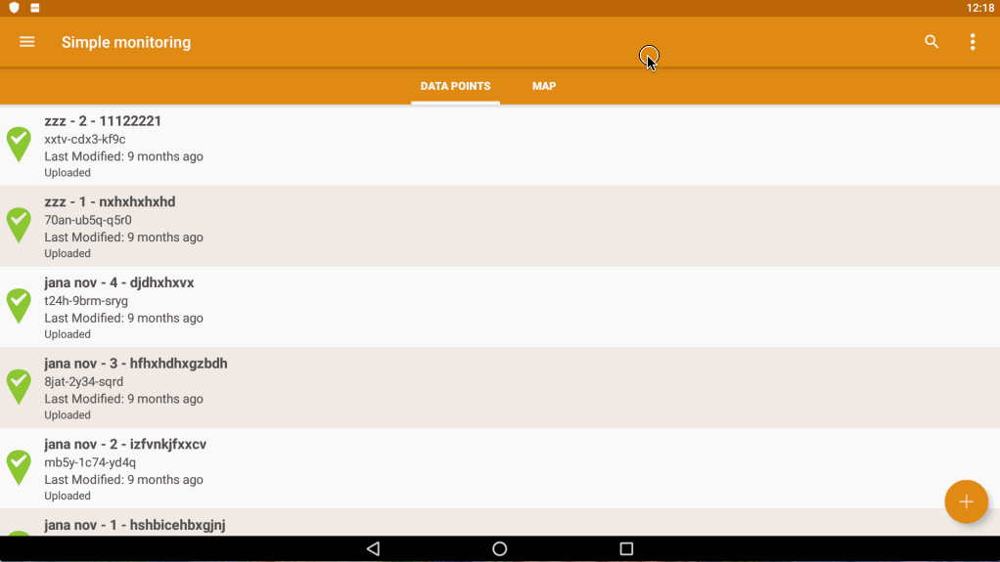

### Using maps offline
If you're going where the Internet is slow, mobile data is expensive, or you can't get online, you can save the area with Flow's Offline map to your phone or tablet and use the map when you are offline. With Flow 2.8.0 (and newer versions) you can not only capture data offline, but also view the location of your data points offline using our newest feature, Offline maps. 

Read more here on how to download and use Flow's Offline maps. 

# Offline data collection
Many of our users capture data in areas with slow or even no data collection. With Akvo Flow you can capture data fully offline. This means you can not only capture the data on your Flow app offline, but you can also add the form to your device offline, as well as get the data from your phone to someone with network connection to sync to Flow's database. 

## Downloading a form to your device offline
To create and edit forms, you need to log into your Flow space, when connected to internet. Once your form is ready for data collection you publish it and then you would sync the form to the device. But you can also get your form to the app, without having your device connected to the internet.  

### How? 
By using the Manual survey transfer functionality. On Flow's online space, once the form is published, you can generate a file holding the form. This file will be emailed to you. Once you download the file you can share it online, or offline with your data collectors to add to their devices. For more details on how to get the file, check this article.

To get the form file onto your device, follow these steps:  

1. Connect your device to a computer using a USB cable.
2. Make sure you can see the contents of the SD card.
3. Go to the folder akvoflow/inbox.
4. Copy the survey or form zip file into the inbox folder. 
5. Disconnect your device from the computer. 
6. Start the Flow app.
7. You will see a notification that the file is being read from your SD card. Once done, the survey will show in the list of survey in the app's menu. It should not take more than a few seconds.

## Capturing data offline
### Filling in a form
You can capture data using the Flow app online of offline. There is no difference in how you fill in the survey form and submit it. Because you are offline, the data points will be in the submitted status (orange icon). You data is securely stored in the memory of your device in a private folder that is not accessible. This will not change to the synced status (green icon).  

### Uploading your data 
To make sure the data gets uploaded to Flow's database, when you can then see the data on Flow's online space or export the data, you can do two things: 

1. **Connecting to a network**. One option is to connect your device to the network what will trigger the submitted points to start uploading. 
2. **Offline upload**. You can get your data out of the device and to a PC fully offline. Then you can upload the data file to your online workspace using the bulk upload tab (this step requires connection as the online workspace does not work offline.) For more details on how to bulk upload data [check these articles](faqs.md#bulk-upload). 

## Offline maps
If you're going where the Internet is slow, mobile data is expensive, or you can't get online, you can save the area with Flow's Offline map to your phone or tablet and use the map when you are offline. With Flow 2.8.0 (and newer versions) you can not only capture data offline, but also view the location of your data points offline using our newest feature, Offline maps. 

**Note:**Capturing and viewing geographical shapes with Offline maps is not supported yet. We will be adding it to the next Flow app release. 

Creating an offline map 
1. Make sure you are connected to the internet. 
2. Go to the Main menu and select Offline maps. You can create your first offline map from the Maps tab too. 
3. Click on the icon in the right bottom corner of your screen. 
4. Zoom in to the area you want to download. 
5. Give the map a name. 
6. Download map. 
   
The offline map will show in the list of Offline maps. Here you will see all your created offline maps and their size. You can preview, rename or delete a map to save space on your device. 

### Using an offline map 
By default the Live map will be selected to use on the Flow app. This means that when looking at data points on the map, Flow will try to use the map connected to the internet. 

If you are not connected to the internet, or would rather use an offline map you have two ways how to select which map to use: 

- Via the map tab by clicking on the Offline maps icon. (see image below) 
- Via the Offline maps list by opening the Main menu, selecting Offline maps and then clicking on 'Select to use' under the map of your choice. 

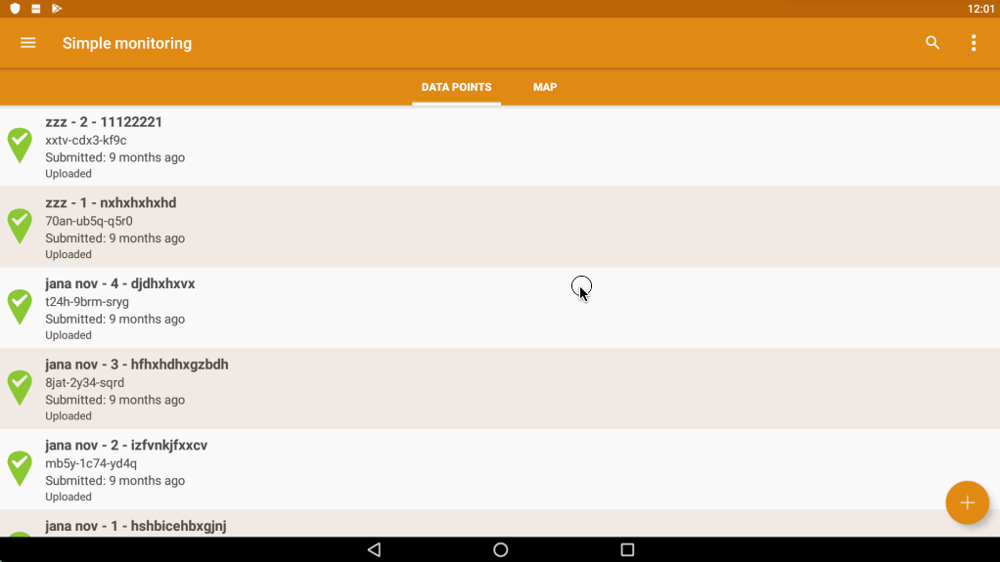