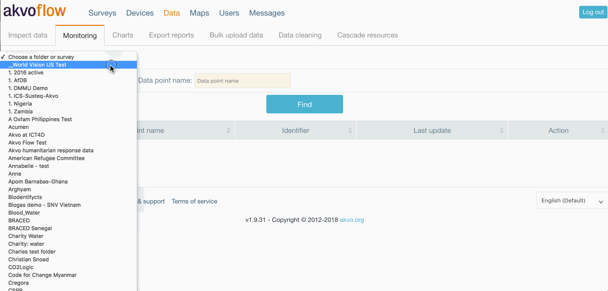

# Viewing data

## Inspect Data tab
The Inspect data tab is the page to view your data. Select the form and hit Find. In the table below you will see all the submissions made to that form, with the most recent ones on the top. By opening the submission you can view the answers to the questions. If you have editing rights, you can also edit the data here. For those with the right to delete a submission, this is the place where you can delete data. Searching for a specific submission? Do you want to see submissions from a specific device? Use the different filters to check your data. 


For each data submission, the table contains:

- Instance ID - unique number assigned to each submission 
- Submitter - the user name set on the device, to identify which device user submitted the data record
- Device ID - the device ID set in the device preferences, to help identify the device
- Collected - the date and time the data record was submitted from the device
- Action - view, edit or delete the submission based on your user rights 


### Filtering data
There are a collection of parameters above the data table that allow you to filter what data records you see, as on the collection date, the instance ID, device ID, and on the name of the submitter. You can filter on one or more parameters by making your selection(s) and then clicking the Find button. To return to the full listing, clear all the filters and press Find again.


### Editing data
To edit a submission, you first of all must have the right to edit data. Select the submission you want to change and hit on Edit. Now you will see the answers. Click on the answer you want to edit and make the change. Do not forget to save. 


Free text and number questions will display a text field, option questions will display a dropdown menu with the available response options, and date question will display a date picker. Please keep in mind that some answers are not editable, like photos or signatures. 

**Note:** Once you change or delete an answer, this permanently changes the answer in the database and you cannot go back or undo the changes.


### Deleting data
You can delete individual submissions simply by clicking on Delete in the Action column. Only users with the permission to delete data have the Delete option available. 

**Note:** This action permanently deletes the data from the Flow database and cannot be undone.

## Monitoring tab
There are three places where you can preview your data in Flow, in the Inspect data tab, on the map and in the Monitoring tab. In the Monitoring tab you view the data based on data points. Each data point holds at least one submission, or more. In this page on Flow you can see which submissions were made for each data point. 





Go to the Monitoring tab and select your folder and monitoring survey. Note that only surveys that have monitoring enabled will show in your list and you will not be able to select the survey form. By pressing 'Find' a list of all data points created under this survey will show. In this list you can see the data points' name, ID and when it was last updated, what means when the last form was submitted to this data point. 

When you click **‘View details’** on any one of the data points in the table, you will see the submissions made to this data point. The submissions are organised from the newest to the oldest, so the last submission in the list is the submitted registration form. In this view you will see the ID (As you might have more than one submission for this point for one monitoring form and the ID will help you distinguish the submissions.), Survey (which indicated to which survey form the submission was made), Submitter, Device, and Collection date. When you click **‘View details’**, you will see the individual answers given to the questions in that response.


## Charts tab
The Akvo Flow Chart Builder is a simple data visualisation tool for viewing your captured data. You can create different simple charts based on answers to one option question in your Flow form. 


To use chart builder, first select a folder, survey, form and question from the dropdown menus. Next select the chart type. Three chart types are available – doughnut charts (like a pie chart), vertical bar charts and horizontal bar charts. If you would like for the smallest items to be grouped together for better viewing, tick the box next to “Group smaller items.” This is good if you have a lot of different responses in small amounts, since it groups everything under 5 percent, and then breaks those items out for you on the right. When you have made your selections, click Build Chart, and the chart will display below. 

We are currently working on a data visualisation tool, [Akvo Lumen](http://akvo.org/akvo-lumen/), that is directly linked to Flow and allows you to create advance data visualisations. 

## Deleting data

You can delete individual data records by locating a record in the data table and clicking Delete in the Action column, or by clicking the **Delete** button at the top of the Edit answers window for that full data record.

**Note:** Only users with the permission to *View data* and to *Delete data* have the Delete option available. Thus to be able to successfully delete data from your form, you need to be able to view the form, to view the data and to delete the data.

This action permanently deletes the data record from the Akvo Flow database and cannot be undone.

# Exporting data
## Export reports tab
To export your captured data, go to the Export reports tab, under Data in Akvo Flow. The Generated exports list holds all the exports you have generated over the last year. You can download the data sheet again from this list simply by clicking on the data export you want in the list. 


To run any export, hit the New export button. This will bring you to the export options we provide. 

1. Select the folder, survey and form from the top dropdown menus.
2. Select the export option that fits your needs the best. 
3. For some export options you can limit the dataset by setting the dates when the data was submitted. 
4. Hit Generate. 
   
Now you will see your generated export on top of the list. Once the file is ready to download, you will receive an email notification. It might take some time to generate your data export depending on the size of your dataset. You can continue working on your Flow instance, viewing data or preparing your next survey in the mean time. Once you received the notification, simply go back to the Data tab and click on the export you want to download. The file will download to your computer directly. 


You can export your data into Excel sheets using our different export options, or into a json file to use in GIS tools. Furthermore, here is the place where you can view your question structure using the Survey form. Here are the options we have now in Flow: 

- Data cleaning export - A good choice if you want to work with your data in Excel. This is the export created also when data cleaning and importing new data into Flow. It holds all your data and splits them into multiple sheets for repeated question groups. 
- Data analysis export - A good choice if you want to use your Flow data in another analytical tool. It holds all you data in one sheet. 
- Comprehensive report - Gives you a quick overview of your data with summary charts. 
- Geographic shape - To export your data into GIS tools. 
- Survey form - To see the structure of your survey form and its questions. 

Check our other articles on more details about the various data export options.

## Form version in data exports
With the Flow release v.1.9.45 we have added another metadata column to your data exports, Form version. This data stands for the form version your submission was made to. 

When cleaning and analysing you data knowing the reason behind the differences in your submissions helps you understand which is outlier is relevant and which is due to the changes in the form. Having more insights into the origins of your submissions will help you trust your data and the insights you get from them. 


Submission metadata with the newly added Form version


### What is the 'Form version'?
Once you finalise a survey form you make it ready for data collection by publishing it. This published form has a specific version and it is sent to the devices with the Flow app. But often with data submissions coming in, you realise that there are changes needed to a question or perhaps to options the respondent can choose from. Once you make these changes to the form, the version updates as you publish it again. 

However, such changes to the form version can affect the data coming in. Perhaps you removed an option from the possible answers in the latest form version 13, but data collection had already started on form version 8. Submissions made to form version 8 may have the option in the answer cells that submissions to form version 13 do not have. Or answers to form version 8 may have an option spelled differently that answers to the same question submitted to form version 13. 


### Why is it valuable to know the form version with submissions?
Being able to see which submissions were made to which form version in your dataset can support you in understanding and analysing your data. When data cleaning you can compare submissions made to one form version or compare across form versions. This way you can better identify which outliers are because of changes to the form version and which are actual relevant answers that you need to consider in your analysis. 

Knowing the form version a submission is based on helps you better understand the origin of your data.

## Data cleaning export
Data cleaning export gives you all the data captured with your survey in an Excel file. This export type is used for cleaning data as it is importable back into Flow and it's new structure makes it easy to work with in Excel. 


Go to New export, select the folder, survey and form in the dropdown menus, the Data cleaning export to export and hit Generate to export the data for your selected form. After a few minutes you will receive an email notification that your file is now ready to download. Go back to the online workspace and download the file from your list of exports. 

Once you download your file, you will notice the name given to it: *DATA_CLEANING-15896832*. The number is the form ID that you can find in your form in Flow's survey editor. This ID is helpful when you are downloading many forms at once to be able to connect each data export to its form.  


### Filter your data based on collection period
Before you export your data for your selected form using the Data cleaning export option you can also decide to only export submissions made in a particular time frame. Select the dates in the Collection period filter and hit Generate. In your list of exports you will see the selected Collection date filter next to the name of your data file. Your data sheet will now only hold submissions made in that period of time. 


### Filter your most recent submissions for monitored data 
Before you export your data for your selected form using the Data cleaning export option you can also decide to only export the most recent submissions for your data points. This option is available only for monitoring forms in your monitoring survey. Select the option Most recent submissions and hit Generate. In your list of exports you will see the selected 'Recent submissions' filter next to the name of your data file. Your data sheet will now only hold the last submission made for each data point in the survey. 


### Structure of the file 
This export structure is mostly used when working with your data in Excel. To make it easier for you to orientate in the data sheet in the known Excel structures we structure the sheet accordingly: 

- Submissions are order by submission date, from the oldest submission to the newest. 
- Question groups are indicated in the first row so you can easily see which question value was captured as part of which group. The first meta data columns are marked as **'Metadata'**. 
- The second row holds the titles of the meta data columns followed by the questions in your form. Each question column has a unique ID and the question name. The question ID is a unique number given to each question by Flow and is used for validating your sheet at import when data cleaning. (For example 1234573|What is your name?)
- Each repeated question group is separated into its own sheet to avoid empty cells and simplify analysing the data.
- Answers to [option questions](questions.md) where you could select more than one answer are combined in one cell 
- Answers to different levels in [cascade questions](questions.md) are combined in one cell.    
Please note that the structure of the data is based on the last published version of the survey form. If you made any changes to the form and did not publish those changes, these will not be reflected in this data export.

The export holds multiple columns, which are the same per each data export and provide you the 'meta data' of your submitted form. This **'meta data'** represents information which we save automatically per each submission. The 'meta data' includes the following information:

- Identifier - This stands for the data point ID. This number is given to each data point automatically by Akvo Flow and you can see it also on your device in the list of data points. The identifier acts as a unique code for each data point. In the case when multiple data points have the same data point name, the identifier will always be unique and thus needed to distinguish the points from each other.
- Display name - The display name equals the data point name. If you have ticked the 'use as data point name' checkbox within a question, the submitted answer will become the name of your data point. This is used to easily recognise each subject of your data collection exercise.
- Device Identifier - Or device ID, is the name, number or other form of identification you set on each device via the Flow app. If you did not set a Device ID for your phone or tablet, this column will be empty.
- Instance - This column holds the unique number that is given to each submitted form by Flow. When previewing data in the Flow online space you can easily filter your collected data by this number to find exactly the submitted form you are interested in.
- Submission Date - In this column you can see when the form was submitted. The rows are ordered by the submission date with the oldest submissions on the top. 
- Submitter - Submitter represents the user logged in on the Flow app who has submitted the data for that particular form.
- Duration - In the Duration column you can easily see how long it took each submitter to finish filling in the form and submitting it. 
- Exports without repeated question groups 
If your survey form does not hold repeated question groups, then with this new structure we removed information that your do not need and added more structure to make it easier for you to analyse, clean and work with your data. 

### Structure of the file: 
- Data export consists of one sheet. 
- We removed the 'Repeat no.' column from the sheet as there are no repeated question groups in your form. 
- First row indicated meta data columns and question groups. 


### Exports with repeated question groups
The largest changes are made around how we present answers to questions in repeated question groups in the newly called Data cleaning exports. We aim to make it easier for you to see which questions are repeated due to the many empty cells, where the repeated question groups are, how many submissions you have as one submission is shown on multiple rows. 

Structure of the file: 
- Data export consists of multiple sheets. 
- The first sheet holds submission meta data and answers to questions that are not in repeated question groups. Thus we follow the rule one submissions = one row.  
- We removed the 'Repeat no.' column from the first sheet. 
- If a question group is repeated, the data to these questions will be in a separate sheet and linked to the other sheet with meta data. For example, if you have two repeated question groups in your form, then your Data cleaning export file will hold three sheets.
- In the repeated question group sheets one repetition sits in one row and all meta data is copied to all rows, so a submission can be shown in more than one row. The 'Repeat no' column indicated the number of repetitions per submission.* (Please note the change in the title where we removed the '.' - full stop - from the title.)*


## Data analysis export
Data analysis export gives you all the data captured with your survey in an Excel file in one sheet regardless of having repeated question groups in your form or not. This export type is handy for analysing your data as it holds variable names instead of question names. Options and cascade levels are split into separate columns by default. And if you have codes defined for option and cascade questions then these are exported and not the value names.  

This export type is not importable back to Akvo Flow and thus cannot be used for data cleaning or importing in new data. 


Go to Next export, select the folder, survey and form in the dropdown menus, the Data analysis export to export and hit Generate to export the data for your selected form. After a few minutes you will receive an email notification that your file is now ready to download. Go back to the online workspace and download the file from your list of exports. 

Once you download your file, you will notice the name given to it: *DATA_ANALYSIS-15896832*. The number is the form ID that you can find in your form in Flow's survey editor. This ID is helpful when you are downloading many forms at once to be able to connect each data export to its form. 


### Filter your data based on collection period
Before you export your data for your selected form using the Data cleaning export option you can also decide to only export submissions made in a particular time frame. Select the dates in the Collection period filter and hit Generate. In your list of exports you will see the selected Collection date filter next to the name of your data file. Your data sheet will now only hold submissions made in that period of time. 


### Filter your most recent submissions for monitored data 
Before you export your data for your selected form using the Data cleaning export option you can also decide to only export the most recent submissions for your data points. This option is available only for monitoring forms in your monitoring survey. Select the option Most recent submissions and hit Generate. In your list of exports you will see the selected 'Recent submissions' filter next to the name of your data file. Your data sheet will now only hold the last submission made for each data point in the survey. 


### Structure of the file 
This export structure is mostly used when analysis your data in Excel or in another tool. 

- Submissions are order by submission date, from the oldest submission to the newest. 
- The first row holds the titles of the meta data columns followed by the question columns in your form. Each question column holds the variable name, if defined. The Flow internal question ID is not exported in this export type. 
- There is no indication of question groups or meta data in this sheet as when importing your data to another tool, this row is not needed for further processing. 
- There file holds only one sheet. 
- Options are split into separate columns per each option. If codes are defined, there are exported instead of the option names.  
- Cascade levels from cascade questions are split into separate columns. If codes are defined, there are exported instead of the cascade items names.  
- Answers to repeated question groups are put in separate rows for each repetition and meta data for the submission is copied over to each row. 
- Contains location information for photo questions (if captured)  


Please note that the structure of the data is based on the last published version of the survey form. If you made any changes to the form and did not publish those changes, these will not be reflected in this data export.


The export holds multiple columns, which are the same per each data export and provide you the 'meta data' of your submitted form. This 'meta data' represents information which we save automatically per each submission. The 'meta data' includes the following information:

- Identifier - This stands for the data point ID. This number is given to each data point automatically by Akvo Flow and you can see it also on your device in the list of data points. The identifier acts as a unique code for each data point. In the case when multiple data points have the same data point name, the identifier will always be unique and thus needed to distinguish the points from each other.
- Repeat no - As the header suggests, it shows the the number of the repetition of the question group. If you did not repeat a question group in your survey, the repeat number will always have number 1 for each form submission. However, if a group was repeated, this number will indicate the amount of repetitions submitted. To see an example of a raw data report with a repeated question group and to learn more about this feature check To repeat a question group....
- Display name - The display name equals the data point name. If you have ticked the 'use as data point name' checkbox within a question, the submitted answer will become the name of your data point. This is used to easily recognise each subject of your data collection exercise.
- Device Identifier - Or device ID, is the name, number or other form of identification you set on each device via the Flow app. If you did not set a Device ID for your phone or tablet, this column will be empty.
- Instance - This column holds the unique number that is given to each submitted form by Flow. When previewing data in the Flow online space you can easily filter your collected data by this number to find exactly the submitted form you are interested in.
- Submission Date - In this column you can see when the form was submitted. The rows are ordered by the submission date with the oldest submissions on the top. 
- Submitter - Submitter represents the user logged in on the Flow app who has submitted the data for that particular form.
- Duration - In the Duration column you can easily see how long it took each submitter to finish filling in the form and submitting it. 


### Showing your variable names
When defining a survey and questions you have the option to add to each question a variable name. The variable name replaces the long question names in the headers of the columns in your export. This functionality is used to easily upload your raw data to your own database or other tool you use within your organisation. 


### Cascade levels in separate columns
If your report holds a cascading question in it, the selected answer will be split into multiple columns. Each column represents one level of the cascade. For example, if your cascade consists of 6 levels (country, region, department, district, canton, commune) then your report will have 6 columns each holding the selected item per each level.


### Options in separate columns
In this export structure we combine the way option question answers are displayed in Data cleaning exports (having the answer packed in one cell also for multiple select option questions) and we create a separate column for each option. The option name is provided in the column header. If the option has also a code given to it, the code is shown. If the option was selected as the answer the cell holds "1" and if not, then there is a "0". If 'other' was defined by the user in the Flow app, the last column will show the answer given.


Example of a Data analysis export where there are two option questions where both have codes defined for their options: 

- The first question, Do you agree, is a single select option question. In the cells you see the codes, Y and N, instead of the options, Yes and No. 
- The second question, Colours, is a multiple select option question meaning you have one columns with all selected options and then separate columns per option. In the first column option codes show. The single option columns have in their headers the code and the option. 


*Example of a multiple select option question and its structure in the "advanced" raw data reports. The question has 8 options and the user could specify an other one as well. All the selected answers are combined in the first column and then separately indicated in the following option columns.*

### Show location information for geotagged photos
The geolocation information for geotagged photos is shown in these exports. Each photo comes with 4 columns: one holding the link through which you can access the photo and 3 additional columns with the captured latitude and longitude coordinates of the photo and the accuracy on the measurement in meters (m).

Here you can find more information on why photos captured with Flow app are geotagged and how it works.


## Comprehensive report
The Comprehensive report exports all raw data along with a summary of all your data with charts. We calculate how many submissions a user made, indicate what the longest duration of a submission was and much more. For option questions we calculate the frequency for each option and for number questions the max number answers, minimum, median, etc. This report give you a quick overview of your data. 


Go to New export, select the folder, survey and form in the dropdown menus, the Comprehensive report and hit Download to export the data for your selected form. After a few minutes you will receive an email notification that your file is now ready to download. Go back to the online workspace and download the file from your list of exports. 

Once you download your file, you will notice the name given to it: *COMPREHENSIVE-15896832*. The number is the form ID that you can find in your form in Flow's survey editor. This ID is helpful when you are downloading many forms at once to be able to connect each data export to its form. 


### Overview of your data
The Comprehensive report holds two sheets: one with raw data and one with a summary of your data. 

The Summary sheets starts with some overall stats about your data set. We calculate: 

- Total number of questions in the form 
- Total number of submissions made to the form 
- When the 1st submission was made 
- When the last submission was made 
- What the fastest submission time was
- What the longest submission time was 
- On average how long it took an enumerator to submit a form 
- How many forms each user submitted 
- How many forms were submitted from each device

For each option question we calculate the frequency of options selected and show the representation in a bar chart. For cascade questions we do the same, but only for the options that are in the last level of your cascade resource. For number questions we calculate the minimum, median, etc.


## Export Geoshape data
Have you captured geographic shapes with your data and you now want to work with the data in a geographic information system (GIS) tool? 

By exporting your data using the Geoshape Data option you will get all the collected data per form in a single json file. This file type can be then transformed into .kml or .shp files and opened in any geographic information system (GIS) tool.

First select your folder, survey and form that holds the geographic shape and then the question in mind. If you have collected data for a survey with three different geographic shape questions and you want to get the data for all three questions, you need to export one file at a time. This means, that each file will be based on one geoshape question from your survey form.

## Export Survey form
With this export option you will get an in Excel format (.xlsx) file with the structure of your survey form in two different sheets: 

- Blank survey form in that can be used to get a quick overview of the structure of your form or to conduct a paper-based survey. 
- Detailed survey form structure. This sheet is helpful to cross check the structure of your form as it shows you all the details per each question. You can also use this form export as a "code book" for analysing the data submitted to this form. 
Please note where that the structure of the data exports is based on the last published version of the survey form, this export shows you the current state of the form. If you made any changes to the form and did not publish those changes, these will be reflected in the export.


Here is an example of the detailed survey form structure. Your entire form is presented as a table with columns indicating the different question settings.


## Download all photo's inside a form via a file
There are certain cases where you want to download all the photos taken inside a form. A good way to do this is via the raw data file which you can download via reports. This guide for Mac & Debian devices walks you through the different steps:

### Installing wget on a Debian Linux

Open the terminal run the following commands:

```
sudo apt-get update
sudo apt-get install wget

```
  
Verify that wget has was downloaded properly by running the following command

```
wget --version
```
Installing wget on a Mac

1. Open your terminal (you can use cmd+space and search for "terminal")
2. Paste the following Url: ```/usr/bin/ruby -e "$(curl -fsSL https://raw.githubusercontent.com/Homebrew/install/master/install)" ```. 
   Press the return key and enter your password.
3. If you run into problems, paste *"brew doctor"* and follow the described steps.
4. Install wget by pasting: brew install wget.

### Downloading the Photos

1. Download the RAW Data Report from the Akvo Flow Dashboard
2. Copy the column containing the photo links and paste it into a new notepad or Text edit. 
3. Save the new notepad as a txt file. e.g *photos.txt*
4. Create a folder on your desktop called photos.
5. Copy the saved txt file, *photos.txt* to the folder photos
6. Open a new terminal window
7. Paste the following command:   ```cd ~/desktop/photos```
8. Afterwards, again paste the command wget -i photos.txt
9. The photos have been downloaded to the  "photos" folder.

## Option and cascade codes in your data exports
If you have added codes to your cascade resource or to the options in you option questions, we add these codes to your data exports. The format if the following: code:cascade value/option value.

### Examples: Codes and Option questions
Let's look at the case, where your option question has these 4 options with added codes: CAR:carrots, POT:potatoes, CAB:cabbage, PUM:pumpkin. Here is how your selected answer will show in the raw data report:

- A single selected option: PUM:pumpkin
- A single selected option, which is 'other' and the option is typed in by the user: OTHER:tomatoes
- Multiple options selected: POT:potatoes | PUM:pumpkin
- Multiple options selected, with 'other' selected and typed in: CAR:carrots | CAB:cabbage | OTHER:peppers

### Example: Codes and Cascade resource
If you have created a cascade resource, added codes to it and added it to your survey, this is how the selected answer will look in the data export:

13:The Netherlands | 135:North Holland | 1351:Amsterdam

## Analysing coded option questions
When working with option questions you can choose to code the different options for use in a statistical analysis tool. You can add the code to each option by entering it in the first text box (before the option itself). The codes are not mandatory, so you can also create options without codes. However, once you add a code to one option, you must add them to all your options. If you have selected 'Allow other' the code is pre-defined as 'other'.


### Analysing coded option questions
Once you export your captured data out of Flow you will see that for options that have codes that answer holds both properties in the cell. To analyse data it is often useful to split the responses in the different columns. Let us look at an example.


As you can see, borehole is coded as "aa3" and dugwell is coded as "aa4". To split the code from the value, we use the text to column functionality of Excel.

1. Insert one extra column on the side of your target column.
2. Select the column with the coded option questions inside.
3. Press data followed by text to column.
4. The file type that describes our data best is delimited as the ":" appears in every cell.
5. In the next screen we set the delimiter to other with the value ":"


After pressing finish the cells will be split and you can start with the actual analysis.


## How to connect your exported registration data with monitored data
When exporting data in Flow, you export data per form. But with monitoring surveys your monitored data links to a data point. For example, if you are monitoring water meters, you might want to export a file which has the customer name and address, plus the latest value of the water meter reading. 

How can you connect the registration data to the data captured over time with the monitoring form? 

[Akvo Lumen](https://akvo.org/products/akvo-lumen/#overview) makes it possible to connect your Flow data from a monitoring survey using the Merge functionality. Here you can see more on how this Lumen feature works.


Another option is to use Excel and match two data files based on the shared unique identifier (Identifier column). This uses the VLOOKUP function, as described in this article and this instruction movie. 

If you need help in implementing this, please contact us as [support@akvoflow.org](support@akvoflow.org)


# Importing data

To make sure your data cleaning goes smooth, here is a quick overview on what to think of and what not to forget when cleaning your data that has answers to repeated question groups in it.

Before we go into analysing Data cleaning exports with answers to repeated question groups, let's take a look at the differences between a data export with and without repeated question groups.


## Data cleaning export without repeated question groups
If you form has no repeated questions to it, then your data export consists of only one sheet and does not have the 'Repeat no' column in it. Every form submission is shown in one row.


*Example of a raw data report without repeated question groups.*


## Data cleaning export with repeated question groups
If your form has repeated question groups in it, then the structure of your Data cleaning export will be different. It will contain multiple sheets. 

The first sheet holds the meta data columns and all the questions groups and their answers that are not repeatable. You will also not find the **'Repeat no'** column in this sheet. In this sheet one submission is located only on one row. 

The following sheets hold a repeated question group each and are named by the question group they hold. Each sheet has the meta data columns, **'Repeat no'** column and the columns for the questions in the group. In this case, as it is a repeated question group, one submission can be represented in multiple rows depending on how many times the question group was repeated. This number is indicated in the **'Repeat no'** column. All meta data is copied over to all rows to make it easy for you to filter and sort your data while not loosing overview of to which submission the answers belong to. 


*Example of a raw data report with repeated question groups.*

### Can I clean an answer from a repeated group of questions?
Yes you can. Simply change the answer that is incorrect as you do with data cleaning and import the cleaned data back to Flow. The answers in the online space and later exports now reflect your changes.

### Can I add another repetition manually?
Let's say you need to add one more group of answers for the repeated question group to your collected data. This is possible: Add a new empty row under the form submission you want to add the answers to. Add the repeat number in the 'Repeat no' column and add the answers. Make sure you do not add a value under these columns: Identifier, Display name, Device identifier, Instance, Submission date, Submitter, Duration, and the last column with the random combination of letters and numbers.

Once the cleaned data is imported against the correct survey, the number of repetitions will reflect the changes made.

See example below:

1. I want to add two more sets of answers to the highlighted form submission. Currently my question group is repeated only three times and it should have been five times.


2. Add two empty rows under the second submitted set of answers.


3. Add the correct number in the 'Repeat no.' column, which is 4 and 5 in our case. Then add the answers under the repeated questions. 


4. Check that the other columns are left empty. You do not need to copy over the meta data in the first columns. Flow will do this for you in the data import. If all is OK, this cleaned raw data report is ready to upload.

### How do I delete a repetition?
If you face the situation where there is for example one repetition too many in your form submission, there are a few ways how to clean this.


#### Delete the entire row - last repetition row
You can remove answers from a repetition by removing the row from the spreadsheet. After importing the report, this change will result in this repetition being fully removed.

For example: We removed the 5th repetition row with all its answers from the report. After importing this report back to Flow our form holds not five sets of answers from a repeated question group, but only four.


#### Delete the entire row - in between two other repetitions
Sometimes you might want to remove a set of answers in a repeated group of question which is not the last one in the row. You can remove the row in your sheet. Now the order of numbers in the 'Repeat no.' column is incorrect. For example, I deleted repetition number 3, so my order of repetitions now is 1, 2, 4, 5. Now you need to fix the order of the repetitions to 1, 2, 3, 4.


### Is it possible to delete a form submission?
It is not possible to delete a form submission via data cleaning. This is to make sure, that if you, by accident, remove a row in your excel sheet, you will not loose your data. 

To delete a form submission you can do so in the Inspect data tab, if you have the permissions to delete data. If you need any help with your data cleaning and import, please feel free to contact us via **support@akvoflow.org**.


## Bulk upload data
With Akvo Flow app you can collect data fully offline. When in the field you submit the data, that remains in the submitted state, on your device. But how do you then get it to Flow to be added to your data set? Either you connect to the Internet and the submissions sync automatically, or you bulk upload the data.


### How it works 
How you bulk upload your data depends on which version your Flow app is. If you are running a version 2.5.0 and newer Flow app, you can check the detailed steps here, or follow the instructions in your online workspace. If your data is captured with a Flow app version 2.4.8 and older, then follow the steps in this article.

Submitted forms are stored in your device as zip files and photos and videos are stored in a separate folder. All these files live in either you published or data folder on your device. The folder location and name depends on which version of the Flow app you are using. To bulk upload data copy over the entire folder. This saves you time copying over separately all the data zip files and photos and videos. Once you have a copy of the entire folder, with its subfolders and files, zip the entire folder. This zip file is what you will bulk upload to your Flow instance. 


### Copy over the entire folder 
Do you have more than one survey form on your device and you collected data offline for all of these forms? Do you have synced in data on your device (data already on your Flow instance) and now you collected more data offline, are you really supposed to copy the full folder? Will it not hold all the data? How does Flow know which data to save where? Will I not get duplicated data submissions? 

Indeed once you copy over the entire published (or data) folder to your computer and zip it, it does hold all the data on your device. Thus it holds data captured offline and not submitted yet, already submitted and synced data you have on your device, and all the photos and videos submitted. But that is ok. At upload Flow will check to which form the submissions need to be saved to and if these submissions are already synced to the data set or not. 

So copy over the entire folder and let Flow do the heavy lifting. 

## Data cleaning
Often once data is captured it sometimes needs to be cleaned to correct things like errors or mis-spellings. Because cleaning may take some time and many of you work offline, we combine the strengths of working with Excel offline with saving your clean data in Flow to ensure you can work with your data offline and ensure you always have the cleaned version at hand for future work. 


### How to clean your data with Flow
To clean your data with Flow, download your data export (into and Excel sheet), clean the data, save your changes and then re-import the spreadsheet. This action will permanently overwrite the existing data in the database with the cleaned data you import.


1) Download your raw data


The first step is to download your raw data. Go to the Data tab, select your survey and form from the dropdown menus. Select the Data cleaning export and download your data export. Once you receive the email with the file, make sure to save it separately to preserve the original download so you can clean your data in a new version of the sheet. 

2) Clean it and Import back to Flow

When you are ready to re-import the cleaned data spreadsheet, return to the page and select the survey and form form the dropdown menus. Click Choose File under Import data, and select the spreadsheet from the location where you saved it on your computer. You’ll see the file name appear next to Choose File after you’ve selected it. Click Import and the spreadsheet will begin to import.

A progress bar will appear below informing you of the status of import. When the import is complete, you’ll see a confirmation message. After the initial import, it will take some time before the data are available on the rest of the online space for viewing and reporting. Check the Messages tab to confirm when the data cleaning in completed are available.


### Rules of data cleaning with Akvo Flow
When cleaning your raw data there are a few rules you need to keep in mind for successfully uploading the cleaned file:

- Download your data from the Data cleaning tab
- You cannot change items in these columns:
      - Identifier
      - Display name
      - Device identifier
      - Instance
      - Submission date
      - Submitter
      - Duration
      - Form version
      - the system code in the last column
- The Repeat no needs to be filled in properly and cannot be changed in the sheets holding answers to repeated questions groups. If you leave this column empty, the upload will not work. The Repeat no represents the number of repetitions of a question group. If you did not repeat a question group in your survey, the repeat number will always have number 1 for each form submission. However, if a group was repeated, this number will indicate the amount of repetitions submitted. If you have no repeated question groups in your form, your data export will contain only one sheet and the Repeat no column will not show. For more information check Data cleaning and import with repeated question groups
- You cannot edit answers to these question types:
      - Photo
      - Video
      - Geographic shapes
      - Signature
      - Akvo Caddisfly
- You cannot delete a form submission. For more information check https://akvoflow.supporthero.io/article/show/can-i...
- You cannot change the column headers, thus the questions - the question name and the question code - in the header of each column
- You cannot import a file with formulas
- You cannot add a header to the last column

## Importing new data via Data cleaning
With Akvo Flow's Data cleaning feature you can also import new data that you have captured on paper or with another data collection tool. Here we will share how to import new data to your Flow form.


### 1) Create a survey form 
To import new data to Akvo Flow you first need to have a form made in Flow that matches the structure of your data. Please note that for monitoring surveys you can only import new data for registration forms. 


### 2) Export your empty data sheet
Once your survey form is ready go to Data and Export reports tab in Flow. Select your survey and the form and download your Data cleaning export. You will receive an email with a link to download the sheet. Because you have no data captured for this form yet, the sheet will be empty, but you will use it for the import of your new data. 


  

Since the Flow release, Yetanother Yak - version 1.9.25, we have changed the structure of exports used for data cleaning and also for importing new data. There is a new first row indicating the Metadata columns and Question groups and if your survey form has repeated questions groups in it, your sheet will consist of more than one sheet. 


### 3) Add in the data 
Now that you have the empty sheet you can add in the data to the columns. There are a few rules you need to keep in mind when importing new data regardless of the structure of your survey form (with repeated question groups or not). 

Please make sure that..

- Add in the data to the appropriate question columns. 
- You cannot import (or edit using data cleaning) answers to signature questions and Akvo Caddisfly questions. 
- Optionally, you can also add in data for Device identifier, Submission Date, Submitter and Duration. Submission Date needs to follow this structure: 17-10-2017 10:01:58 CEST and Submitter this structure: 00:41:43
- In other Data cleaning exports from Flow we add a ID in the last column, leave this columns empty.
- Do not change the structure of the sheet (first two rows, order of columns or the sheet order) 
- Make sure you have no formulas inside the Excel file.
- Separate longitude and latitude by full stops, not by commas.

Because of the difference in structure of exports for survey forms with and without repeated question groups there are a few more rules you need to follow when importing new data specific to these two options


### Adding in data for survey forms without repeated question groups 
If your survey form does not have repeated question groups in it, your empty data sheet will consist of only one sheet and the rule: one submission = one row applies. 

When importing new data make sure to leave Identifier, Display name, Instance empty (columns highlighted below). These are IDs Flow generates automatically at import. 

Note: In the case where you import a sheet that includes data already registered in the database, keep the Identifier, Display name, Instance to avoid generation of duplicates. 


*Leave empty these columns when importing new data for forms without repeated question groups*

### Adding in data for survey forms with repeated question groups 
If your survey form does have repeated question groups in it, your empty data sheet will consist of multiple data sheets:  

- One data sheet (the 1st one) with Metadata columns and columns for answers to all questions that are in question groups that are not repeatable 
- Data sheets for each repeated question group. If you have two question groups that are marked as repeatable you will have one sheet per repeated question group. 
  
Each data sheet holds the metadata columns followed by columns for the questions. When importing new data where you have data for a repeated group you need to ensure that the data in the repeated group sheet links to the data in the Raw data sheet (the 1st sheet). To make the link you need to add your custom unique IDs to the Identifier column. Here is how you can prepare the data for import: 

- In the raw data sheet (1st sheet) add all the data to the question columns. Leave Display name and Instance empty. You can also add data to the Device identifier, Submission Date, Submitter, Duration columns too. 
- In the Identifier column add unique IDs to each row that starts with 'new-', for example: new-1; new-2; new-3. The IDs cannot be duplicated and must follow the structure 'new-[number]'. After you import the data Flow will use the ID to link your 1st row data to the repeated group data, forget the IDs and create the Flow data point IDs. You must make sure you add the ID correctly in the repeated question group sheet. If you add an ID in the repeated group sheet that you did not add in the raw data sheet (1st sheet) Flow will ignore the rows in the repeated group sheet. If you add an ID in the raw data sheet and not in the repeated group sheet, Flow will act as if no data was submitted for the questions in the repeated group. 
- Open your sheet for the repeated question group. One submission at a time: 
      - Add the data to the question columns 
      - Add the ID in the Identifier column to link the two data sheets. Make sure you correctly add the ID to ensure that the repeated question group answers are linked with the other answers from the other columns. 
      - Add the order number of repetitions to the column to indicate the number of repetitions. You need to make sure that you combine the repeated rows and they follow after each other.  
      - Make sure the ID is copied over all the repeated rows. 
- Repeat for each submission. 
- Leave all the other metadata columns empty, as this information will be taken from the raw data sheet (1st sheet) 

Here is an example: 

A year ago we collected data on how our colleagues in Akvo commute to work. We want to capture more data and include more of our colleagues using Flow. The survey form consist of a few basic questions: Name, in which country you work in and how much time you take to commute to work. The 2nd question group is a repeated one. We ask which method of transportation you use and how long it takes. As you can commute to work by bike, train and by foot we made the group repeatable to allow each respondent to indicate their situation. 

Here is how we prepared the data for import: 

1. Copy in the answers to the raw data sheet (1st sheet)
2. Create the IDs using the pattern "new-1"
3. Add the metadata to the rows 
4. Add answers to the repeated question group sheet one submission at a time. 
5. Add the right ID to the rows 
6. Add the number of repetitions in the Repeat no column 
7. Repeat for the next submission.  


### 4) Import the data 
Now that your data is ready in the sheet, save it and it is time to import your new data into Flow. Go to the Data cleaning tab in Flow and select the survey and form form the dropdown menus. Click Choose File under Import data, and select the spreadsheet from the location where you saved it on your computer. You’ll see the file name appear next to Choose File after you’ve selected it. Click Import and the spreadsheet will begin to import.

A progress bar will appear below informing you of the status of import. When the import is complete, you’ll see a confirmation message.


### 5) Confirm
After the initial import, it will take some time before the data are available on the rest of the online space for viewing and reporting. Check the Messages tab to confirm when the data cleaning in completed are available.


### Are you importing more than 5,000 rows?
With Akvo Flow Data cleaning you can import as many rows as you need. But the larger the dataset the more time it will take to process. We advise to split your dataset into separate files and import them as batches one by one. Make sure to: 

- Wait until your first file is imported successfully before you import the second one

- Not have data from the previous batch in your next batch (each batch has a unique set of data) 