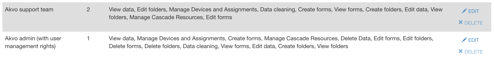
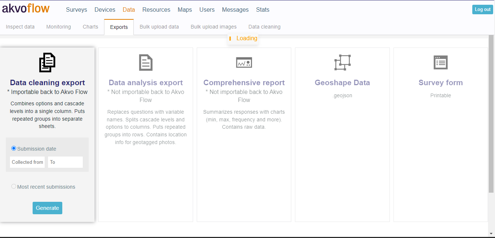
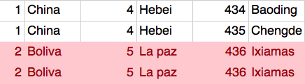
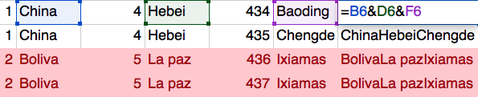
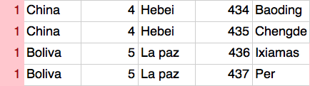

## In what languages is Akvo Flow available?
Flow's online space is available in these languages: **English, Spanish, French, Portuguese, Bahasa Indonesia and Vietnamese**.

The Flow app is available in multiple languages as well. We currently provide these languages: **Bahasa Indonesia, English, Spanish, French, Hindi, Khmer, Portuguese, Dutch, Vietnamese and Nepali**. 

Furthermore, Flow allows users to enter alternate translations for surveys on the online space, and then make those available on the Flow app. This allows data collectors in the field to conduct surveys in their local language. There are 183 languages available in the language list and many languages with a non-Roman alphabet or ones reading anything other than left-to-right work as well. However, we do not guarantee that all languages will work on the Flow app as they require a special character set and support on the device. Please contact Akvo to learn more about this and you can read more information [here](forms.md) on how to translate your survey.

## We work in remote locations. Will Akvo Flow work for us, if we have bad or no internet connection?
Akvo Flow consists of two main components: the online workspace that runs on your browser and an Android app.

As with any web-based application, you need to connect to the internet to use Flow's online workspace. Since most of our users work in places with slow connection, but still want to collect a lot of data using large surveys and having a seamless and fast experience, we continuously improve Flow to load quickly, even if your internet connection is not the best. If you can open and use other pages, like your favourite news provider, social media app or your email, then you can also use Flow. 

Our Flow app supports full offline data collection. You can add your Flow survey to the app, capture an unlimited amount of data, and share the collected data fully offline. For more details, [check this article](collection.md). 

## How does Akvo ensure data security?
At Akvo, supporting you and your data journey is our top priority. So when you choose to share any data or information with us or use our products, we commit to keeping it safe and secure. Akvo has strong data security and privacy protection policies, frameworks, and procedures in place. In this article we share a short overview of these policies and the key points around how we ensure data privacy and security. 

### Policies and Terms  
Akvo's general terms and conditions, Data processing agreement and specific product Services and Support Terms and Conditions, Terms of use and Data privacy policies can all be found openly available on our [website](http://akvo.org/help/akvo-policies-and-terms-2/).  

We also actively work on ensuring compliance with the [General Data Protection Regulation](http://akvo.org/help/akvo-policies-and-terms-2/gdpr/), a new European law aimed at further securing the protection of personal data. 

### You own your data 
Your survey data is owned by you. Not only that, but the Akvo Foundation treats your surveys as if they were private (except if you have selected to add the surveys to the Akvo Flow’s public map) and we act merely as a custodian of your data. You retain full ownership to your data and content. Akvo does not claim any ownership to it. You can download your data at any time accessing the online workspace or extracting your data via Flow's read API. 

We don’t sell them to anyone and we don’t use the survey responses you collect for purposes unrelated to you or our services, except in a limited set of circumstances (e.g. if we are compelled by a subpoena, or if you’ve given us permission to do so).

Akvo Flow Users conduct thousands of surveys each day using our services. We host the surveys on our websites and collect the responses that you submit to the survey creator. If you have any questions about a survey you are taking, please contact the survey creator directly as The Akvo Foundation is not responsible for the content of that survey or your responses to it. The survey creator is usually the organisation that invited you to take the survey and sometimes they have their own privacy policy. If you think a survey violates our Terms of Service or may be engaging in illegal activity, report it to privacy@akvo.org.

For more details on how we handle your personal data check this article.

### Data privacy and security 
We safeguard collected ted and the Akvo Foundation acts as a mere custodian of that data. For more details on how we handle your personal data check this article.

All communication between various parts of the Flow system are carried out over a secure connection and are encrypted. We use Secure Socket Layer (SSL) encryption protocol in all such communication.

Partners only have access to their own the Flow instance. Access to the instance is password protected. We encourage you to create strong passwords. Different user roles and permissions allow you to determine which users have access to which functionalities and information on the Flow online workspace. 

We create separate product instances for each partner. The way each Flow instance is created ensures that data submitted with a device, connected to this instance, can only be accessed in this instance's online space. In other words, it is not possible for a user in one Flow's instance to access data of another one.

Akvo takes all reasonable precautions against system security breaches, but there are cases of data security breaches occurring in even the most secure systems in the world. As a consequence, Akvo holds the right not to work with partners where it feels publication of data could lead to very significant impacts.

### Data deletion
Only users with the given deletion permission can delete data. Data deletion on the your Flow instance is accompanied with warning pop ups and only one form submission can be deleted at a time. This decreases the risk of unintentional mistakes and data loss. However, once data is deleted from your Flow instance it cannot be retrieved. We advise you to limit the users you give the data deletion permission and to ensure you back up your data regularly.

Akvo staff supporting you in using our tools does not delete your data (or survey forms, assignments, device groups, users, etc) without your written consent. 

### Data storage
Akvo tools makes use of cloud-based software and storage. Cloud-based software and storage has multiple advantages. Costs for storage are reduced, security levels are increased, data can be encrypted (during transmission and at rest), and back-ups can be automated and kept safe. Cloud-based systems enable users to access their account from multiple locations and multiple devices, such as computers, tablets and phones over the Internet.

Flow uses cloud services provided by [Google (Google App Engine)](http://cloud.google.com/security/) for software execution, where we run the data exports and for data retention, [Amazon (Amazon S3)](http://aws.amazon.com/security/) for pictures, data exports and data backups. They are amongst the most used and best known service providers globally, are ISO certified and comply with US and EU regulations. The serves used are EU held. Moreover, these organisations provide round-the-clock security maintenance and essential upgrades for the best level of security. In addition, we do regular database backups to protect against any eventuality. We backup all your data once a week and each back up older than 3 months is automatically deleted. 

We store your data in a private folder on your devices when using the Flow app (version 2.5.0 and newer). This folder is not accessible by connecting your device to a computer or browsing the files via the My files app on your Android device. Furthermore, if you delete data from your Flow app or uninstall the app, all the data will also be removed from your device automatically.   

If you are interested in storing your data locally, you can use our data export options or read API to do so to get your data out of Flow and store these copies of the data securely on a local server.

The regulations around storing data in the cloud are in many countries still under development. Some countries demand that data that is related to ‘national security’ should be stored inside the country. Akvo has a policy in place not to work with partners on initiatives that aim to collect data that relates to these matters of national security.

### Open data and data sharing – Your choice
In cases where you collect data that is not sensitive or private, we encourage you to open up data where appropriate, so it can support “the common good”. With Flow's survey setting you can set your survey to 'public'. This means that any submissions made to the survey forms will show on your Flow instance public map. Data displayed on the public map follows these open license agreements: 

- [Images [CC-BY-NC-SA]](http://creativecommons.org/licenses/by-nc-sa/3.0/)
- [Data [CC-BY-SA]](http://creativecommons.org/licenses/by-sa/3.0/)
- [Open Database License 1.0](http://opendatacommons.org/licenses/odbl/1.0/)

Via our API you can connect to open data sharing portals. Open data sharing can benefit the development sector and the general public at large. It encourages active use of valuable data, enables more connections and collaboration between practitioners and supports better decision-making by all. Akvo has a close collaboration with WPDx and you can share your data on their portal easily using Flow's API. If you are interested in sharing your data, contact us for more details.

## How does Akvo Flow handle my personal data?
Below you can find some key points around our privacy policy and how we handle your personal data. Akvo Flow is [GDPR compliant](http://akvo.org/help/akvo-policies-and-terms-2/gdpr/) and continues to support you on following data protection regulations in the countries you capture data and implement the principles of responsible data management in your data collection projects. 

For our full Akvo Flow Privacy Policy please go [here](https://akvo.org/akvo-flow-privacy-policy/). 

### If you are an Akvo Flow user:
- **Your survey data is owned by you**. Not only that, but the Akvo Foundation treats your surveys as if they were private (except if you have selected to add the surveys to the Akvo Flow’s public map). We don’t sell them to anyone and we don’t use the survey responses you collect for purposes unrelated to you or our services, except in a limited set of circumstances (e.g. if we are compelled by a subpoena, or if you’ve given us permission to do so).
- **We safeguard collected data**. The Akvo Foundation acts as a mere custodian of that data.
- **We hold your data securely**. Read our Security Statement for more information.
- **Survey data is stored on servers located in the European Union**. The Akvo Foundation will process your survey data on your behalf and under your instructions (including the ones agreed to in this privacy policy).
- **Accessing and correcting your personal data**. You have the right to access and correct the personal information that the Akvo Foundation holds about you. This right may be exercised by contacting gdpr@akvo.org.

### If you answer surveys:
- **Surveys are administered by Akvo Flow Users**. Akvo Flow Users conduct thousands of surveys each day using our services. We host the surveys on our websites and collect the responses that you submit to the survey creator. If you have any questions about a survey you are taking, please contact the survey creator directly as The Akvo Foundation is not responsible for the content of that survey or your responses to it. The survey creator is usually the organisation that invited you to take the survey and sometimes they have their own privacy policy.
- **Are your responses anonymous?** This depends on how the survey was created.  Contact the survey creator to find out.
- **We don’t sell your responses to third parties**. The Akvo Foundation doesn’t sell or share your survey responses with third party advertisers or marketers (although the survey creator might, so check with them). The Akvo Foundation merely acts as a custodian on behalf of the survey creator who controls your data, except as further described in this privacy policy with regard to surveys added to Akvo Flow’s public map.
- If you think a survey violates our Terms of Service or may be engaging in illegal activity, report it to privacy@akvo.org.

## What access does Akvo staff have to my Flow instance?
From April 2018 we updated our policy on how Akvo staff accesses Flow partner instances. This policy is based on the following principles: 

- **Minimise access**: Akvo staff has access to your Flow instance to support you in your work, to further develop Flow or to work together with you on collaborative projects. We ensure that, if we have access to your instance then it is for a specific reason. Once an Akvo staff member does not need to access it anymore, we have mechanisms in place to ensure her removal. 
- **Transparency**: In the User list on your Flow instance you can see who has access to what and what level of permissions. This applies also to Akvo staff who are visible in your user list. 
- **You are in control**: You are the owner of a Flow instance and of the data captured with Flow. We are here to help and support you on your data journey. Thus if you feel Akvo staff should not have a certain level of access or should have no access at all, you are free to remove us from the instance.
This policy follows our [Akvo privacy policy and data handling policy](http://akvo.org/help/akvo-policies-and-terms-2/akvo-privacy-policy/) and [Akvo Flow terms of use](http://akvo.org/help/akvo-policies-and-terms-2/akvo-flow-terms-of-use/). We are also actively working on ensuring compliance with the [General Data Protection Regulation](http://akvo.org/help/akvo-policies-and-terms-2/gdpr/), a new European law aimed at further securing the protection of personal data. 

### Akvo staff access 
All Akvo staff access your instance with their akvo.org email account. We are clearly marked by 'Akvo - [name]'. We have three levels of access to your Flow instance:

- **Akvo support team** - our support team has limited access to your instance (no delete permissions and no user management rights) to be able to respond to your questions and requests. 
- **Akvo admin** - your account manager has full access to your instance to support you in using the tool, collaborate on projects and be to any assistance you need. 
- **Akvo development team** - our development team has access to your instance from the 'back door' to be able to further maintain, develop, and keep the software up and running. You will not see the Akvo development team members in your user list. 

Your instance will always have the Akvo admin assigned to your instance and this person is your Akvo contact person. You will also have some Akvo support team members assigned to your instance to be able to quickly support you in using Flow. 

### Managing Akvo staff access 
You have the full right to remove any Akvo staff members from your instance at any time.

Furthermore, the Akvo admin is the one responsible for the access of other Akvo staff members to your instance. She can add other Akvo staff users to your instance, only if you agree to it. Furthermore, the user access will only be given to the survey and data needed to perform the task we agreed on and the role will only hold the permissions needed for this task. She will make sure to remove the staff user from the instance once the task is completed. 

If a Akvo staff member should no longer have access to your instance due to termination of contract with Akvo, we immediately remove her or his access to your instance. 

## Akvo Flow Policies and Terms
Here is a list of Policies we have for Akvo Flow: 

- [Akvo Flow General Terms and Conditions](http://akvo.org/help/akvo-policies-and-terms-2/akvo-general-terms-and-conditions/exhibit-a-akvo-flow-services-and-support-terms-and-conditions/)
- [Akvo Flow Terms of Use](http://akvo.org/help/akvo-policies-and-terms-2/akvo-flow-terms-of-use/)
- [Akvo Flow Privacy Policy](https://akvo.org/akvo-flow-privacy-policy/)
- [Akvo Data Processing Agreement](http://akvo.org/help/akvo-policies-and-terms-2/akvo-data-processing-agreement/) 
- [Akvo Flow API code of conduct](http://akvo.org/help/api-code-of-conduct/)
- [Akvo staff access to your Flow instance](http://flowsupport.akvo.org/article/show/56607-what-access-does-akvo-staff-have-to-my-flow-instance)

For more Akvo policies go to [Akvo Policies and Terms](http://akvo.org/help/akvo-policies-and-terms-2/) on our website. 

## How can I verify my account?
Have you signed up to our tools and now when accessing them you see this page? This means you did not verify your account. To verify your account, you need to click on a the link sent to your email. 

### Did not receive the verification email?  
Check your spam inbox. The email maybe landed there. 

### I clicked on the verification link, but I still see that page when logging in.
If you signed up to our tools and only later verified your account, there is a chance the verification link expired. The link is only active for two weeks. No worries, the moment you try to login with an account that is not verified yet, we send you automatically the verification email again. 

#### To verify your account: 

1. Log in using the email and password you chose during the set up process. 
2. Now you should see the page above that tells you your account is not verified. 
3. Go to your email inbox and open the new verification email you just received. 
4. Click on the new verification link. 
5. Open Akvo Flow or Akvo Lumen again and log in.
6. Your account is now verified and you can access the to tools. 

## Can I reuse an Akvo Flow survey which I have on one Flow instance on another one?
Do you want to use a survey you have on one Akvo Flow instance on another one? Do you want to share your standardised survey with your partners to collect data on their own Akvo Flow space? Do you want to use the survey you have on our pilot Flow space on your own Akvo Flow space?

This is all possible. If you are a user on both Flow instances, our support team can copy your survey with all its forms, questions and settings for you into the other Flow space. All you need to do is send us your request via the "Contact us" on this page by selecting "I would like to use my survey on another Akvo Flow online space I have access to"

Please keep in mind, that when recreating a survey on another Flow space we do not copy over:

- translations of the original survey
- cascades that are added to the original survey

## How can I update the names of my data points?
A data point contains all the information collected for a particular something, such as a water point, school, or farmer. Some data points hold more than one form, and all the filled forms are part of the same data point.

Each data point has a name created based on answers to selected questions. The name makes it possible for you to easily identify the 'particular something'. In your Flow's online space, you can specify which questions are used to construct the data point name.

After the data is submitted many times data cleaning needs to take place, or your realise that the questions selected to build the data point name do not make it easy to identify particular points. For monitoring data collection exercises it is vital to be able to select a specific point and collect more data for it.

### How to change the name of your data point?

There are a few ways you can change the name of an already existing point:

1. In the survey definition select different questions to build the data point name
2. Edit the submitted answers via data cleaning
3. Edit the answers in the online space when viewing your submitted forms

In order to trigger the data point name change, you need to resynchronise the points on the app. After re-synchronising the points, the point name will be updated and changes also in the online space and in your reports.

It is only possible to update the data point names for monitoring surveys. For more information on [data points](data.md) check this article explaining how data points work on the Flow app.

## Can I copy a form inside the same survey?
It is not possible to copy a form inside the same survey. 

## Can I copy a question group to a different form inside the same survey?
It is not possible to copy a question group to a different form inside the same survey. 

## How can I delete a survey from my folder?
In the Akvo Flow online space to delete something such as a survey or even a folder, you need to delete from the last step that was completed.

So if you want to delete a folder you need to:

1. delete the data collected for the forms in the survey in the folder
2. delete the forms in the survey in the folder
3. delete the survey
4. delete the folder
   
In order to follow these steps you need to have the required permissions to do so.

## Why is my report not displaying the latest collected data?
Generating a (comprehensive) report is an intense task for the servers. To reduce processing tasks and data traffic we have build in a 'caching' system which basically saves the last report you generated. Great if you want to re-download it, but not if you want to have a report with the latest data points.

- To generate a report with the latest data points, in which period you collected the data. This will trigger a brand new report.
- New reports will be send to your (g)mail whereas cached reports will be downloaded right away.

## Can I delete data via data cleaning?
No, due to safety reasons this is not possible. If you would for example upload an empty Excel file back to the system this would remove all your data points.

Instead you can remove data points via the Inspect data tab.

## Can I change the privacy status of a survey?
At this moment changing the privacy status of a survey after data collection won't prevent the data points from showing on the map. If you have an urgent request to change the status of a survey please contact us with your Flow's online space, folder and surveys which you would like to change.

For more information on how to set-up a survey please have a look at creating and editing: Surveys and forms

## Is it possible to import new data into a monitoring form?
No, this is not possible at this moment. 

## Can I import data to a registration form?
Yes, you can. With Akvo Flow's Data cleaning feature you can also import new data that you have captured on paper of with another data collection tool. 

To read more on how to import data check [this](data.md) article explaining all the steps you need to take and what to keep in mind when doing so. 

## Why doesn't my cascade resource import?
Using the import function of the cascading resource can help you save great amount of time. There are some things to keep in mind though.

The file itself:

- Should be a .csv format
- Should not contain a header (so make sure you start with the actual data)
- If you are using codes, every cascade value should have it's own unique code.

#### Common mistakes

#### Cascade containing duplicates

The system will tell you that the import of the cascade has failed. Often this is caused by a duplicated value in the cascade.

If the lowest level contains an unique code it is easy to find the duplicates with Excel using the find [duplicates feature](http://www.excel-easy.com/examples/find-duplicates.html). If this is not the case, it's recommended to create another column where you merge the cascade without the codes. This way you can find the duplicates based on the last column, avoiding not finding any duplicates as the code of the lowest level might be unique.

Once you have found the duplicate and you are sure these can be removed, use the remove [duplicates feature](http://www.excel-easy.com/examples/find-duplicates.html).

#### Codes are not unique
In some cases the codes are used for different values. If you are not sure if this is set-up correct in your file, you can use the [Vlookup function](http://www.gcflearnfree.org/excel-tips/how-to-use-excels-vlookup-function). While doing this you need a sheet where all the codes per cascade value are defined.

#### The file contains header rows
Uploading the file with header rows will break the import.

For more information on this topic please have a look at the cascade resources tab.

## Why doesn't the form version change?
You have finished working on your form and now you are ready to test it out on the app and collect data. So you publish it. This means that your form is now ready to be assigned to a device. Once you hit Publish on the form, go to the Messages tab to check if the publishing is completed. 

But after working with the form on the app, you realise you need to make some changes to the form. You open it again and make your changes. At this moment the form version updates and the Publish button that was disabled is now enabled again. Once you are ready, you hit Publish again, check in the Messages tab and repeat the steps again. 

Why is my form version not updating? 
This situation happens when you made a change to the form, hit Publish and made another change to the form. So you did not leave the form page and go to the Messages tab to check if publishing was completed. In the form editor you will thus not see the form version update and the Publish button still seems enabled. 

When publishing a form in Flow, you always need to go to the Messages tab to check that the publishing is completed, before making more changes to the form or assigning it.

How can I get my form version to change and publish?
Have you made a change to the form, hit publish and made another change resulting in your form version staying the same? To make your form version update: 

Hit Publish on the form. 
Go to the Messages tab to check whether publishing was completed. 
Go back to the form and make another change to ensure your form version is not a higher number than what you have on the app. A small change can also be to add a new question and delete it. This step is to trigger the form version to update. 
Hit Publish on the form. 
Go to the Messages tab to check whether publishing was completed. 
Reopen the app to ensure the updated form version is downloaded to your form (if you have an active assignment for the form and the device). 
Why do I need the form version to update? 
Once you get the form on the app, the form is in a certain version. The app regularly checks if a new version of this assigned form is available, to ensure all the most recent changes to the form are on the app. This ensures your data is consistent as all enumerators work with the same version of the form. 

## What is the size of photos taken with the Akvo Flow app?
If you are collecting photos with your data, you can decide the size of the photo. By default we use the minimum size (320x240px). This is to ensure data upload does not fail in areas with low connectivity and the data usage is not too high.

There are three possible photo sizes to choose from: 

320x240px
640x480px
1280x960px
If you want to change the size of photos or make the images as large as possible in the Akvo Flow app: 

Open the Flow app and go to Settings in the side navigation panel 
Under Settings you will find Image size 
Click on Image size 
Select the size you prefer 

## Why are the survey forms on my phone greyed out?
With Akvo Flow you can capture data once or continuously using Flow's monitoring functionality. This means that you do not need to resubmit registration or baseline data again and again. You synchronise in already captured data to your device and submit new data to the existing data points. 

In practice this means that monitoring surveys have multiple forms. One - the registration form - that you submit once, it holds the basic information about your subject and it created the data point. For this data point you can then submit monitoring data using the different monitoring forms. 

Sometimes you do not need your enumerators to create new data points, but just to submit new monitoring data. Then you can only assign the monitoring form to the enumerator. If you want them to also capture new data points, then you need to assign also the registration form to them. 

Why is a survey form greyed out on my device? 
When monitoring in Flow there are a few rules to remember: 

A registration form can only be filled in once. It creates a new data point. Once the registration form is filled in, for this new data point you can now only submit data to monitoring forms. 
Every time you hit the 'plus' icon in the app you will see the registration form enabled and the monitoring forms greyed out. 
If you select an existing data point, the registration form cannot be submitted anymore, thus it is greyed out, but the monitoring forms are available for data collection. 
If you have only assigned monitoring forms to your device (not the registration form), and you then hit the plus icon, the monitoring form will be greyed out and you cannot open it for data collection. This is because you can only submit monitoring form data to an existing data point. Select a data point and now your monitoring form will be ready for data collection. 

For more details on how monitoring works on the Flow app, check this article. 

## How do I ensure that my surveys have been properly submitted to my Flow online space?
The data points status indicates if your answers have been saved and still need to be submitted, submitted but not uploaded to Flow's database yet, or are successfully uploaded. 

If you have just connected your device to the internet and want to ensure your submissions get uploaded to your Flow online workspace in the top right menu select Upload. This action will force Flow to start uploading your submissions for the survey. Please note that you need to be connected to the internet to upload submissions. 

## How do I check that enough memory is available on my phone to carry out surveys ?
Open the Akvo Flow app and tap on Settings-Check SD Card State.This will show the amount of free space available on your phone to conduct surveys (in MB).
If the value displayed is less than 100 MB, then please contact your manager to clean up your phones. Do remember that conducting surveys without sufficient memory will lead to loss of survey data which is NOT recoverable.

## How do I re-send data to the Flow online space?
Are your submitted data points still in the orange - exported - status? 

In the top right menu select upload. This will start the upload of the submissions for that survey. 

If you have captured data for more than one survey offline open the main menu go to Settings. Select Upload all submitted data points to Flow instance. You need to be connected to the internet for the submitted forms to sync. 

## I’m not getting a GPS fix. What should i do ?
Ensure that the GPS is turned on
Ensure that you are in an open area and NOT inside a building
Open the GPS Status app
Keep the device static and DO NOT move around with it. If possible away from reflecting surfaces such as walls
Monitor the status of the GPS data being received by the device in the GPS status app.
If you still do not get a fix after 15-20 mins, re-locate to a different spot a few meters away and try again
Note that in Akvo Flow App, the accuracy limit in the GPS question is gone. Therefore one can capture and submit geolocation even after surpassing the accuracy of 20M.

## My device does not show in the Device list. What should I do?
After you install the Flow app to your phone or tablet and fill in your user name and device ID, you will see your device in the list of Devices on your Flow online workspace. Now you can assign surveys to your device to capture data. But what to do when your device is not showing up in the list? 

There can be a few reasons why your device is not showing up in the list: 

Are you connected to Wifi? Then...

Check that your network connection is working. 
Force close the Flow appby pressing and holding the button with two rectangles on the bottom left of the tablet. This will open all apps currently running on the tablet. You can either swipe the app you want to close to one side, or you can press ‘Close all’. 
Open the Flow app again. This triggers the app to re-connect with your Flow instance again. 
Reopen the list of devices and now you should see your device on the top of the list.  
Are you using mobile data? Then...

Check that your network connection is working. 
Open the Flow app and in Settings check if you have Enable mobile data turned off. This Setting is turned off by default when you install the app to make sure you do not unintentionally use your mobile data when working with Flow. Enable mobile data in Flow.  
Force close the app and reopen it again. 
Reopen the list of devices and not you should see your device on top of the list. 

## How do I turn on translations for the survey?
Tap on the concerned survey and then tap on the Menu Button (Located on the top right of the screen).
Tap on Languages , which will open up the Survey Languages popup.
Select the checkbox next to the language that you want the survey to be displayed in.
Tap OK.
Please have a look at the managing translations article for more information.

## What do I do if the survey does not get downloaded?
Check that you are connected to an internet network. On your Flow online space at the devices list, you can see when the device made it's last connection.
Check that you are not getting any notification that the survey is unpublished
Make sure the assignment is set-up correct and is not expired

## My phone does not allow installations from unknown sources
To install the Akvo Flow app you will have to navigate with the browser on your phone to the the name of your dasboard (ask your Akvo contact person) and add "/app2" after the url. This will directly start downloading the file.

By default phones do not allow installation of files coming from outside the app store.

To allow installation of apps obtained from unknown sources press "settings". This will open the following screen.

After allowing unknown sources you can install the Flow application. Note, in the future you will have to leave this setting activated. By disabling the Flow app will not function as expected.

## Why is my submissions showing unnamed data point?
When creating your survey form you can specify which question answers will be used to create the data point name. If you do not select any question "Use as data point name" then your data points will be unnammed in your list. It is especially useful to name your data points if you want to collect more data for the point when monitoring.

## I cannot update my Flow app
Are you unable to update your Flow app? This article is for users using devices with Android 7.0 and newer and are now running Flow app version 2.7.1. In this version of the Flow app we found a bug that does not allow you to update the app because of a new way how Android handles file permissions on devices with Android 7.0 and newer. This is now resolved in the newer versions of Flow, but in order to update your Flow app, you need to follow the steps below: 

If you are using an older Android device or you are using a different version of the Flow app, you are connected to the Internet, you should be able to update your Flow app without any issues. If you still cannot update your Flow app, please contact us.

How to update your Flow app and fix the problem
If you are using a device with Android 7.0 and newer and are now running Flow app version 2.7.1 to update your Flow app follow these steps: 

Open the browser on the device. The browser app might be called Internet or Browser, or it could otherwise be an specific browser name (i.e. Chrome, Firefox, etc)
In the browser address bar, type the address of your Flow online space, and add ‘/app2’. For example, if your organisation is called ‘care’, this would usually be ‘care.akvoflow.org/app2’. 
Follow the instructions to download the app. This will update your current Flow app. 

When installing the new app version you may see the following message. Press settings and check "Allow from this source". Press back and press "install" again. This time the app update will install correctly.

Do I need to do this now every time I want to update my Flow app? 
No. Once you use Flow app version 2.7.2.1 and newer the issue is resolved and you can update your Flow app just by clicking 'Install' when you see there is a new version available. Read more here.

## How to make sure geotagging of photos will work
Photos collected with Akvo Flow can hold the location information of where the photo was taken. This is called 'geotagged'. Having your photos geotagged helps you to confirm where the photos were taken, to ensure that the collected data is of desired quality.

However, in some cases, this information will be missing from the photo. In this guide, we will guide you through making sure everything is set up to have the images geotagged. There still may be a case where you will not get a geotag in some cases where the location is just not available at that moment.

How to make sure geotagging will work
The Flow app reads the image geolocation that comes in the Exif tags. In some cases, this information will be missing. Either it is not provided by the Camera app or capturing the location is just not available at that moment. 

So the first thing to check is that your device reads your location. You can do so by opening any maps app to see if your location shows correctly. 

Now, here are things to check to make sure your photos will get geotagged: 

1) Enable device location
Got to: Settings > Location. Make sure ‘Use Location’ is enabled.

2) Enable location permissions for the Camera app
For the camera app to be able to access your location, you need to make sure you grant the camera app the permissions. Go to Settings > Apps > Camera > Permissions. Make sure location is allowed. This is only valid for phones starting with Android 6.0.

3) Enable the geotagging of images in the camera app
The next step is to turn on the Save location option in the Camera app. 

4) Check it works 
Try taking a picture with the camera app and see if the location is available, open the picture and see the details, like time and date as well as location. 

Here is a link with more information on image location by Google.

## How can I change my repeated question group rows to columns?
You can exported your dataset and see that answers to the repeated question group are exported in separate rows for each repetition. But what to do if you prefer to have them in separate columns? 

The following steps allow you to merge repeat group data (which is in separate rows) as columns in the data sheet. To follow these steps we assume you have exported the data using the Data cleaning export and that you are familiar with using VLOOKUP formula in your preferred spreadsheet software. 

Create unique IDs for each repetition
The broad idea is to generate a unique ID for each row in the repeat group sheet that can be easily “formulated” in the data sheet. In your repeated group sheet: 

Create a new column (preferably after the meta data columns), with the name ‘new-repeat-ID’
Use the concatenate formula with identifier column and repeat number column to generate unique IDs for each row.[=concatenate(A3,”-”,B3)]. So the new repeat ID could look like [xxxx-xxxx-xxxx-1 or xxxx-xxxx-xxxx-2]
Add columns in the raw data sheet
In the raw data sheet create new columns at the end of the sheet. Total number of columns added should be equal to [max number of repeat groups x (number of questions in repeat group + 1)]

for example: if maximum number of repeat groups is 3, and each repeat group has 2 questions, then you have to add 3x(2+1) = 9 columns
If you have a question that has an ‘other’ option then you will need to add 1 extra column for each repeat group
Taking the example of max 3 repeat groups and 2 questions each, name your new columns in the following manner:

Column 1 name: 1-repeat-id
Column 2 name: 1-question1-name
Column 3 name: 1-question2-name
Column 4 name: 2-repeat-id
Column 5 name: 2-question1-name
Column 6 name: 2-question2-name
…. And so on….

Generate same IDs in raw data sheet
Under the column ‘1-repeat-id’ use the concatenate formula with the mid formula to generate the same format of the ‘new-repeat-ID’.
``
[=concatenate(A3,”-”,MID(X$2,1,1))]
``
where column X is for ‘1-repeat-id’

VLOOKUP answers to the raw data sheet 
Now in columns ‘1-question1-name’ and ‘1-question2-name’ you can use the VLOOKUP formula with the value in ‘1-repeat-id’ as search key.

You can use the above steps for each repeat group.

## How to bulk upload data collected with Flow app 2.4.8 and older?
With Akvo Flow app you can collect data fully offline. When in the field you submit the data, that remains in the submitted state, on your device. But how do you then get it to Flow to be added to your data set? Either you connect to the Internet and the submissions sync automatically, or you bulk upload the data.

## Bulk uploading data
Have you collected data offline with Flow app version 2.4.8 or older and you want to bulk upload it to your Flow instance? Here are the steps you need to do to bulk upload your data:

**1) Connect device to your PC**
Connect the device to a computer using a USB cable. (For some devices you might need to use the MTP, Media Transfer Protocol, protocol.)

**2) Find the folder with submissions**
Open the file system of your device on your computer. Open the akvoflow folder. Here you will see the data folder. This folder hold the submitted data in separate zip files and the photos and videos submitted.

**3) Copy the data folder to your PC**
Copy the entire data folder to your computer. You do not need to open this folder and copy its files separately. Simply copy the complete data folder.

**4) Zip the data folder**
Now make a zip file out of the full data folder. This is an important step as Flow will not allow you to import a different file type than .zip. 

**5) Bulk upload the zip file**
Open your Flow instance and go to the Data tab. Here you will find the Bulk upload data tab. Drop the zip file here. Once you see a green tick next to your file, your data has been successfully uploaded to the correct form.

Please note the on your Flow instance you will see instructions in the Bulk upload data tab on how to prepare and upload data collected offline. These instructions are only for user uploading data from Flow app version 2.5.0 and newer. We highly recommend to update your Flow app to the latest available version. 

##  How to bulk upload data collected with Flow app 2.5.0 and newer?
With Akvo Flow app you can collect data fully offline. When in the field you submit the data, that remains in the submitted state, on your device. But how do you then get it to Flow to be added to your data set? Either you connect to the Internet and the submissions sync automatically, or you bulk upload the data.

With the 2.5.0 version of the app we improved how we store data on your device to a secure private folder. With the 2.5.0 version of the Flow app, we now store your data in a private folder not accessible by connecting your device to a computer or browsing the files via the My files app on your Android device. Furthermore, if you delete data from your Flow app or uninstall the app, all the data will also be removed from your device. (To read more on where we store your data, check this article.)

This change affects how you bulk upload data. In this article we first share with you the steps you need to take in detail. You can also follow the steps on your online workspace in the Bulk upload tab. Below you can also find some answers to some frequently asked questions too.  

## Bulk uploading data
Have you collected data offline and you want to bulk upload it to your Flow instance? Here are the steps you need to do to bulk upload your data:

**1) Publish the data on the app.**
To upload the submissions made offline to your Flow instance you first need to publish the data. This will make a copy of all the submitted data you have on the Flow app. This copy will be available in a public folder, that you can access via your PC. The data will be available in the public folder for only 90 minutes. Then they will be automatically removed from the public folder to ensure your data is always secure.

To publish data go to Settings on your Flow app and under the Data section hit Publish data. Now you have 90 minutes to complete the next step.

**2) Connect device to your PC**
Your submitted data is now copied over to a public folder. Connect your device to your PC with a USB cable. (For some devices you might need to use the MTP, Media Transfer Protocol, protocol.)

**3) Find the folder with submissions**
Open the file system of your device on your computer. Open the Android folder. Open the data folder. Open the org.akvo.flow folder. Open the files folder. Here you will see the published folder. This folder hold the submitted data in separate zip files and the photos and videos submitted.

**4) Copy the published folder to your PC**
Copy the entire published folder to your computer. You do not need to open this folder and copy its files separately. Simply copy the complete published folder.

**5) Zip the published folder**
Now make a zip file out of the full published folder. This is an important step as Flow will not allow you to import a different file type than .zip. 

**6) Bulk upload the zip file**
Open your Flow instance and go to the Data tab. Here you will find the Bulk upload data tab. Drop the zip file here. Once you see a green tick next to your file, your data has been successfully uploaded to the correct form.

## FAQs around bulk upload 
We've answered some of the questions we've heard most often below.

### If I copy over the entire folder, will I not get duplicated data once I upload? 
Once you hit publish, all the data that you have on your device is copied over to the published folder. Thus it holds data captured offline and not submitted yet, already submitted and synced data you have on your device, and all the photos and videos submitted. But that is ok. At upload Flow will check to which form the submissions need to be saved to and if these submissions are already synced to the data set or not. So copy over the entire folder and let Flow do the heavy lifting. 

### What happens with the published folder after the 90 minutes? 
Once the 90 minutes are over, Flow automatically deletes the published folder from the list. Submissions are saved in the private folder that is not accessible. If you need to bulk upload your data again, hit to publish. All data on your Flow app, are then again copied over to the published folder and ready for bulk upload. 

### What happens to the published folder if I delete data from the app?
When you delete data from the app, within the 90 minutes that it is available in the public folder for bulk upload, the data is also removed from the public folder. The Akvo Flow published folder will no longer appear in the folder structure.

### I published data and then made new submissions, are they also published?
No they are not.

In order to bulk upload the data you have submitted after you published, you need to publish again. If your 90 minutes period is not over yet, you simply need to wait and then publish again. Once published, all your data will again be moved to the published folder and you can copy over the folder, zip in and upload to your Flow instance.

### If I save data (not submit) will it show in the published file?
No it will not. The published folder only takes the submitted data, as it enables you to bulk upload the data to Flow. If you only have saved data on your Flow app, you will not be able to publish the data, until you complete the submissions.

### How do I delete collected data?
To delete the data collected from a device where the device id or submitter name is known, please do the following;

1. Login to your instance
2. Find the data tab
3. Select the inspect data sub-tab
4. Navigate to the folder with the data to be deleted
5. Provide the device id or submitter name in the relevant field
6. Click on 'Find'
7. The system will list datapoints associated with the device or submitter
8. Click on 'Delete' for each data point as needed