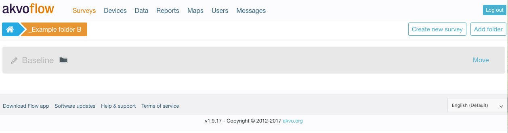

The Surveys page shows a list of all survey folders. Folders can contain other folders, just as in a regular file system on a computer. Folders can also contain a mix of surveys and folders.

c

Each folder has a name and an indication if the folder is empty (white folder icon) or contains more folders and surveys (black folder icon).

## Navigating between folders
You can enter a folder by clicking on the name. You will see the folders and surveys that live in this group. At the top, the breadcrumb navigation shows where you are in the folder hierarchy. Clicking on items in the breadcrumb will take you to that folder.

*Breadcrumb navigation*

## Creating new folders
When you are in a specific folder, you can create a new subfolder by clicking the **‘Add Folder’** button. This will create a new folder called **‘New folder’**. By clicking on the pencil icon, you can edit the name of the folder. Clicking the pencil icon again will save the change.

## Editing the folder name
By clicking on the pencil icon to the left of the folder name, you can edit the name of the folder. Clicking the pencil icon again will save the change.

*Editing the folder name*

## Moving folders
You can move a folder by clicking on ‘move’. The selected folder turns green. 

Now you can click and select any folder you want to move the "Baseline" folder to, simply by clicking on the folder name, or using the breadcrumb navigation. Once you reached the folder you want to move your selected one to, click on "Move here". 

 

The folder "Baseline" with all its content (folders and surveys) is now successfully moved to its new location in your selected folder.

## Deleting folders
A folder can be deleted by clicking on ‘delete’. A folder can only be deleted if it doesn’t contain any surveys. In fact, if a folder contains surveys, the delete icon is not shown.

