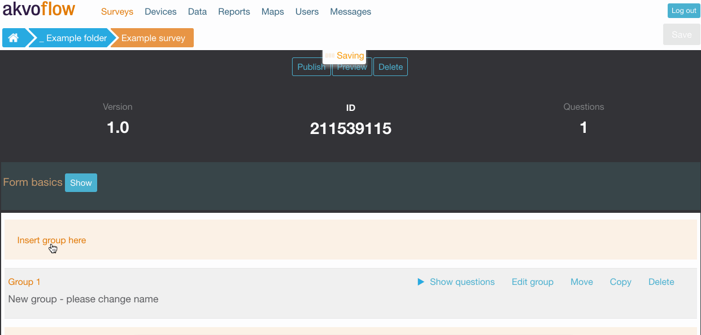
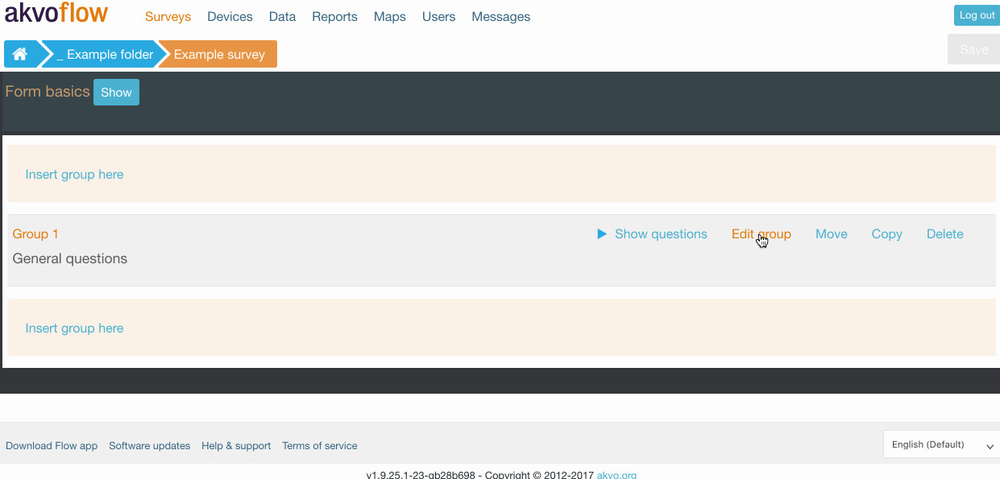
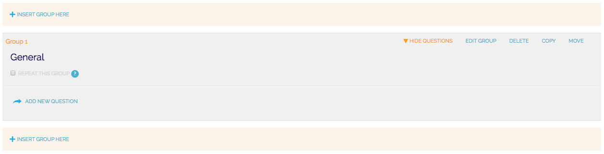
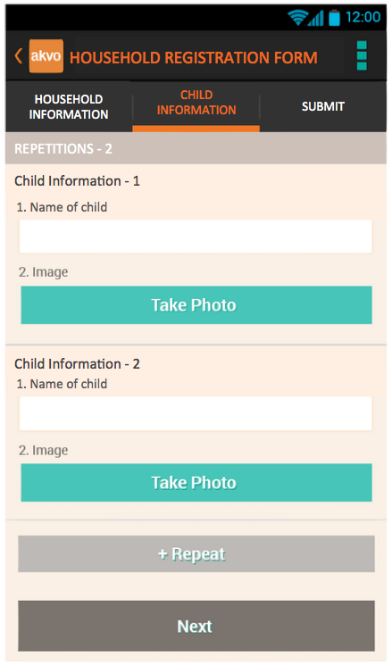
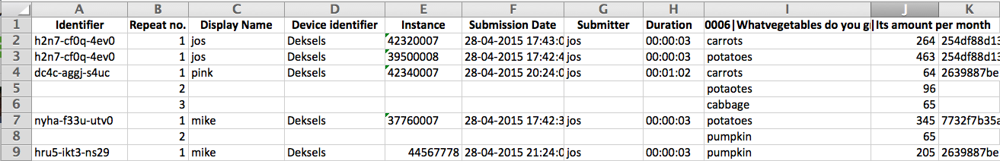
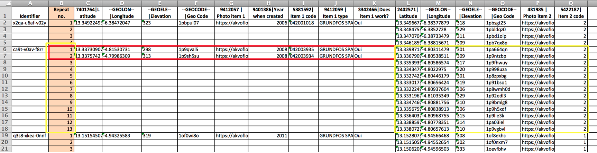
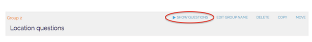

## Creating and editing question groups
A form consist of questions organised into question groups. This chapter explains how to create, edit, and delete question group.

## To add or edit a question group
To add a new question group click on '+ Insert group here'. The group number and 'New group - please change name' appears as the group title. Click **'Edit Group Name'** to change the name of the group and click Save.

## To delete a question group
To delete your question group click **‘Delete’** next to the question group. You cannot delete a question group that contains one or more survey questions.

### Next step 
The next step you want to do is to create a question in your new group. Read more [here](questions.md).

## Repeating a question group
By clicking **‘Repeat this group’** you will allow the enumerator, when collecting data in the field, to repeat this group of questions as many times as needed. This will make it possible to ask the same set of questions multiple times without needing to predefine them manually in the surveys. For example, if you want to ask the same questions to each member of a household, you will add the questions to one question group and click on the repeat option.

*The 'Repeat this group' button is shown after you click on 'Show questions' and is located under the name of the question name.*

In the app, once you reach the question group with enabled repetitions, a new button ‘+ Repeat’ automatically appears. By clicking in this button you will get a new set of questions from that question group. Once you are done collecting the data for this set of questions, click on ‘Next’ to proceed to the following question group.

*The '+ Repeat' button in the Flow app screen.*

In a raw data report, the repeated question group and the collected answers will appear as a grid. Each repetition is placed in a new row and the questions are headers in the columns. Each raw data report holds now a column called 'Repeat no.'. This column indicates if a question groups was repeated in the submitted form or not, and if so how many times was the group of questions repeated.

An example of a raw data report holding information from a repeated question group.

In this following example we were collecting data on two items and we used the two repeated question groups, one which held information on 'item 1' and the other group on 'item 2'. The 'Repeat no.' column indicates the number of repetitions for both of the groups within one form submission.

An example of a raw data report with multiple question groups repeated. The set of question with the answers in the red box was repeated only twice, where the answers in the yellow box represent the questions repeated thirteen times.

There are some limitations to repeated question groups:

- You will not be able to create a data point name from a question within a repeated question group.
- The dependency rule is limited as well. You can make a question the in the repeated group dependent on each other or on a question from another group. However, you cannot make a question depending on a question from the repeated question group.

## Moving a question group
You can rearrange the position of question groups after you’ve created them by clicking the Move button next to a survey group. This will show you a Move Group Here button in each new possible location. Click the Move Group Here button where you’d like the new position to be. The group will move to the spot you selected and all the groups will re-number.

Click the Move button next to the question group name.

Select the new position for the question group by clicking the button in the appropriate location.

The question group will move to the new position and the groups will re-number.

## Copying a question group
Click the copy button next to the group name. Paste Group Here buttons will appear in all of the available places to paste a copy of the question group. Click the Paste Group Here button where you’d like to position the question group copy, and it will copy and paste to that location. At the moment, the questions inside the question group are not copied automatically.

image of dashboardClick the Copy button next to the question group name.

image of dashboard Select the position for the copy of the question group by clicking the button in the appropriate location.

image of dashboard The question group will be copied and pasted to the selected position and the groups will re-number.

The difference between moving and copying a question group is that for a move, the question group just changes position in the survey, whereas for a copy, the group remains in its current location and a copy is pasted in the new selected location.

You can only copy a question group within the same form. You cannot copy a question group from one form and paste it into another form or survey.

## Viewing questions within a question group
Click ‘Show Questions’ next to the question group and all the questions in that group will appear below. You can only have the questions showing for one survey group at a time. Click Hide Questions to hide the questions again, or just click Show Questions for another group.
