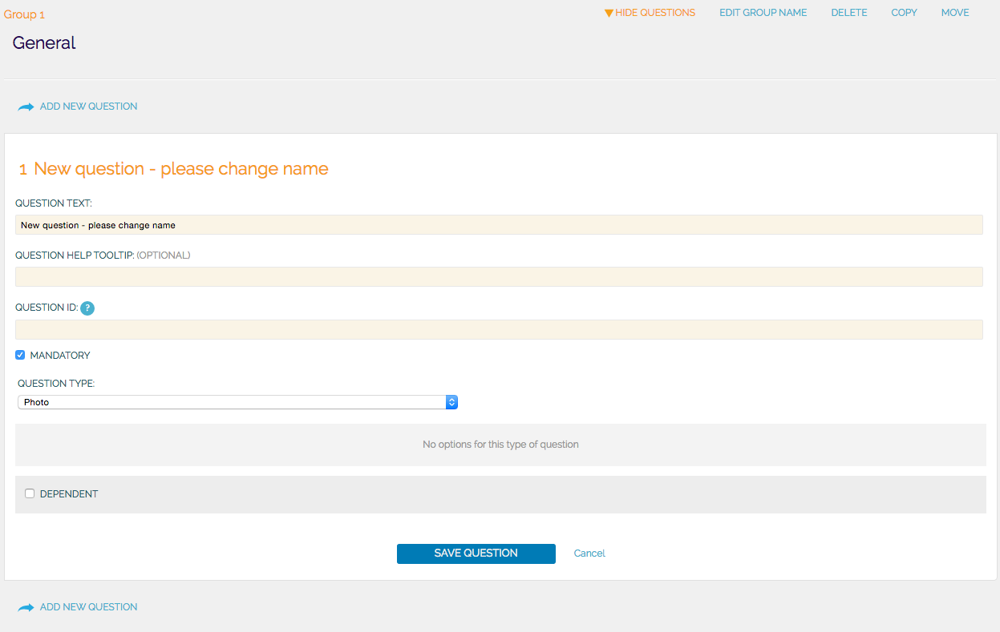
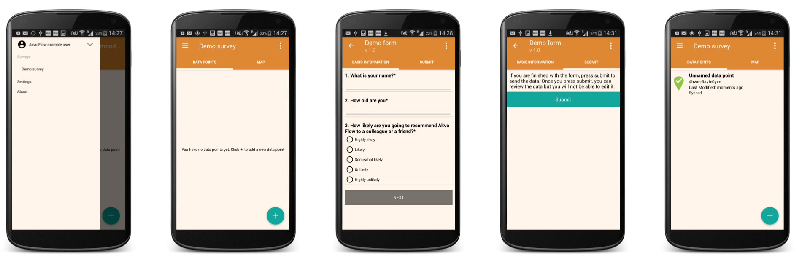

## Using Akvo Flow's online workspace
Only have a few minutes? Start using Akvo Flow to create surveys, manage app users in the field and check, clean and export captured data in 5 easy steps: 

The Akvo Flow online workspace is the web-based location where you access and manage your Flow data. All the data collected through Flow is stored and processed here. It is also where you can create and edit surveys; view, edit and export data; and manage data collection projects. Each organisation has its own URL to access its online workspace.

### 1. Log in 
To access your Akvo Flow online workspace, you need a Google account and to be a registered user. Log into our organisation's online workspace via the Log in link at the top of your Flow online workspace. 

### 2. Create surveys 
Each survey in Akvo Flow is created to capture data on a different subject. A survey can consist of one or multiple forms (monitoring surveys have multiple forms), which hold your questions that are organised into question groups. In Flow you can use different types of questions, such as free text, options, cascading options, numbers, geo-location, geographic shape, photo, video, date, barcodes, signature and water quality tests. You can also apply different rules and logic to the questions to ensure the captured data is of the best quality. 

#### To create a survey:
1. Go to the survey folder in which you want to create a new survey.
2. Click on ‘New survey’. Your new survey is shown in the folder. Now click on 'Edit'.
3. Give your survey a name and decide on its settings.
4. Add a new form to this survey.
5. Create a question group.
6. Add questions to the group. To do this, when in a question group click on ‘show questions’. Now the ‘add new question’ button appears. Don’t forget to Save the changes you make.
7. Once your survey form is ready for data collection, publish it.

### 3. Manage devices 
Your survey is now ready to be sent to your enumerators capturing data in the field. In the Devices list you can see which devices, with the Flow app, are connected to your instance. To distribute your survey to the enumerators you need to create an assignment. To give them the survey offline, use manual survey transfer. 

#### To create an assignment: 

1. Select 'New assignment' in the Assignments list page.
2. Give your assignment a name and set its start and end dates. 
3. Select which survey form you want to assign and hit 'Add selected forms'.
4. Select which devices are to receive this survey and hit 'Add selected devices'.
5. Save the assignment.  

### 4. Explore data 
Once your data is collected, you can explore it in different ways on your Flow online workspace. In the Inspect data and Monitoring pages you can view each submission made to a form. Maps shows you the data in location and explore the submitted data. Reports page gives you different options to download all the data for a form for further cleaning and analysis, or you can get a quick overview of it using the Summary report. 

### 5. Manage users 
You can add any number of users to your Flow online space. Roles and permissions describe the different levels of access a user has and are fully customisable to fit your workflow. Access can be restricted either by activity, such as creating or editing a survey, making a report, or deleting data, or by survey or survey folder. 

*Do you find this guide useful? [Download it!](pdfs/Quick%20start%20guide-online%20workspace%20(v.2018).pdf)*

## Using the Akvo Flow app
Only have a few minutes? Start using your Akvo Flow app to capture data in 5 easy steps: 

### 1. Install the Flow app 
We are excited you decided to use Akvo Flow to capture your data. Start by installing the app to your smartphone or tablet. 

1. Make sure your device allows you to download and install third party software. You can enable the setting Unknown sources in Settings > Security (or Applications).
2. Open the internet browser on your device.
3. In the browser address bar, type the address of your Flow online space, and add ‘/app2’. For example, if your organisation is called ‘care’, this would usually be ‘care.akvoflow.org/app2’. 
4. Confirm. This will download the latest version of the Flow app directly. You will see the download icon in the notification bar at the top of the screen.
5. When the download is complete, draw down the notification bar from the top of the screen and click on the notification.  
6. Click Install. Once the installation is complete you can open the app.

### 2. Sign in
Once you open the app for the first time, you need to create your user name and ID of your device. This device ID will be used to identify the device on the Flow online space when assigning surveys. 

### 3. Select survey 
To start collecting data you first you need to select a survey. Your device may have one or multiple surveys assigned to it. Each survey is created in Flow's online workspace and then assigned to devices. These are then sent to your smartphone or tablet, if you are connected to the internet. You can also always get a survey to your device offline.

To select your survey open the side navigation menu and select a survey from the list. 

### 4. Capture data 
It is time to capture data. To fill in a new form, click on the ‘+’ icon. 

If you have a non-monitoring survey, you will access the list of questions directly.

For monitoring surveys, you can either register a new data point or update an existing one to capture change over time.

To create a new data point, click on the '+'  icon. You will see a list of forms in this monitoring survey. Select the registration form to capture a new data point.

To submit data that shows change over time, you simply select the data point you want to update from your list. You will see the list of available monitoring forms and the registration form greyed out as it is already submitted for this data point. Select your form and answer the questions.  

### 5. Submit data 
Don't forget to submit your form once you have completed it.

A submitted form is locked to prevent further editing, and uploaded to the Flow server (green icon). If  you are working offline or your internet connection is slow, the form is queued in the phone (orange connectivity icon) until connectivity is restored, when the data will be sent to Flow.

You can also capture data fully offline and upload it to your Flow’s workspace using bulk upload. 

*Do you find this guide useful? [Download it!](pdfs/Quick%20start%20guide%20-%20App%20(v.2018).pdf)*

## In the field
You have your Flow app installed, surveys ready too and now it is time to go to the field and capture data. In this guide we will share some useful tips on what to do before you go, when you are in the field capturing data, and once you come back. 

### Before you go
Here are some handy questions to cross check before you head off into the field: 

- Is your batter charged? Do you need an extra battery?
- Do you have enough storage available on your device? Is your SD card properly installed?
- Do you have a GPS calibration app installed to ensure your location data is as accurate as possible?  
- Is the time and date well set on your device?
- Are you going to monitor data points? Yes. Do you have the data points synced to your device? 

### When in the field capturing data 
Once you arrive in location, calibrate your GPS. Every time you relocate to another location, we advise you run your GPS calibration app again. 

Now it is time to open your Flow app, ensure you have selected the right survey and start capturing the data. If you are collecting data online, submitted data will sync to Flow right away. You will know that your submission is fully synced by the green status icon in the data point list. If you are capturing data offline, once you submit a form it will be in the queue waiting for you to reconnect. This is indicated by the orange connectivity icon. 

### Once you come back
Welcome back. We hope you enjoyed your data collection exercise today. 

If you were capturing data online and all your submissions are successfully synced to Flow, there is nothing more you need to do, besides charging your phone if needed. 

If you were capturing data offline: 

1. Connect your device to a network. 
2. Reopen the Flow app. If you have the app open in the background of your device, make sure you fully close the app and reopen it again. 
3. Check that all your submissions are now fully synced. 

You can always use Flow's bulk upload feature to get the data out of your device and into Flow. 

*Do you find this guide useful? [Download it!](pdfs/Quick%20start%20guide%20-%20in%20the%20field%20(v.2018).pdf)*