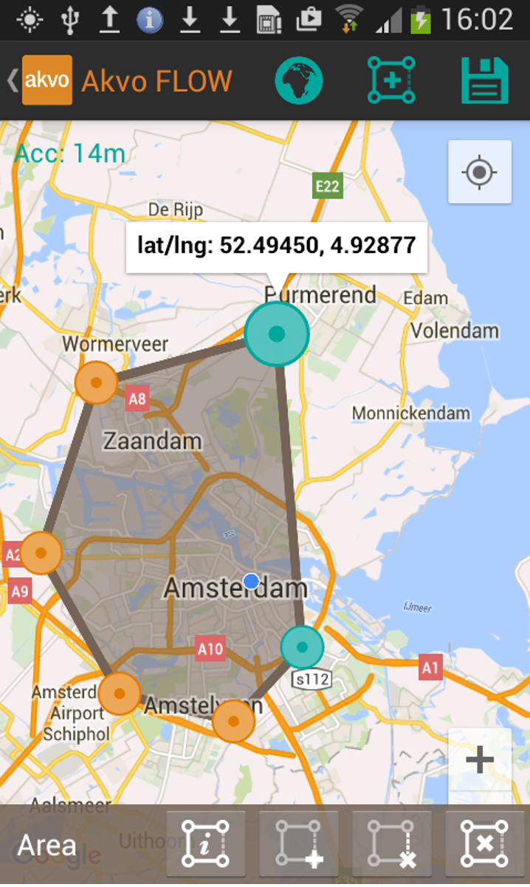
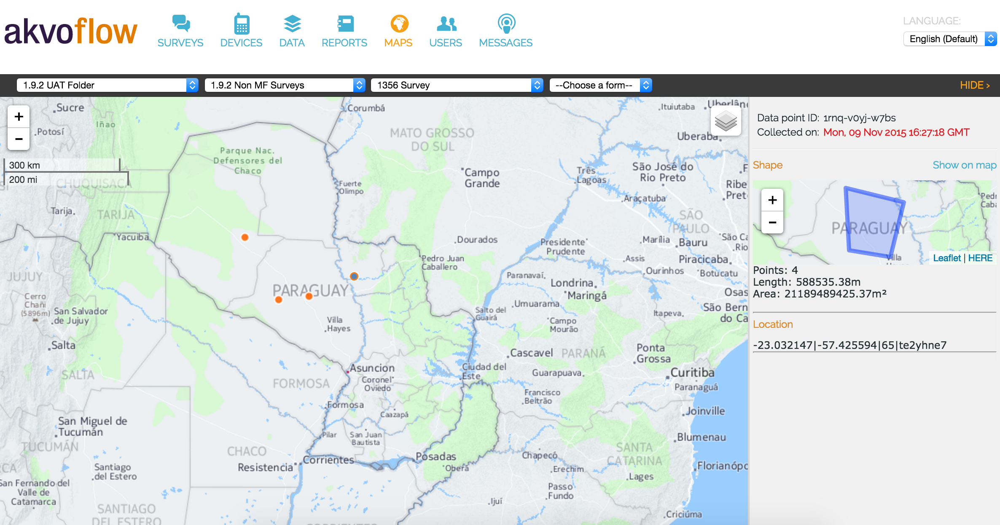
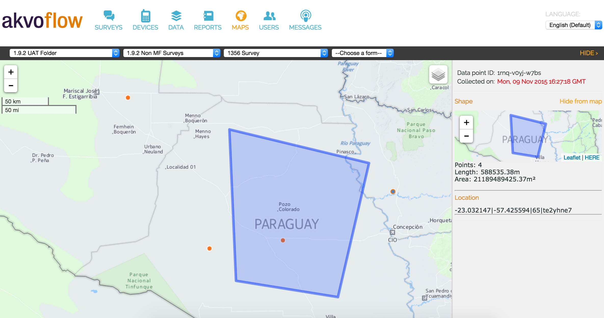
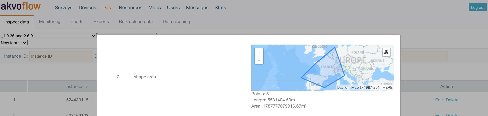
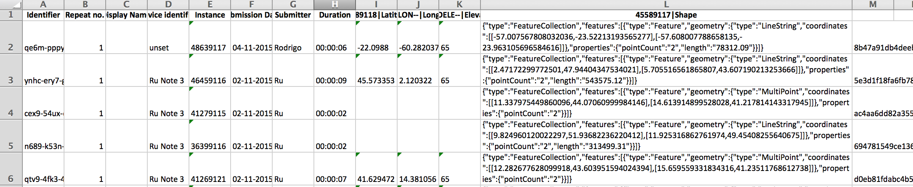
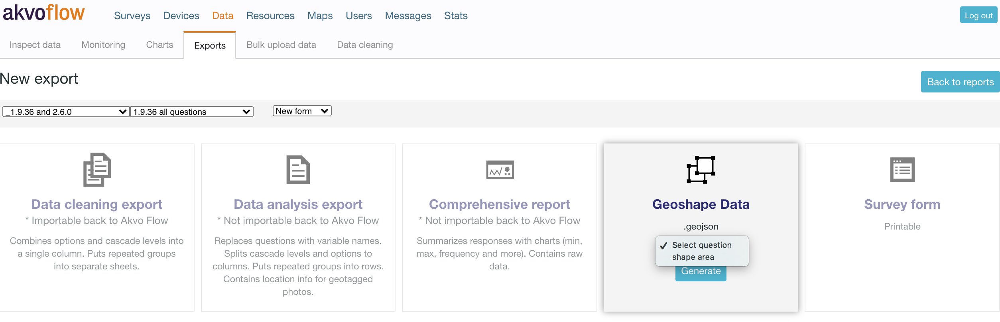

## Data on Flow map
Do you want to see where your data has been collected? Go to the Map tab in Flow, select your folder and survey and view your data points on the map. 

After you have selected the survey form, you can view your data points on the map. Clicking on the data point shows the answers submitted to it. Please note that only answered questions show in the side panel. Did you capture geographic shapes? Check them on the map. 

If you have collected data for a [monitoring survey](monitoring.md) and are viewing submissions for one of the monitoring forms by clicking on the data point you will see the last submission made to it on the map. If this data point does not have a submission for the selected monitoring form, Flow informs you in the side bar. 

The Flow map only shows datasets that hold location data and the geolocation question has the setting 'Use as data point location' enabled. 

## Geographic shapes on Flow map
With geographic shapes you can map out farm area, locations of planted trees, where the water line flows and more. In your Akvo Flow survey form you define this question type and on the device create the shape in the field. You can capture a geographic shape as an area, line, or as points. How to create a geographic shape and more information on this question type is specified here.

### In the Map tab
Each geographically referenced data is understood the best when presented on a map. Select your survey in the Flow online space under the Map tab, which holds a geographic shape. Now all data points are shown on the map. Click on the point.

A bar on the right side opens and shows you all the answers submitted under that data point. The geographic shape is shown in it on a separate small map together with the number of points, which were added to create the area, its length and size.

If you want to see the geographic shape on the main map, simply click on 'Show on map', located in the side bar. The map will zoom in if needed and the shape will be shown on the main map now as well.

To remove the shape from the main map you can either click on another data point or on 'Hide from map'. To see another geographic shape from another data point simply click on the point you want to see.

## Viewing geoshapes in Data tab
To preview a submitted form in Flow you can also use the Data options, Inspect data tab to see all your individual submissions or Monitoring tab to see submissions related to individual data points. If you have created a geographic shape you will be able to see it, when previewing your submitted forms. The geoshape shows on a individual small map with the automatically calculated information, number of points needed to create the shape, area (m2) and length (m). 

## Reports with geoshapes
Submitted geographic shapes in raw data reports appear in a string format.

*An example of a raw data report holding geographic shapes*

Now, you can export an area geographic shape as well. This is a new report type provided by Flow that solely focuses on the area geographic shape. This report makes it possible to export one geographic shape with all the collected data per form in a single geojson file. In order to create this report you need to select a question holding a geographic shape from the chosen survey. This file type can be then transformed into .klm or .shp files and opened in any geographic information system (GIS) tool.

## Photos on Flow map

If you have access to geolocation and you have geotagging of photos enabled on the camera of your phone, Flow saves the location of the photo together with the image. This information is useful when validating photos. You can then easily check where the photo was taken in relation to the location of the data point or a geographic shape. 

You can see the coordinates of the photo when viewing data in the Data tab or when exporting the dataset using the Data analysis export. 

Another place where you can see and make use of the location of photos is in Flow's Map tab. 

1. Select the survey and form and see the data points appear on the map. 
2. Select a data point and view the answers in the side panel. Fotos show directly. Please keep in mind that only answered questions show in the side panel.  
3. If the photo's location was saved, click on the link under the photo to show location on the map. 
4. A small purple square will show on the map to indicate where the photo was taken. 
5. Select to overlay a captured geoshape for the data point or all the photos to see how their locations relate to one another. 
6. Hide the photo's location from the map by clicking on the link below. 

