## Creating and editing questions and their settings
To create a new question select the question group you want it to be in and click Show Questions next to the question group. Click Add New Question or click Edit next to an existing question. Now you can see all the details of the question that you can customise to your needs. There are two settings important to each question: question text and question type.

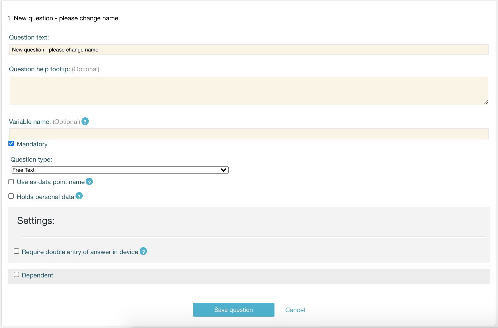

### Question text 
The question text holds the question you want your respondent to answer. The question text can contain the maximum of 500 words. There is no limitation in which language you ask the question. 

### Question type 
In Flow we support a large variety of different question types to help you create a diverse survey. These are the question types available in the Flow system: Free text, Option (select one option or select many using check boxes), Cascade, Number, Geolocation, Photo, Video, Date, Barcode, Geographic shapes, Signature and Akvo Caddisfly, to add a water and soil quality test to your Flow survey. 

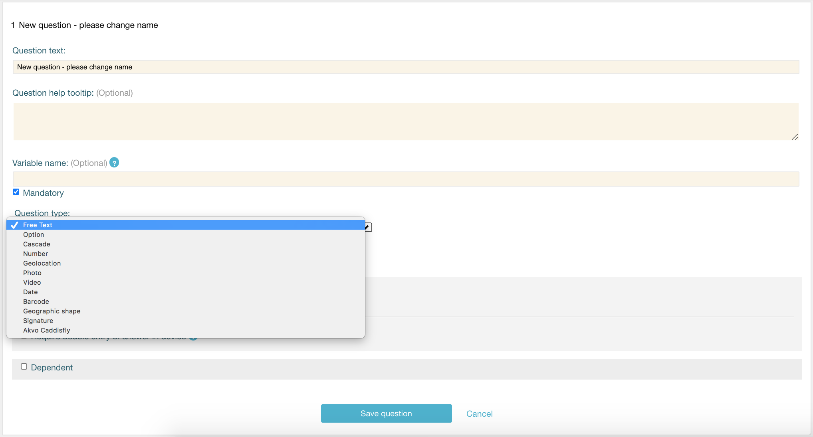

<!-- For more details on our question types check this article. -->

### Optional question settings 
You can also adjust your question using the optional settings: question help tooltip, making the question mandatory or making the question dependent on the answer to a preceding question. 

### Question help tooltip 
Sometimes you want to share some instructions about a specific question, or explain it in a bit more detail. The survey author can enter hint or tip text that’s visible through an info icon next to the question on the device. The tooltip has the limit of 1500 characters. When creating the tooltip you can expand the text box using the right lower corner. 

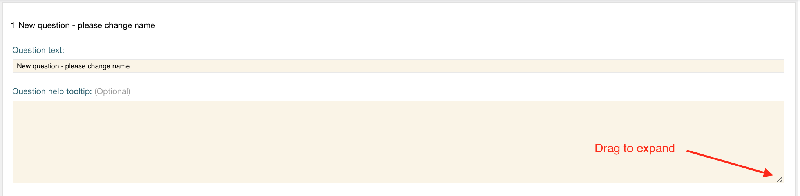

### Variable name 
Each question lives in a separate column (or more depending on the question type) in your data export. The question text is saved in the header of the column. When analysing your Flow data it can be useful to change the header of your column and give it a shorter name. This is the variable name. When exporting your data choose the Data analysis export to export your variable name instead of question text as the column headers. Each variable name can only contain letters, numbers and a few special characters (a dash and an underscore). Furthermore the variable names for a question in a survey (in all forms of the survey) must be unique.

### Mandatory 
By making a question mandatory, on the device the user won’t be able to submit the form unless they have answered it and all other mandatory questions. These are marked with an asterisk in the Flow app.  

### Holds personal data
With this flag you mark that the data collected is personal. When exporting the data with the API you can then use this flag and decide not to show the data in your end solution.

### Dependent 
Tick this box to make the current question dependent on the answer from any preceding option question in the same survey. On the device, the question will only show if the respondent has chosen the answer to the question. 

To make your question dependent: 

1. Tick the checkbox. 
2. Select which question you want this one to depend on. Note that you can only make a question dependent on option questions that come before this question in your survey form. 
3. Select the answer you want to question to depend on. You can select one or multiple answers. 
There is one more limitation to setting dependencies. You cannot make a question dependent on a question that is located in a repeated question group. 

Make this question locked when copied (available upon request) 

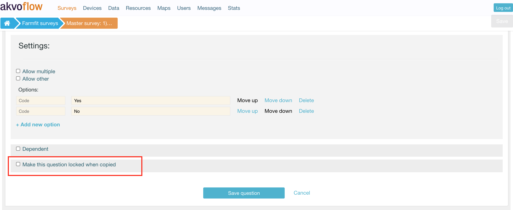

More and more we see that organisations are putting effort into understanding how their different projects contribute to their overall goals and impact. This has implications for how you design your surveys. For the organisational indicators, these questions need to be asked in a consistent way, with the same question definitions (the text, variable names, limitations, dependencies, etc) in order to be consistent on the organisational level. However, projects still need to have the flexibility to collect data they need as well.

We have a prototype feature available upon request that sets your surveys as a template. This means, that questions in this surveys can be locked. When the survey is copied, the locked questions cannot be edited. All unlocked questions can be changed. New questions and question groups can be added. Entire question groups can be deleted, even if all the questions in this group are locked. You can lock one question, or lock them all depending on your needs.

Are you interested in using this feature? Contact us and we can discuss possibilities. 

## Question types
These are the question types available in the Flow system:

**Free text** - shows the user a text box on the device to fill in the answer, with no specific format. Text can be letters, numbers and symbols, and appears in the data views and reports exactly as it was typed into the device.

**Option** - create a set of preset options for the device user to select from on the device when answering the question. Option questions can be single answer or multiple answers. The survey author can elect to allow ‘other’ responses, which on the device presents a free text field for entering any other response outside the preset options. Option questions will have frequency analysis performed on them in data analysis.

**Cascade** - a cascade question uses a user-defined hierarchy of options in order to display multiple dropdowns on the device. Determining a location is a good example: in a first dropdown question you choose the region, and then in the next dropdown, you can choose from the districts in that region, and so on. The user selects a pre-created cascade from the ‘Choose cascade resource’ dropdown menu.

**Number** - allows only numbers to be typed into the answer entry field on the device. Number questions will have basic statistical analysis performed on them in data analysis.

**Geolocation** - uses the device’s GPS to automatically fill in latitude, longitude and elevation. Click the Check Geo Location button to fill in these questions on the device.

**Photo and Video** - presents the option to take a photo or video as part of the survey. Click the Take Photo or Take Video buttons on the device to access the device camera.

**Date** - presents a date picker on the device for the device user to select a date.

**Barcode** - with the Barcode question you can scan a barcode or a QR code as part of your Flow form. Install a scanner app on your device and Flow will connect to it once you reach the question in the Flow app.

**Geographic shape** - allows the user to define points, lines or areas on a map. This can for example be used to capture geographic features of interest such a group of water taps, walking paths, farmer plots, or protected woodland areas.

**Signature** - with this question you can add a signature field to your form, which holds both the signature and the name of the signatory. For more information check the guide of how to use signatures of Akvo Flow

**Akvo Caddisfly** - Akvo Caddisfly enables you to add a water quality test to your Flow survey. You can choose from a list of parameters that you want to measure. For more information check the guides on what [Akvo Caddisfly](caddisfly.md) is and how to use it as part of your Flow survey. 

Some question types also offer additional settings to fill out, which change the behaviour of the question on the device. These are explained in more detail for each individual question type. 

## Free text question
Free text question types shows the user a text box on the device to fill in the answer, with no specific format. Text can be letters, numbers and symbols, and appears in the data views and reports exactly as it was typed into the device. There is no limitation to the size on answers for this question type.

### Free text question settings

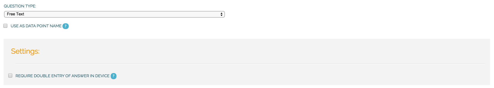

### Use as data point name 
Each datapoint you create on the Flow app is given a name. The name is determined by questions that have this option set. If multiple questions have this option set, the answers to those questions are combined in a single name, separated by a dash (‘-‘). In this way, you can give data points names that identify what you have surveyed, so they are easy to find back in the list of data points.

### Require double entry of answer in device 
This can be used to force the user to type the answer to the question twice, which can be used as data verification. This can be useful for items such as telephone numbers, email addresses, or identification numbers, which are easy to type wrong.

## Number question
Number question type allows only numbers to be typed into the answer entry field on the device. Number questions will have basic statistical analysis performed on them in data analysis.

### Number question settings
For number questions, there are a few additional settings you can enable. All of these settings are optional.

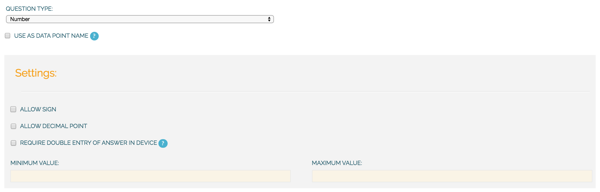

### Use as data point name
Each datapoint you create on the Flow app is given a name. The name is determined by questions that have this option set. If multiple questions have this option set, the answers to those questions are combined in a single name, separated by a dash (‘-‘). In this way, you can give data points names that identify what you have surveyed, so they are easy to find back in the list of data points.

### Allow sign and Allow decimal point 
By default, device users cannot enter a positive or negative sign or decimal point for number question responses. You can choose to allow device users to enter numbers with signs and/or enter numbers with decimal points by ticking the boxes next to “Allow sign” and/or “Allow decimal point”.

### Require double entry of answer in device
This can be used to force the user to type the answer to the question twice, which can be used as data verification. This can be useful for items such as telephone numbers, or identification numbers, which are easy to type wrong.

### Minimum and Maximum value 
You can also set minimum and/or maximum values for the numbers that the device user can enter. This will prevent them from being able to submit responses outside the specified range.

## Option question
Create a set of preset options for the device user to select from on the device when answering the question. Option questions can be single answer or multiple answers. The survey author can elect to allow ‘other’ responses, which on the device presents a free text field for entering any other response outside the preset options. Option questions will have frequency analysis performed on them in data analysis.

### Option question settings
An option question offers three additional settings. For option questions, you can enter options in the text box that appears below. For each option you can also create a code, which is not mandatory. This is entered in the first text box. The second box is where you type in your option name.

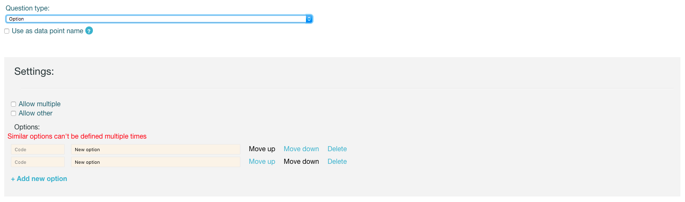

### Allow multiple 
On the device, the default behaviour for option questions is that the device user can only select one answer. You can allow device users to select multiple responses to a question by ticking the box next to “Allow multiple”. 

### Allow other 
You can allow device users to enter a free text (‘Other’) answer on the device by ticking the box next to “Allow other”.

### Working with codes (optional)
Each option field can have a codes as well. You can add the code to each option by entering it in the first text box (before the option itself). The codes are not mandatory, so you can also create options without codes. However, once you add a code to one option, you must add them to all your options. If you have selected 'Allow other' the code is pre-defined as 'other'.

Once you have collected your data, the answer will hold the option name as well as the code. These codes are, however, not shown in the Data tab when previewing data. You can only see the codes in the raw data reports. This is because the main use of codes is it simplify analysing the data.

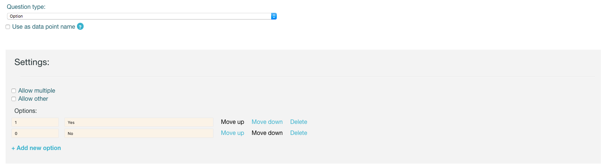

### Use as data point name
Each datapoint you create on the Flow app is given a name. The name is determined by questions that have this option set. If multiple questions have this option set, the answers to those questions are combined in a single name, separated by a dash (‘-‘). In this way, you can give data points names that identify what you have surveyed, so they are easy to find back in the list of data points.

## Cascade question
In a survey, sometimes an answer to one question determines what options are shown in the the following question and so on. Or you might have a question that is shown based on selected answers to multiple previous questions. 

We call these cascading questions, as the effect of how a choice on the first question cascades into the next questions. Cascades can thus be understood as a combination of multiple linked closed questions with predefined options.

In Akvo Flow the cascade questions are based on a cascade resource. Once you create the cascade resource you can reuse it limitlessly in any number of cascade questions in any survey. Creating one cascade resource allows you to use one resource multiple times without having to duplicate the work. You can manage your cascades in the Resources tab. 

Capturing location is one of the many ways you can use the cascades. You can create a scoring chain using cascades, transform tabular questions into cascades and more. To see more examples check these tutorials. 

### Cascade question settings
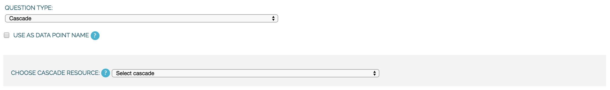

### Use as data point name
Each datapoint you create on the Flow app is given a name. The name is determined by questions that have this option set. If multiple questions have this option set, the answers to those questions are combined in a single name, separated by a dash (‘-‘). In this way, you can give data points names that identify what you have surveyed, so they are easy to find back in the list of data points.

## Geolocation question
Geolocation question type uses the device’s GPS to automatically fill in latitude, longitude and elevation. Click the Check Geo Location button to fill in these questions on the device.

### Geolocation question settings
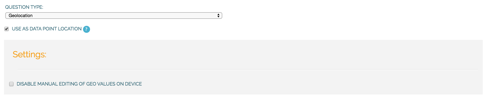

### Use as data point location
In some cases, you might have multiple geolocations in a single survey form. In that case, this setting determines which one will be used as the primary location of the datapoint (where a marker will be shown on the map). If there is only a single geolocation question in the form, that one will be used by default.

### Disable manual editing of values on device
Setting this option will stop users manually entering latitude and longitude on the device. In almost all cases, the device should provide the GPS coordinates, and manual entry is unwanted. Only in the rare case where you have an external GPS device is manual entry needed.

## Geographic shape question
Geographic shape question type allows the user to define points, lines or areas on a map. This can for example be used to capture geographic features of interest such a group of water taps, walking paths, farmer plots, or protected woodland areas. Here you can read more on how to create such a shape using the Flow app. 

### Geographic shape question settings
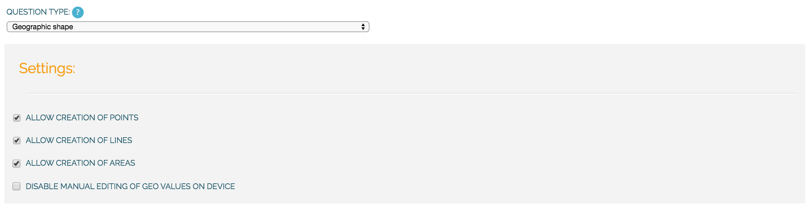

### Feature types
For a geographic feature question there is the option to restrict the choice of feature types available to the enumerator. If nothing is selected, the enumerator can choose between points, lines, and areas when she creates a new feature. If you already know that the enumerator will only need to create areas, for example, it makes sense to hide the other options, to avoid confusion.

### Disable manual editing of geo values on device
Setting this option will stop users manually entering latitude and longitude on the device. In almost all cases, the device should provide the GPS coordinates, and manual entry is unwanted. Only in the rare case where you have an external GPS device is manual entry needed.

### Capturing geographic shapes
A geographic shape (line or an area) consist of points. To create a line, you need to add at least two points. To create an area, you need to add at least three points. To be able to create a shape with Akvo Flow, the accuracy of the location of the point has to be 20m and less. If your GPS accuracy is higher than that, you will not be able to create the point. This is to ensure that your captured shapes reflect the location as best as possible. The accuracy is shown in the geoshape editor screen on the app. 

Below you can find the steps on how to create, edit and delete a shape. 

### Creating a shape 
If you want to create a geographic shape there are two ways to do so. One way is to create the shape manually and the other uses the internal GPS of your device.

### Creating a shape manually
With this method you can create the shape directly on your screen manually without needing to move around the area to capture it. 

1. Select the geographic shape by clicking on the shape icon in the top menu bar. 
2. Tap on the map on the location where you want to create the geographic shape until you see the message to add a point to this location. This should take less than a second. 
3. Confirm you want to add a point to this location.The point is now added to the map showing the latitude and longitude.
4. Add another point.  
5. Once your shape is complete, hit save in the top menu bar. 

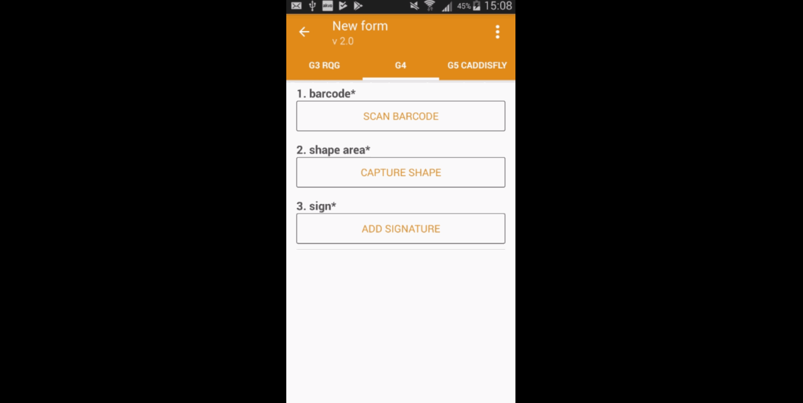

Creating the shape using the GPS on your device
With this method you will be able to capture a geographic shape by using the GPS on your device by walking around or towards the structure you want to map out. The steps needed to capture the geographic shape this way do not differ in essence from the above mentioned steps. 

1. Once you are at the area you want to capture, click on the add point icon on the bottom of your screen. 
2. Move to the next point and repeat adding the point. 
3. Once you have captured your entire area, hit **Save** on the top of your screen. 

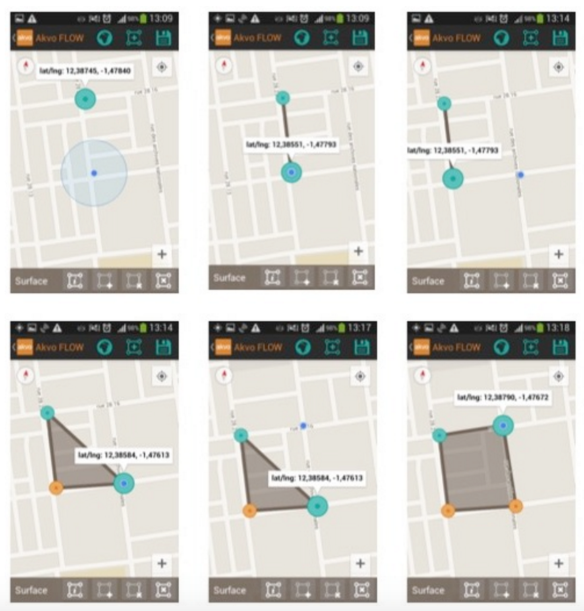

### Editing a saved shape
Every time you finish working on your geographic shape you need to save it. But sometimes you need to relocate while creating the shape. This means you are in one location, you turn off your phone and move to another location. We currently do not autosave the shapes you create. But you can save your shape that is still in progress, move to the next spot, open the shape and click on your last point to edit the shape again. 

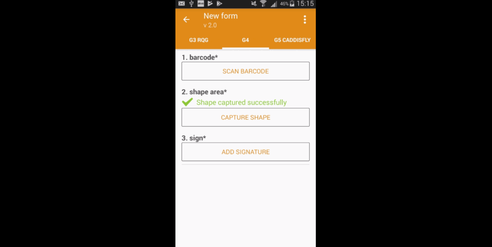

### Moving the location of a point
You can also move the point, if you are not satisfied with its location. In order to move the point you have just created, place your finger on top of the point. Keep your finger at the point and move your finger towards the desired place. The point will automatically follow your moves. Once you let go of the screen the point will be moved.

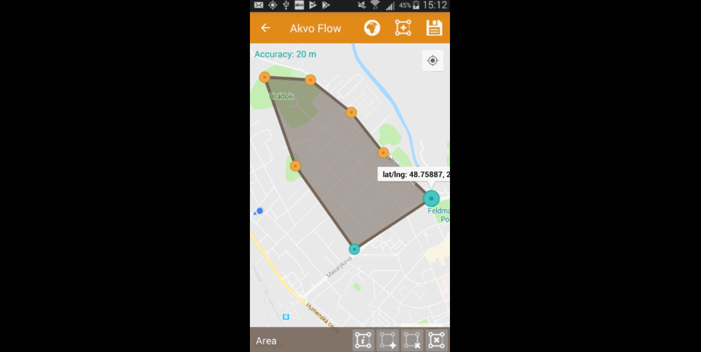

### Deleting a point
If you need to delete a point from your created shape, press your finger on the point to select it. Click on the delete point icon on the bottom of your screen. A pop up window will appear to confirm your actions. Select ‘OK’ if you are sure you want to delete the point.

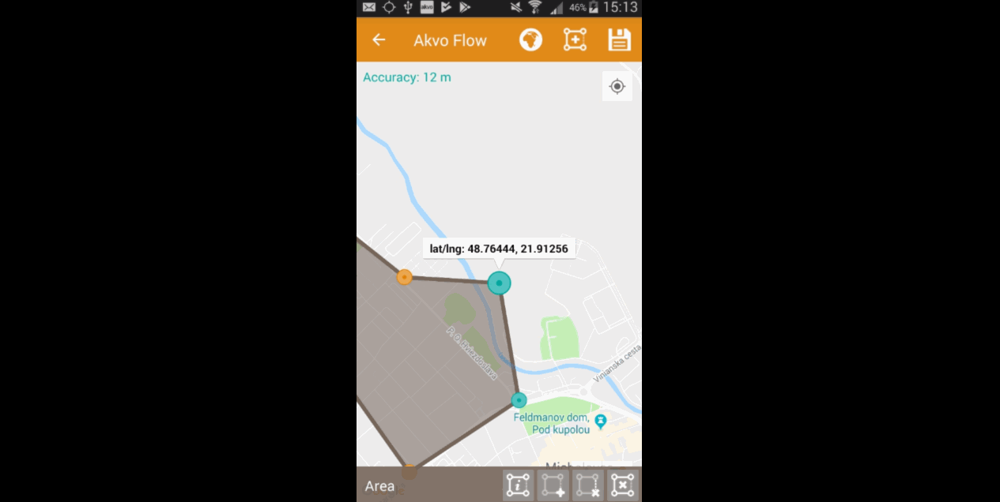

### Deleting an entire shape
To delete the created geographic share, press the delete shape icon at the bottom of your screen. A confirmation question will appear in the pop up window. If you are sure, you want to delete the shape, press ‘OK’.

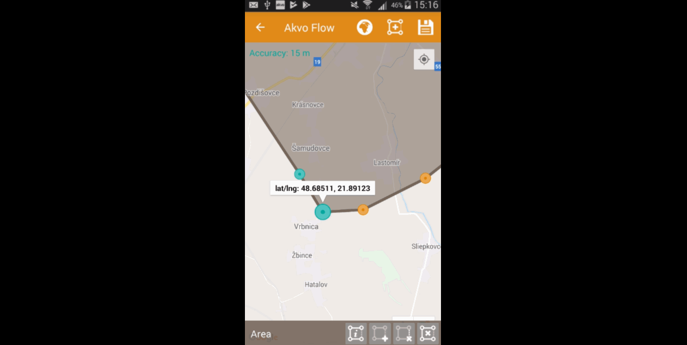

### Shape details
To check the properties of your created shape, click on the ‘information’ icon on the bottom of your screen. A window will show you information on the point count, length and the size of the area, which are automatically calculated.

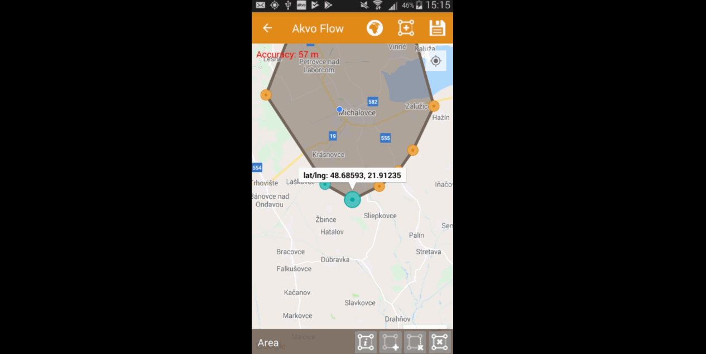

## Photo and Video question
Witt the photo question type and video question type you can take a photo as part of the survey. 

Photo questions
There are no settings to decide on regarding photos. But there are two important things to know when it comes to using this question type:

1. Size of photos
2. Photos captured with Flow are geographically referenced

Size of photos
There are three possible photo sizes to choose from. By default we use the minimum size (320x240px). This is to ensure data upload does not fail in areas with low connectivity and the data usage is not too high.

If you want to change the size of photos or make the images as large as possible in the Flow app, go to Settings and select the Image size you prefer. 

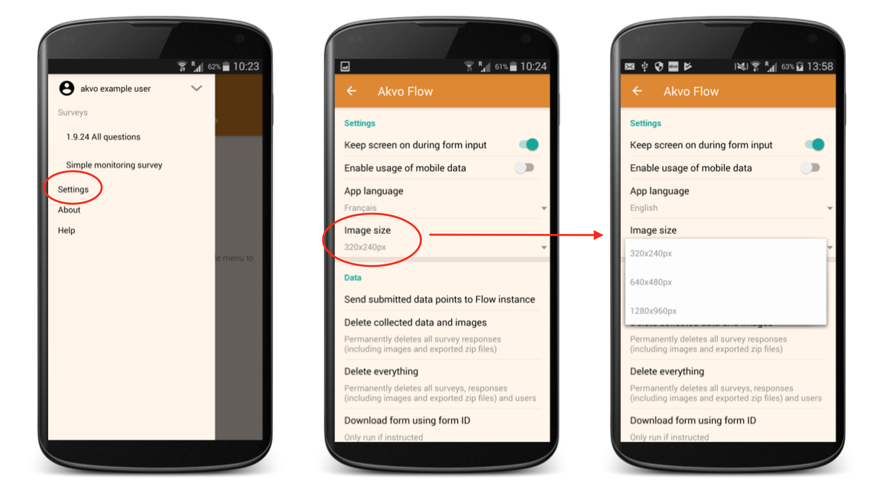

### Photos are geographically referenced
Having a photo geographically referenced, or geotagged, means that the location of where the photo was taken is saved with the photo. If you enable photo geotagging on your device, each photo you capture will hold location data, a geotag. If you do not enable geotagging on your device, or you do not have your GPS turned on, or you are in an area where it is hard to gather GPS data, your photos are not geotagged. 

When capturing a photo a part of your Flow form (or using an existing one from your devices Gallery), the Flow app reads this geotag and saves it with your photo. You can see the geotag on Flow maps or export the data with the Data analysis export. 

Having your photos geotagged helps you to confirm where the photos were taken, to ensure that the collected data is of desired quality.

What does this mean?
Every time you capture a photo with the Flow app, GPS is available and you enabled geotagging on your phone we will by default save also the location of where the photo is taken. The location information includes the latitude and longitude coordinates and the accuracy of the geographic information.

In the app you will get a small indication under the captured photo informing whether the location information was captured or not. If there is no GPS available (e.g. you are collecting data while being inside of a building or the satellite coverage is not sufficient) or you did not enable geotagging on your device the photo will still be captured without the geotag and you can continue with the data collection. The lack of geotag does not affect a mandatory photo question either.

Viewing the captured location for photos
In your Flow's online space when previewing the submitted forms we show the latitude and longitude under the photo. When exporting data with the Data analysis export you will get four columns for one photo question with the url, latitude coordinates, longitude coordinates and the accuracy of the location data. On the Map you can overlay the photo location on the map. This geographic data is not editable. 

An example of a geotagged photo shown in the Inspect data tab 
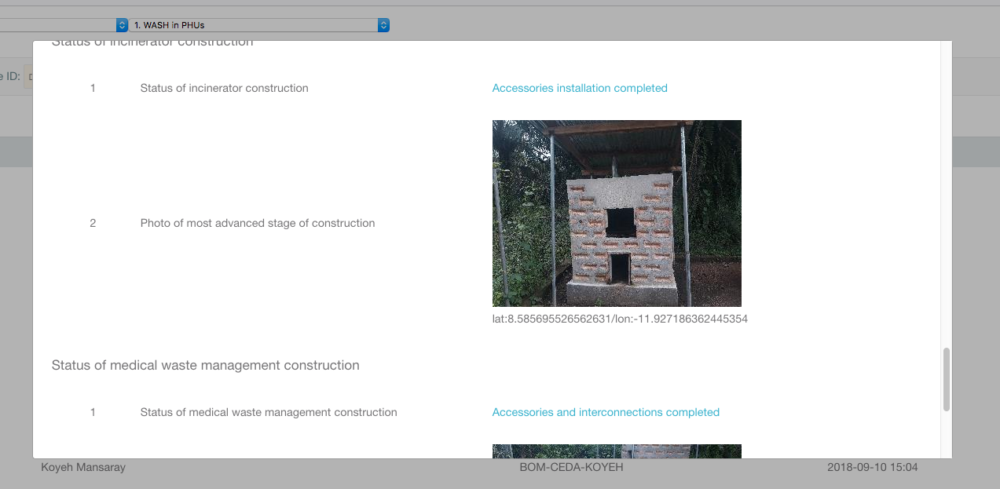

An example of a geotagged photo shown in the Map tab
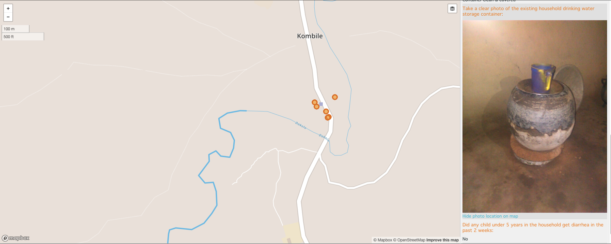

## Date question
With the date question type you can pick a date when capturing your data. A date picker is shown on the device for the user to simply select a date.

## Barcode question
With the Barcode question you can scan a barcode or a QR code as part of your Flow form. Install a scanner app on your device and Flow will connect to it once you reach the question in the Flow app. 

### Scanning Barcodes and QR codes 
You can scan barcodes and QR codes within Flow. Install an app on your phone, for example, Barcode scanner, or use an external scanning device. The value will show as numbers in your data. For more information contact our support team for more advice. 

### Barcode questions settings

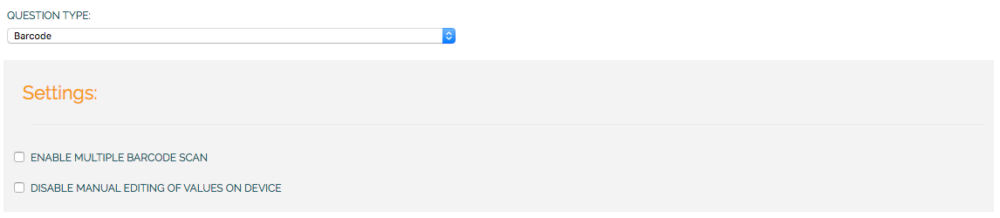

### Enable multiple barcode scan
In some cases, you might want to scan multiple barcodes at one. This setting enables you to scan as many barcodes as you need within one question.

### Disable manual editing of values on device
Setting this option will stop users manually entering the barcode on the device.

## Signature question
With this question type you can add a signature field to your form. The signature is entered with the Akvo Flow app. In the app the user has to provide two fields: the signature itself written down on the app canvas; and the signatory's name. Both fields are mandatory in order for the signature to be submitted.

<!-- For more information check the guide of how to use signatures of Akvo Flow -->

### Where is the Flow signature stored?
Because signatures represent sensitive pieces of information we took extra precaution when storing the images. All other photos collected and submitted via the Flow app are stored on Amazon S3 servers, where they can be accessed via a specific link created for each photo.

To ensure the security of signature images, they are stored instead directly in the main Flow database. The only way to view the signature is to be a signed-in user with the appropriate permissions. This also means there is no link available to the image, neither in the Flow online space, nor in the exported data report.

### Is the Flow signature legally binding?
The legal aspects of signatures can be quite confusing, especially because of the different types of ‘electronic’ signatures. We follow [the EU framework for electronic signatures](http://eur-lex.europa.eu/LexUriServ/LexUriServ.do?uri=CELEX:31999L0093:en:HTML), according to which Flow captures electronic signatures. Electronic signatures “represent data in an electronic form attached to other data with the purpose to serve as a form of authentication”. (Article 2, point 1)

This type of signature does not share the same qualities as ‘digital signatures’, 'advanced electronic signatures' and 'qualified electronic signatures’ as Flow is not a ‘secure signature-creation device’. Based on Article 5, point 2 of this framework an 'electronic signature' does not need to be created by a 'secure signature-creation' device to be legally binding.

However, we do not take legal responsibility for the use of the submitted electronic signatures and we do not guarantee their legality. To fully understand the legality of electronic signatures and their use we recommend to consult a lawyer as the regulations differ among countries and their national legislations.

### Capturing signatures on Akvo Flow
With the Signature question type you can now add a signature field to your form.

### How does it work?
When creating your survey simply select 'Signature' as the question type for your new question. You can make this question mandatory, but you cannot base the data point name on a signature.

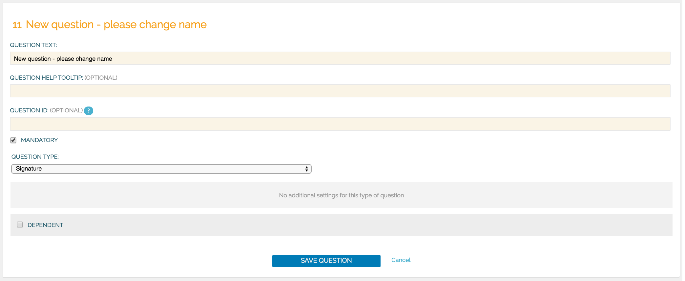

The signature is entered with the Akvo Flow app. In the app the user has to provide two fields:

- the signature itself written down on the app canvas
- the signatory's name

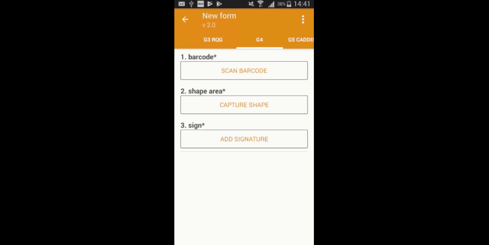

Both fields are mandatory in order for the signature to be submitted.

In your Flow's online space, when previewing the submitted form, both the given signature and the name of the signatory are shown. Both fields are not editable and cannot be changed via data cleaning either.

Exported reports hold the name of the signatory as the answer field. Furthermore, we record the date and time of form submission, device ID, and GPS location (if available) as additional information that can provide further confirmation for the signature.

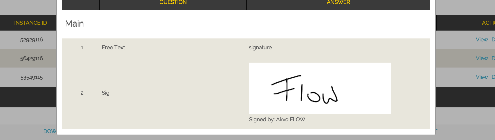

<!-- ### Where is the Flow signature stored?
Because signatures represent sensitive pieces of information we took extra precaution when storing the images. All other photos collected and submitted via the Flow app are stored on Amazon S3 servers, where they can be accessed via a specific link created for each photo.

To ensure the security of signature images, they are stored instead directly in the main Flow database. The only way to view the signature is to be a signed-in user with the appropriate permissions. This also means there is no link available to the image, neither in the Flow online space, nor in the exported data report. -->

## Akvo Caddisfly question
Akvo Caddisfly enables you to add a water quality test to your Flow survey. You can choose from a list of parameters that you want to measure. For more information check the guide on what [Akvo Caddisfly](caddisfly.md) is and how to use it as part of your Flow survey. 

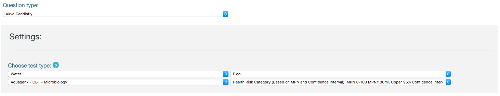

### Akvo Caddisfly question settings
When selecting Akvo Caddisfly as your question type you need to specify which parameter you want to measure in your water quality test or your soil quality test.

