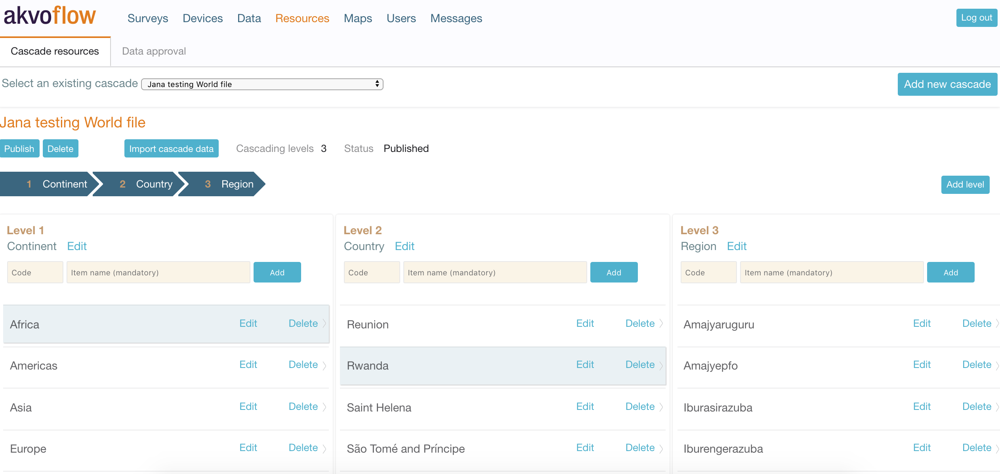
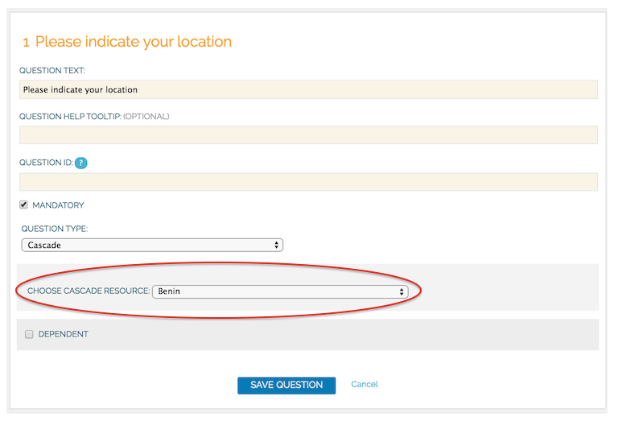
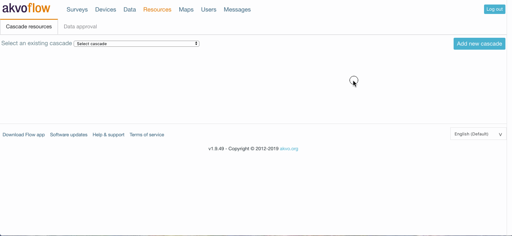
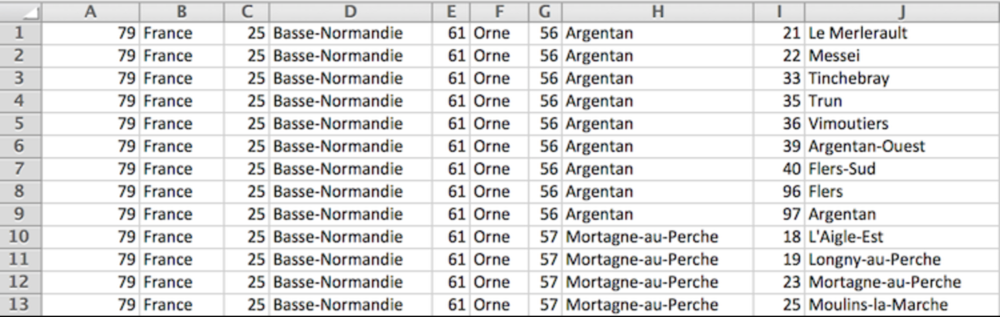
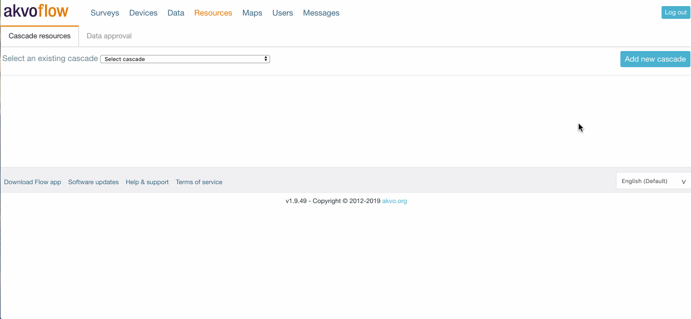
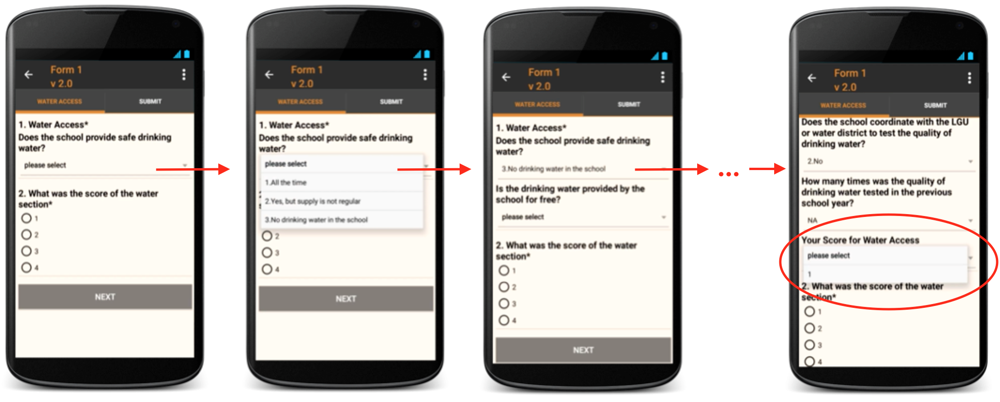
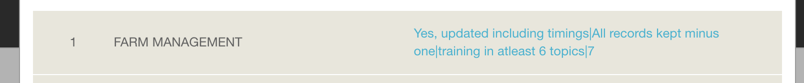

## Cascades
One of the most frequently used and also most advised question types are closed questions. These are also known as option questions. Each option question gives the respondent a few pre-defined options to pick from, making analysing the data easier as you already know what data you will get. Option questions are preferred as you can have other questions depend on them. If you answer 'yes' to question 1, then question 2 will not show to the respondent. 

Akvo Flow's cascade questions are a combination of multiple linked option questions. We call them cascade questions, as the effect of how a choice on the first question cascades into the next questions. 

Flow's cascades simplify your form. As one cascade question holds answers to many linked option questions they removing the need to create multiple option questions and their dependencies. Secondly, one you create your cascade, you can re-use it limitlessly in any number of cascade questions in any survey. Creating one cascade resource allows you to use one resource multiple times without having to duplicate the work. 


## Cascade resources
As cascades can be used across any survey you do not create them in the Flow form editor, but under the Resources tab. This tab holds all the cascades available on your online workspace. Here you can create new cascades, edit existing ones and publish them once they are ready to be added to a form. 



A cascade consists of the following parts: 

- Name 
- Level - Think of a level as a separate question that holds predefined options. Each level is linked to the following one. 
- Items - Items are options within a level that the respondent selects. Depending on the item selected in the previous level, the items in the following level will filter out and show only those that depend on the selected option. 
- Status - Published or unpublished. As with forms, cascades first need to be published before you can add them to your form. 

### Using a cascade resource in a question
To use the cascade resource in a question, follow these steps:

1. Open the form in which you want to place the cascade question
2. Create a new question of the type ‘cascade’
3. Select the cascade resource that you want to use
4. Save the question.



If you can’t find the cascade resource in the list, it probably has not been published yet. Only published cascade resources are shown in the list.


## When to use cascades 
The most common use case is to use a cascade to allow the respondent to select a location. In this case you start with the largest administrative area, country, then have the regions and then districts.  Using cascades for location is handy as you can reuse the cascade resource in any form. 

There are however also other situations when using a cascade can be of value. You can create a scoring chain using cascades, transform tabular questions into cascades and more. To see more examples check these tutorials. 

## Creating a new cascade via the editor
To create a cascade resource, that you can use in any form, go to the Resources tab in your Flow online workspace. You can create a cascade directly in the editor, or you can import an .csv file with the cascade structure. 

By creating the cascade using the editor you have full control over each dependency in the cascade. 


Steps to take
1. Go to the Resources tab. 
2. Click Add new cascade. 
3. Name the cascade and save it. 
4. Rename the first level. 
5. Add the items to the level. 
6. Create the next level and give it a name. 
7. To add items to the second level, select the item in the first level. The items you add now to the second level will only show if the respondent selects this item in the first level.
8. Add all the levels and items you need. Only three columns are shown at a time. However, if the resource has more levels, you can navigate to higher and lower levels by either clicking on the level arrow of using the navigation arrows, Move right and Move left, in the bottom of the page.
9. Once ready, publish the cascade. 



## Creating a new cascade via importing a .csv file
To create a cascade resource, that you can use in any form, go to the Resources tab in your Flow online workspace. You can create a cascade directly in the editor, or you can import an .csv file with the cascade structure. 

It can be a lot of work to manually create a cascade, especially for the larger ones (as those representing administrative boundaries. It is often the case that this data is available in the form of an excel file. This data can be uploaded to Flow, which will automatically create the required structure of the cascade. 


### File structure
Each column represents a cascade level and each row a possible string on options. The first column has the first level of administrative area names, the next column has the next level, etc. Importantly, the first level names are repeated for each row. 

In some cases, codes are available for the various levels as well. If these are available, the format of the file looks like this:



**Please note** that when importing a cascade the file should not have a first row with the names of the levels. These need to be provided later in the user interface. In order to upload the data, your file needs to be in the correct format, which is following the above shown structure and saved as a **.csv (Comma Separated Values)** file. It is very important to check if the file has the right encoding **(UTF-8)**, because otherwise accented letters can get mangled.


#### Steps to take 
1. Go to the Resources tab. 
2. Click Add new cascade. 
3. Name the cascade and save it. 
4. Click to Import cascade data. 
5. Define the number of levels (columns in your .csv file). 
6. If your cascade has codes, click the check box. 
7. Select the file from your computer. Make sure it is a .csv file. 
8. Click Import cascade file. 
9. Go to the Messages tab and refresh till you see the update that your cascade import is completed.
10. Go back to the Resources tab and select your cascade. You will see the levels and items created. 
11. Add names to your levels. Edit the items. 
12. Once ready, publish the cascade. 



## Using cascades - examples

### Using predefined scores - video tutorial

### Using predefined scores
We capture data to gather information. In some cases this information can be in the form of a score. It can tell us the severity of malnutrition of a child; the chance of an entrepreneur to be awarded a grant; or how sustainable a local farmer is in growing his produce. Usually follow up action is taken based on the interviewee’s score, information is shared or advice is given.

A score is based on a combination of answers to questions. It can be in the form of a number or a status indication as severe vs. no concern. The motivation to use scoring when looking at captured data is to understand the state of your subject on a particular topic.     

Usually you first capture your data in the field and later analyse it to calculate one’s score based on the pattern and logic you have in place. But did you know there is a better way to do it?  You can add the pattern of your scoring logic directly in your questionnaire. The benefits of taking this second approach are:

- Save time - without having to go back to the office and analysing the data, you know the score of your interviewee right away.
- Take direct action - because you learn your interviewee's score on the spot, you can share advice, ask targeted follow up questions, or take other steps based on your programme.
- Share information with those involved  - by knowing your interviewee’s score on the spot you can share the learning with them and thus the data brings information to all involved effortlessly.  

#### How can you add a scoring pattern to your Akvo Flow survey?


You can add your scoring pattern in Akvo Flow by using our cascade resources feature. Create a scoring pattern as a cascade and simply add it into your survey form as another question.

```
Cascade level = Question that builds up the score  
Levet title = Question text

Cascade options = Question options

```


When submitting data in the Flow app the cascade holding your scoring pattern stands as one question, that consist of multiple linked questions. After the interviewee answers the first question (picks an option from the first cascade level), the following question is shown. The options to this second question depend on the selected answer to the first question. The pattern continues until the interviewee reaches her score. The last question (the last level of the cascade) holds the pre-defined end score. The last question shows only one option for the interviewee to confirm, the score itself.



*Partial example of how the cascade scoring pattern will show on the Flow app*


#### The score is a chain of options linked together
With the current structure of cascades the interviewee must choose her answer from a set of options. So you need to create the scoring pattern in a way that it gives the interviewee options to pick from. The calculation of the score is basically a chain of options linked together. You can define these chains either in Excel and then import the csv file to Flow’s editor, or you can create your scoring pattern directly in Flow.

A cascade resource can be used across multiple survey forms. So even though it may take more time to adjust your scoring pattern and to create the structure in Flow, you can re-use it in multiple survey forms and learn the score while collecting your data.  


#### The score is part of your data set
After the form is submitted, all the answers the interviewee selected as part of the scoring pattern are saved together with the score. The score is simply part of your data set as all other submitted answers for that form. In the Flow online workspace you will see all the selected options and the score as part of the answer to the question holding the cascade resource.



*Example of a submission holding all the selected answers including the score*

In your data export, all answers will be shown in one cell. If you export the data using the Advanced settings export feature, each question of the scoring pattern (each level of the cascade) will be shown in a separate column. The last column on the cascade scoring pattern holds the score.


Example of data exported using Advanced settings. Each question (cascade level) is in a separate column with the question text (level title) in the top row and with all the selected answers including the score


#### Some examples from our partners
Here you can see two examples of cases where our partners used the cascade structure to reach to a numerical score evaluating the state of farm management pre-harvest and to evaluate the level of malnourishment of a child.  


Cascade resource to indicate the score of farm management pre-harvest based on the open Standard on Sustainable Rice Cultivation
Following the Standard on [Sustainable Rice Cultivation](http://www.unep.org/roap/Portals/96/SRP_Standard_FINAL.pdf) Mars Food used Flow’s cascade resources to create a scoring pattern to evaluate a farm’s management pre-harvest. The score is based on three different questions. The farmer must with each question select one answer. The combination of selected answers is then reflected in the end score.


Scoring pattern to evaluate farm management pre-harvest consisting of 3 questions (cascade levels 1-3) and a final score (level 4)


Mars Food used the cascade import feature to create their scoring pattern in Flow. In the csv file, each row represents the chain of options that results in the given score in the last level.


The image above shows the structure of the scoring pattern. Column A, holds the answers to the first question. The existing four options are repeated. The amount of options of the last level,  in this case the last question in column C, determines the number of repetitions needed in the previous levels.

As you can see in column A, if the interviewee answers the first question “Yes updated all timings and inputs”, the second question will give her four options. If she answers “All records kept”, then in the last question she can choose from four options. If her answer is “training in at least 6 topics”, the score given based on the answers selected is 9 (all options live in row 1).

Please note that the csv file does not hold the question text (titles of the levels). You must add these after importing the csv file in Flow’s editor.

To see how the scoring pattern was built in to csv file, or to use it in your Flow survey form, you can check the file here. 


Cascade resource to indicate the level of malnutrition of a child based on the standards shared by the World Health Organisation
According to standards provided by the World Health Organisation you can assess the level of malnutrition of a child based on its sex, age and height. Our partner, Welthungerhilfe, used this open standard and created a cascade resource, where the interviewee had to answer three simple questions. Based on the chosen answers she learnt right away the status of a child’s stunting.


Scoring pattern to evaluate status of stunting of children younger than one year consisting of 3 questions (cascade levels 1-3) and a final score (level 4)


Because the scoring pattern was less complex, this type of scoring pattern can be defined directly in Flow’s editor. First start by defining the options for the first question: the sex of the child. Select one of the options in question one, male, and start defining the second level answers that link to your selected option. In the second level, age (in months), you need to create an option for each possible answer (0 to 12 months are the possible answers - 13 possible options). The following step is to repeat these options for the remaining option in question one, female. Repeat these steps for the following levels. The last column holds the score that is based on the options selected for the previous levels, either severe or moderate.

Cascade resource to calculate the PPI score for India to later translate to poverty likelihoods based on the India 2011 Progress out of Poverty scorecard 
The 2011 India Progress out of Poverty index shares a scorecard that uses ten indicators from India’s 2011/12 Socio- Economic Survey to estimate the likelihood that a household has consumption below a given poverty line. For more information on this scorecard please check this document, or the score card and look up tables. Our partner ICCO uses this score card to calculate the poverty index for households in India. 


As the score is based on predefined answers to 10 questions, we have created the structure in Excel and imported the .csv file into Flow's cascade editor. The levels hold each question and the last column tells the respondent the final score based on the answers given. To further calculate the poverty index, either a second cascade can be created to take the following indicators and generate the poverty index, or these can be added as following levels to the initial cascade. 

To see how the scoring pattern was built you can check the file here. 


How to trigger follow up action based on a score
Do you want to link follow up questions to the end score? Do you want to add advice for the interviewee directly in the survey based on the end score? Simply add a follow up option question after the cascade question holding your scoring pattern. In this option question each option represents the possible score. Make the next questions dependent on the selected score in the option question.


Example of how to ask for more information based on one’s score.

Need help?
Do you need help in adjusting your scoring pattern to fit Akvo Flow’s cascade structure? Feel free to contact our support team for more guidance.  

### Using predefined scores - Step by step guide
We capture data to gather information. In some cases this information can be in the form of a score. It can tell us the severity of malnutrition of a child; the chance of an entrepreneur to be awarded a grant; or how sustainable a local farmer is in growing his produce. Usually follow up action is taken based on the interviewee’s score, information is shared or advice is given.

A score can be based on a combination of predefined answers to questions. Here we will walk you through the steps you need to take to fit your scoring pattern to the structure of Flow's cascades. 

We will look at the case of the India 2011 Progress out of Poverty Index (PPI) at its Simple Poverty Scorecard. This case reaches to the score, which then must be converted into a poverty likelihood using the PPI look-up table to make the full use of the index, by counting the sum of values associated with possible answers. For more information check here. 


The questions
In this case we have 10 questions, all with given options the respondent needs to choose from. Each option has an allocated value that then sums up into the final score. 


Because of the size of the cascade, it is easier to first make it in Excel, save the file as a .csv file and then import it into Flow. 


Prepare your sheet
Create 11 columns in your sheet and add the questions into the 1st row. The last 11th column will later hold your total score. You will remove the questions before importing the file, but for now it is good to have them there to guide your input. 


Step 1 - Create the possible option strings 
When translating your questions into the cascade structure there are a few rules to follow: 

Questions define the level 
Start from the last question and build your way forward
Identify your smallest building block
Start with the last question, question 10. In our case it has two possible answers: Yes and No. Add Yes in one row and No in the second. These two answers are your smallest building block. 


The Yes and No options in question 10 are your smallest building block. You need to make sure that this building block is used for all the answers in the previous question, in question 9. The next question, question 9 in column I, has also two possible answers: Yes and No. So you need to make sure, that is your respondent answers Yes in question 9, she gets both possible answers in question 10. The result will be that you will have in question 9, Yes and No twice to cover the two possible answers in question 10. 


Now your building block is the combination of answers to questions 9 and 10. In question 8 you need to make sure that this block is available for all the possible answers in question 8. 


Your building block now comprises on answers to questions 8, 9 and 10. Here is a video showing how to fill in your sheet following the above mentioned rules.


Step 2 - Adding the final score 
You have now created all the combinations of possible answers to all 10 questions. The next step is to add the score in the final 11th column. You need to now transform your sheet with questions to a sheet to hold the values allocated for all options. 

We suggest to make a copy of your sheet and then use the replace functionality in Excel to switch the option with the score value column by column. After your sheet holds all the score values instead of the options, in the final column calculate the summary of these values per row. The final score in this case is simply generated as a sum of the values. 


Step 3 - Prepare your sheet for import into Flow
Now you need to copy the sum and paste it into the last column of your sheet where you hold the possible answers. Make sure you copy the sum score only as value to not copy in the formula. To make your sheet ready for import, you need to remove the header with your questions, as these will be added in directly in Flow's editor. The last thing is to save your sheet as a .csv (Comma Separated Value) file. 


Step 4 - Importing into Flow   
To import your file into Flow, create a new cascade and select Import. Do not forget to define the correct number of columns, which is in our case 11. To ensure your import is completed go to Messages. Then open your cascade. Now your cascade holds all the possible answers and you need to fill in the questions. Add those to the level names. Once you cascade is ready, do not forget to publish it to be able to use it in your survey. 


### Determining location based on administrative structures
Determining a location is the most common use of cascades in Flow. This is due to two reasons. The structure of the cascade is straightforward. You start with picking your largest administrative structure (most likely country). The next dropdown gives you a list of regions for that country, followed by districts for your selected region, etc. If you want you can have the entire world's administrative areas in one cascade. 

Secondly, once you create the administrative structure of a country as a cascade resource, you can use it across multiple surveys. 


Building this example as a cascade 
Cascades consist of two main parts: levels (which have their name) and items (name and optional code). For this type of questions your levels are determined by the depth of the administrative structure you are to use. Each level holds one administrative structure. You start with the largest one, for example region. Your last level will hold the smallest administrative structure, for example community. 


Example - world administrative areas
Based on GADM database of Global Administrative Areas we have created a cascade .csv file you can download and use on your Flow space. This file holds the first three world administrative areas (continent, country, 1st country administrative structure).

You can access the file here. 

 

Example - one country
Let's say we are collecting data on French vineyards and we want to know their location in regards to the French administrative structure. Instead of asking the respondent separate questions to define the region, department, arrondissement and canton, where he vineyard is located, you can set the administrative structure as a cascade and have her simply select from the series of drop downs. 


Structure of the .csv file 
In the csv file you will not add the level names, which in this case would be: state, region, department, arrondissement and canton. These you must add in the editor in Akvo Flow after importing the file. Your csv will have 5 columns. The number of rows is determined by the number of all cantons in all arrondissements of France. To clarify, the number of rows is defined by the number of possible options in your lowest level. 


The first column holds the state, in our case France. The next column holds all regions. Notice how the options are repeated for each row. This is to ensure, that if your vineyard is located in Longny-au-Perche, you need to select France, then Basse-Normandie, then Orne and Mortagne-au-Perche to arrive to this lowest level. Each previous level will be repeated as many times as needed in the last level of the file. 

In some cases, codes are available for the various levels as well. If these are available, the format of the file should be like this:


After you have created your file, you need to save it as a .csv (Comma Separated Values) and import it to the editor in Akvo Flow. Set the number of levels accordingly and import your file. Confirm in the Messages tab that your import was successful. In order to successfully import the file you also need to make sure there are no duplicates in your chains. 


Structure in the cascade editor 
You can also create the cascade directly in the editor in Flow's online workspace under the Data tab in Cascade resources. For each level set the name to hold your category. Start by creating one option for the first level, in our case for the state where the option is France. Select France and create the list of regions in your second level. Then select the first region in your second level and fill in the arrondissements for this region. Select the following region and define its arrondissements. Continue until you have the entire structure created. After you have created the entire structure don't forget to publish your cascade so you can add it to your survey.  

If your administrative structure is large, we suggest you use the import functionality. 


Using the cascade in a form 
To use this administrative structure in your survey create a new question and select the question type to be Cascade. Now from the dropdown select your cascade. If your cascade is not showing in the list, this is because you have not published it. Return to the Data tab and your cascade and publish it. 

In the Flow app your respondent will see a series of drop downs. She will first select France and then see the list of regions, followed by the other levels you have defined. 


After your data is submitted the cascade and selected values can be either seen in the Data tab or exported in raw data reports. In the raw data exports all answers to the cascade are combined in one cell. If you export your data using the Advanced settings, each level of the cascade will be split into a separate column.   

### Dividing values across multiple options
In some cases you want to ask your respondent to divide a certain value (points or percentage) among multiple categories. You can ask them:  

To indicate how much time of their 8 hours of work day they spend on certain activities,
To prioritise items based on importance from 1 to 5, where 5 is most important,
To split 100% over the crops they grow  
To divide 10 points over categories that can could purchase if their income was higher


Example question where the respondent divided 10 points over 3 categories


There are many ways how to use this type of question. Usually it has the form of a list of items next to which your respondent can give her answer. The rule is that the respondent must allocate the values in such a way that the sum of individual numbers results in the original value. If you want the user to divide her 8 hours, in the end she must make sure she did not allocate 10 hours in total to her categories, or that her sum of hours is less than 8 hours. 


Building this example as a cascade  
Cascades consist of two main parts: levels (which have their name) and items (name and optional code). For this type of questions, your categories are placed in the level name. You will have as many levels to your cascade as many categories are in your question. The possible number the user could allocate is defined as the options. 


Example 
Let's look at an example where we want our respondents to divide 10 points over 3 categories. Furthermore, we want to give them a visual indication that their choices do indeed sum up to 10. We will create a cascade of 4 levels (3 levels for each category and the last level for the sum of 10). The name of each level will hold our category.


Example where the respondent divided 10 points over 3 categories
Structure of the .csv file
In the .csv file you will not add the level names. There you must add in the editor in Akvo Flow after importing the file. You .csv will have 4 columns and 66 rows. Each row is a combination of the possible values the user can divide over the three categories. If she allocates 10 points to the first category, she can only give the follow categories 0 points. But if she allocated 8 points to the first category she can either give the following two categories 1 point, or give one of the two 2 points and the other one 0 points. Each row holds a possible combination of numerical values she can divide over the three categories, but still summing up to 10 points. 


You can find the example file here.  


After you have created your file, you need to save it as a .csv (Comma Separated Values) and import it to the editor in Akvo Flow. Set the number of levels accordingly and import your file. Confirm in the Messages tab that your import was successful. 


After the import is completed do not forget to put the category in the name of each of your levels. The last column holding the sum of 10 points can be named Sum, for example.  


Structure in the cascade editor 
You can also create the cascade directly in the editor in Flow's online workspace under the Data tab in Cascade resources. For each level set the name to hold your category. Create 4 levels. Now create the options for the first level. We will create 11 options, as our respondent can either give the first category, Extra land, from 0 to 10 points. 


Then select the first option, in our case 0. If she gives the first category 0 points, she can divide 0-10 points to the second category, Inputs. Click on 0 in the first level and start creating the options in the second level. 

Now you need to repeat creating following the possible options for the second level. For example: If she selected 5 points for the first category, she can select 0-5 points for the second level. Click on 5 in the first level and start creating the options in the second level. 


Once you have created all the possible options for the second level, proceed to the third. Here is one example. If our respondent allocated to Extra land 3 points and to Inputs 4 points, then she can has only the option of 3 points to allocate to reach the sum of 10. In the third level you then only need to add the option 3. 


After you have created the entire structure don't forget to publish your cascade so you can add it to your survey. 

Using the cascade in a form 
To use this question in your survey create a new question and select the question type to be Cascade. Now from the dropdown select your cascade. If your cascade is not showing in the list, this is because you have not published it. Return to the Data tab and your cascade and publish it. 


In the Flow app your respondent will see a series of drop downs. Based on the number she selects from the first level, she will see the possible options for the following levels as you have defined them. 


After your data is submitted the cascade and selected values can be either seen in the Data tab or exported in raw data reports. In the raw data exports all answers to the cascade are combined in one cell. If you export your data using the Advanced settings, each level of the cascade will be split into a separate column.   


Example of how the data export looks like if Advanced settings is selected

### Order the following items based on... questions
In some cases you want to ask your respondent to divide a certain value (points or percentage) among multiple categories. You can ask them:  

To indicate how much time of their 8 hours of work day they spend on certain activities,
To prioritise items based on importance from 1 to 5, where 5 is most important,
To split 100% over the crops they grow  
To divide 10 points over categories that can could purchase if their income was higher


Example question where the respondent divided 10 points over 3 categories


There are many ways how to use this type of question. Usually it has the form of a list of items next to which your respondent can give her answer. The rule is that the respondent must allocate the values in such a way that the sum of individual numbers results in the original value. If you want the user to divide her 8 hours, in the end she must make sure she did not allocate 10 hours in total to her categories, or that her sum of hours is less than 8 hours. 


Building this example as a cascade  
Cascades consist of two main parts: levels (which have their name) and items (name and optional code). For this type of questions, your categories are placed in the level name. You will have as many levels to your cascade as many categories are in your question. The possible number the user could allocate is defined as the options. 


Example 
Let's look at an example where we want our respondents to divide 10 points over 3 categories. Furthermore, we want to give them a visual indication that their choices do indeed sum up to 10. We will create a cascade of 4 levels (3 levels for each category and the last level for the sum of 10). The name of each level will hold our category.


Example where the respondent divided 10 points over 3 categories
Structure of the .csv file
In the .csv file you will not add the level names. There you must add in the editor in Akvo Flow after importing the file. You .csv will have 4 columns and 66 rows. Each row is a combination of the possible values the user can divide over the three categories. If she allocates 10 points to the first category, she can only give the follow categories 0 points. But if she allocated 8 points to the first category she can either give the following two categories 1 point, or give one of the two 2 points and the other one 0 points. Each row holds a possible combination of numerical values she can divide over the three categories, but still summing up to 10 points. 


You can find the example file here.  


After you have created your file, you need to save it as a .csv (Comma Separated Values) and import it to the editor in Akvo Flow. Set the number of levels accordingly and import your file. Confirm in the Messages tab that your import was successful. 


After the import is completed do not forget to put the category in the name of each of your levels. The last column holding the sum of 10 points can be named Sum, for example.  


Structure in the cascade editor 
You can also create the cascade directly in the editor in Flow's online workspace under the Data tab in Cascade resources. For each level set the name to hold your category. Create 4 levels. Now create the options for the first level. We will create 11 options, as our respondent can either give the first category, Extra land, from 0 to 10 points. 


Then select the first option, in our case 0. If she gives the first category 0 points, she can divide 0-10 points to the second category, Inputs. Click on 0 in the first level and start creating the options in the second level. 

Now you need to repeat creating following the possible options for the second level. For example: If she selected 5 points for the first category, she can select 0-5 points for the second level. Click on 5 in the first level and start creating the options in the second level. 


Once you have created all the possible options for the second level, proceed to the third. Here is one example. If our respondent allocated to Extra land 3 points and to Inputs 4 points, then she can has only the option of 3 points to allocate to reach the sum of 10. In the third level you then only need to add the option 3. 


After you have created the entire structure don't forget to publish your cascade so you can add it to your survey. 

Using the cascade in a form 
To use this question in your survey create a new question and select the question type to be Cascade. Now from the dropdown select your cascade. If your cascade is not showing in the list, this is because you have not published it. Return to the Data tab and your cascade and publish it. 


In the Flow app your respondent will see a series of drop downs. Based on the number she selects from the first level, she will see the possible options for the following levels as you have defined them. 


After your data is submitted the cascade and selected values can be either seen in the Data tab or exported in raw data reports. In the raw data exports all answers to the cascade are combined in one cell. If you export your data using the Advanced settings, each level of the cascade will be split into a separate column.   


Example of how the data export looks like if Advanced settings is selected