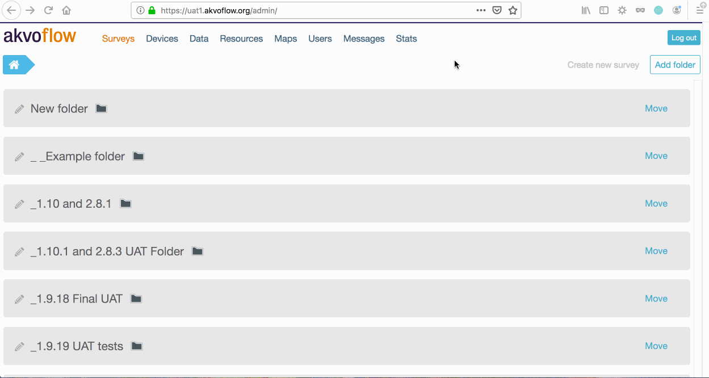

## Stats page
Do you want to know how many submissions were made to every form you have on Flow? The Stats page enables you to download a sheet with all your Flow forms and the number of submissions made to each form. It also holds the total number of folders, surveys and forms for you to see how you have been using Akvo Flow. 

You have two ways how to export the stats sheet: 

- Without defining the dates - If you do not set any dates, then the stats sheet will hold the number of submissions, folders, surveys and forms from the beginning of time till today
- With defining the dates - If you want to know how many form submissions, folders, surveys and forms were created on Flow in a specific time frame, you can specify those in the date picker. So if you want to know the number of submissions made this year, pick January 1st and todays date. 

**Please note**, that the Stats page is only accessible to users with the Admin role. 

