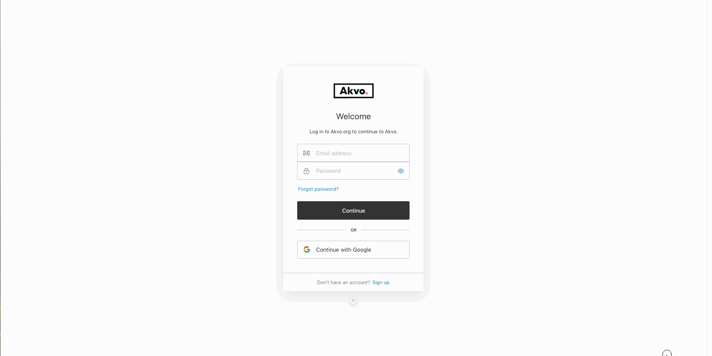

## Managing users
In Akvo we handle your data with care and understand that for large organisations deciding who can access what data and in which way is crucial to managing your data projects. Users, roles and permissions keep this order on Flow's online space.

In the Users tab, the *Users sub-tab* displays the user name, email address, and roles for all users. The actions ‘edit’ and ‘delete’ enable you to edit the user, change the roles and permission of this user or remove him or her from your online space. You can define any number of users on the Flow.

**Roles &Permissions** describe the different levels access a user has on the online space. Access can be restricted either by activity, such as creating or editing a survey, making a report, or deleting data, or by a survey or a folder of surveys. A set of user permissions is called a ‘role’. Roles can be changed and customised, in order to fit the workflow of a particular organisation.

**Note:** *This tab is only visible and available to those users who have the permission, called 'Administrator - Create, Modify and Delete Users'.*

## Adding a new user
Before anyone can access your Flow online workspace, they need to be added as a user. To add a user, click on the ‘Add new user’ button. Provide a user name and an email address. 

You can give user the role to manage other users called, **'Administrator - Create, Modify, and Delete Users'** by checking the checkbox. Only administrators can manage users, create new users and change their roles and only they can see the **'Users'** tab. You can see who has this user admin role in your list of users. 

Click **‘Save user info’** to save the new user. Now you need to give the user, with user admin role or without it, permissions for other actions as for example creating a survey, editing data or managing assignments to devices. This is explained in the Roles and Permissions subchapter.

## Editing an existing user
To edit user details of an existing user, click on edit. If you make any changes to the user's Name, Email or the User Admin role, you must hit save to not loose these changes. Any edits to the user's Role and Permissions are autosaved. 

## Roles and Permissions
We create Akvo Flow to help you and all your colleagues capture data easily at scale. This for us also means you can use Flow across you entire organisation, share it with other partners, etc. To ensure the work on Flow is organised with larger groups of users you need to be able to restrict who can do what. Users, roles and permissions keep this order on Flow's online space.

Roles &Permissions describe the different levels of access a user has on the online space. Access can be restricted either by activity, such as creating or editing a survey, making a report, or deleting data, or by a survey or a folder of surveys. A Role is a set of user permissions. Permissions are actions the user can do when working with Flow. Roles can be changed and customised in order to fit the workflow of your particular organisation.

## Adding roles to a user
A new user starts without any roles. To add roles to an existing user, click ‘edit’ in the Users' list. Below the user information, there is a section Roles & Permissions. To add a role, first select a role from the dropdown list. Second, select the folder or survey to which you want to apply this role. When you select a specific folder you can continue to select subfolders. Alternatively, you can simply select ‘All folders’.

In the image below, we have given the user the role ‘Survey editor’ in the folder ‘02. Burundi’. This means that the user has the permissions that go with the role ‘Survey editor’ in all surveys and subfolders in the folder ‘02. Burundi’.

## Administrator - Create, Modify and Delete users role
There is a separate role that is not connected to a folder or a survey in Flow. This role is called 'Administrator - Create, Modify and Delete users' and you can find it under a user's name and email address. This role gives the user access the the Users tab on Flow. If you do not give a user this role, she will not see the tab and will not be able to add new users to Flow, change roles and their permissions. 

You can see which user has this role in the list of users indicated under **User Admin**. 

## Editing roles and permissions
A Role is a set of user permissions. Permissions are actions the user can do when working with Flow. Roles can be changed and customised in order to fit the workflow of your particular organisation.

To change the permissions for an existing role, or to create an entirely new custom role, go to the Roles & Permissions sub-tab. To edit an existing role, click ‘Edit’ in the list. This will display a list of permissions associated to this role. The checkboxes indicate which permissions this role has. You can also edit the name of the role here. When you are done, click ‘Save permission set’ to save. To create a new role, click ‘Add new role’ in the roles list. You can provide a name for the role, and select the permissions you want to include.

## Available permissions
We currently provide permission connected to working with folders, forms and submitted data. These permissions are most likely to be connected to a certain folder in your online space.

- folder: view, edit, delete, create
- form: view, edit, delete, create
- data: view, edit, delete, data cleaning

Furthermore, there are actions you can do on the Akvo Flow online space that are not connected to one specific folder or survey, as managing your online space users, create a new user role, or edit a cascade resource which can be added to multiple different surveys. This type of permissions that you can give to your users are:

- Administrator - Create, Modify and Delete users
- Manage cascade resources
- Manage devices and assignments

These three permissions, when given to a user, allow him or her to view, edit, delete and create new users, cascades, devices and assignments. Thus they cover all the actions related to that item.

### Important rules:
There are some rules you need to keep in mind when creating combinations of these permissions:

The structure of data collection in Flow consists of folders that hold surveys that consist of forms. Forms hold the questions. **We do not have a permission set that is called surveys**. But all the permissions related to folders apply to surveys. For example: You have the permission to 'view folder' and 'edit form' in the folder called Demo. Demo folder consists of one survey called Test, which has one form called Example. You can view the folder Demo, view the survey Test and make changes to the form Example. But you cannot make changes to the folder Demo, nor to the survey Test and you cannot create a new (second) survey in this folder either. In order to add a new survey in this folder you would need to have also the permission 'create folder' and 'edit folder' assigned to your role.

For a user to be able to **View data** in the Inspect data tab or Monitoring tab, he will be able to view the folder, and also view the survey and its forms assigned to him.

For a user to be able to **Delete data** in the Inspect data tab, he will be able to view the data as well view the folder, survey and forms assigned to him.

## Getting started with Akvo Flow - New users
Are you new to Akvo Flow and Lumen. Before you can access the tools your organisation admin needs to add you to them. Below you can find out how to get access to Flow and how to sign up.

### New to Akvo Flow
To be able to access Flow, your organisation admin needs to first create your user account in Flow. 

Once your account is set up: 

1. Go to your Flow online workspace. 
2. Select Sign up at the bottom of the login page. 
3. Add your email (which is registered in Flow) and enter a password you want to use. 
4. Verify your email by clicking in the link sent to your account. Now your user account is all set.
5. Access Flow.
6. Next time you go to Flow to capture and analyse data, simply log in. 

## Login
In October 2019 we changed how you log in to Akvo Flow and Akvo Lumen as part of our goal to create a more connected user experience for you across the two tools. This change not only streamlined the workflow across the products but also allows existing users to use other email accounts than Google to access Flow and Lumen. 

Below you can find out: 

- How to log in with your current user account 
- How to change your current user account (if you want to use another email than Google) 
- How to get started for new users.

Please keep in mind that your user needs to be created in Flow and Lumen first, before you can access the products. To be able to use Flow data in Lumen, you need a user account in Flow and also in Lumen based on the same email address.

To see how this change affects logging in to Lumen, check this article. 

## Log in with your current user account 
When accessing our products today, you must have a user account set up with a Google email. You can still use this account with our new login: 

1. Go to Flow. 
2. Click 'Continue with Google'.
3. Fill in your account details (your Google email and Google password).
4. Log in.  

## Change your existing user account to another email  
With this change you can have your organisational admin change your email to another one, sign up and login using that newly added email address. This allows you to use other email providers than Google to manage users. For example, you can use your organisational email instead.

## Changing your user email in Flow
In Flow your organisational admin can change your current user account and set you up with a new email. Please note, there are no automatic email invitations sent out from Flow. Your organisational admin will have to inform you about the change and which email she used. 

### To change a user's Flow account: 

1. Log in to your Flow online workspace. 
2. Go the the Users tab. 
3. Select the user you want to change and click on 'Edit'.
4. Remove the user's email and add the new one. Save. Make sure there are no spaced before and after the email. 
5. Inform the user about the change and which email she needs to now use to access Flow. 
6. Accessing Flow for the 1st time with your newly added email: 

### Go to your Flow online workspace. 
1. Select Sign up at the bottom of the login page. 
2. Add your email (which is registered in Flow) and enter a password you want to use. 
3. Verify your email by clicking in the link sent to your account. 
4. Access Flow.
5. Next time you go to Flow to capture and analyse your data, simply log in. 

## New to Akvo Flow and Lumen
Are you new to Akvo Flow and Lumen. Before you can access the tools your organisation admin needs to add you to them. Below you can find out how to get access to Flow and how to sign up.

### New to Akvo Flow
To be able to access Flow, your organisation admin needs to first create your user account in Flow. 

#### Once your account is set up: 

1. Go to your Flow online workspace. 
2. Select Sign up at the bottom of the login page. 
3. Add your email (which is registered in Flow) and enter a password you want to use. 
4. Verify your email by clicking in the link sent to your account. Now your user account is all set.
5. Access Flow.
6. Next time you go to Flow to capture and analyse data, simply log in. 

