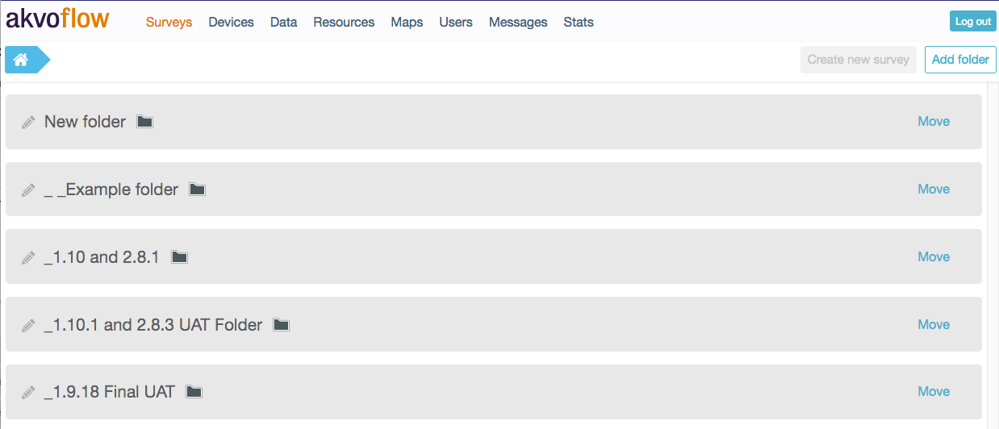
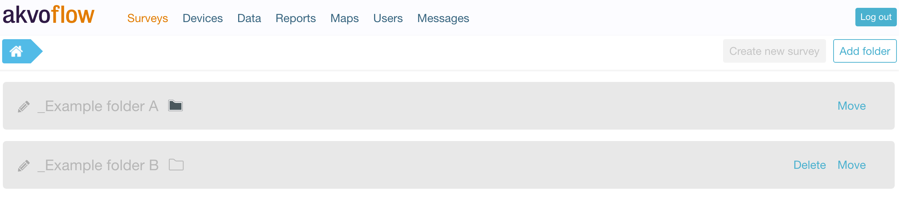
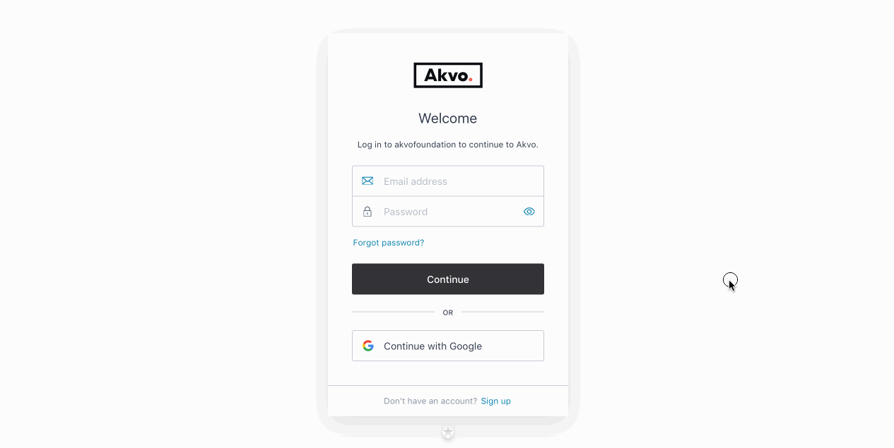

## Getting to know the Akvo Flow online workspace
The Akvo Flow online workspace is the web-based location where we support you across the first two steps of your [Data journey](https://akvo.org/our-approach/), design and capture. Here you prepare to capture, access and manage your Flow data. Each organisation has its own URL to access its online workspace.

The Flow online workspace is made up a series of pages. The first page you see after you log in is the Surveys tab. The top bar menu helps you navigate across all the pages:

- Surveys: Surveys are the centrepiece of Flow. Create, edit and publish surveys from the Surveys tab.
- Devices: In the Devices tab you manage the devices connected to capture data.
- Data: The Data tab is where you can view, edit, export, import and clean data collected with Flow surveys.
- Resources: The Resources tab holds your cascades, as they act as a resource you can create and re-use in any Flow form. 
- Maps: The map on your Flow's online space shows the surveys collected with a GPS location as points on a map.
- Users: Here is where you manage your users and their permissions.
- Messages: The Messages tab lists messages related to activity with surveys and data processing activity.
- Stats: Do you want to know how many submissions were made to each form you have on Flow, or how many folders, surveys and forms you have? The - Stats page creates a an overview sheet with all the details. 

Access to each tool menu is limited by permissions so not all functions will be available to all users.

**Important - There is no “Back” button on the online workspace!**

All separate pages are contained and displayed within your organisations Akvo Flow URL. This means that clicking your browser’s “Back” arrow button will take you away from Akvo Flow to whatever webpage you had previously visited before starting your Akvo Flow session. To navigate between the pages of your online workspace, use the main navigation menu on the top of your page.

## Survey structure in your Akvo Flow space
Surveys are the centrepiece of Akvo Flow. Create the questions you want to ask, edit the forms and publish them once ready for data collection from the Surveys tab. When you first visit the online workspace, you’ll land on the Surveys page. Here you can create folders to hold your surveys.

View of folders in the Surveys page

## Folders
Surveys on the online workspace are kept in folders to help you stay organised. Folders can contain other folders, just as in a regular file system on a computer. This means you have a lot of freedom in organising your surveys. You can assign users specific roles in specific folders, so you can also use the folder structure to organise who has access to what. A folder can also contain a mix of folders and surveys.

## Surveys
A survey is used to collect data on a particular subject. Different surveys collect data on different subjects. Surveys live in folders — you can have multiple surveys inside a single folder. Surveys do not directly contain questions, but forms that hold your questions. 

## Forms
A survey can consist of one or more forms. A regular survey will only contain a single form. However, if you use monitoring (You can find more information what Flow's monitoring is here: Monitoring - tracking things over time), you can add additional forms to a survey, which capture different aspects about the subject of the survey. For example, if you survey water pumps, you could have a ‘registration form’ that captures the basic information for a water point, a ‘water quality form’, that captures water quality information about that point, and a ‘functionality update form’ that periodically captures the functionality.

## Question Groups
Each form contains of questions and the questions are organised into question groups. Each group of questions appears in a separate tab on the screen when answering the questions in the Flow app.

## Questions 
In Flow we support a large variety of different question types to help you create a diverse survey. These are the question types available in the Flow system: Free text; Option (select one option or select many using check boxes); **Cascade; Number; Geolocation; Photo; Video; Date; Barcode; Geographic shapes, Signature and Akvo Caddisfly**, to add a water and soil quality test to your Flow survey. For more details on our question types check this article. When creating a Flow form you can edit the behaviour of the question using multiple settings to customise your survey as much as possible to fit your needs. 

## The language of your Akvo Flow online workspace
Flow's online workspace is available in these languages: **English, Spanish, French, Portuguese, Bahasa Indonesia and Vietnamese**.

By default Flow is set to English. You can change the language of your online workspace simply by selecting the language in the dropdown in the footer. Flow will refresh automatically and all it's navigation and items will be in the language of your choice. Once you come back to Flow, your language choice will be remembered. 

## Getting started with Akvo Flow
<!-- Are you new to Akvo Flow and Lumen. Before you can access the tools your organisation admin needs to add you to them. Below you can find out how to get access to Flow and how to sign up.

New to Akvo Flow -->
To be able to access Flow, your organisation admin needs to first create your user account in Flow. 

Once your account is set up: 

1. Go to your Flow online workspace. 
2. Select Sign up at the bottom of the login page. 
3. Add your email (which is registered in Flow) and enter a password you want to use. 
4. Verify your email by clicking in the link sent to your account. Now your user account is all set.
5. Access Flow.
6. Next time you go to Flow to capture and analyse data, simply log in. 

<!-- ## Staying up to date on Flow developments
The Akvo Flow Development Team frequently updates Akvo Flow with new or enhanced features. You can read a summary of the updates here or check our Github page for all the details on the updates about each new version release. With a new version release, you may experience a small down time when using Flow. 

Do you want to know how Flow is performing? We regularly update our status page - http://status.akvo.org/

We regularly share news about Flow in our bulletins. You can subscribe here.  -->

