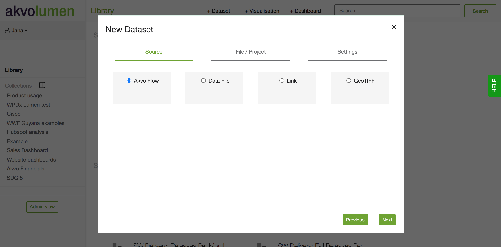
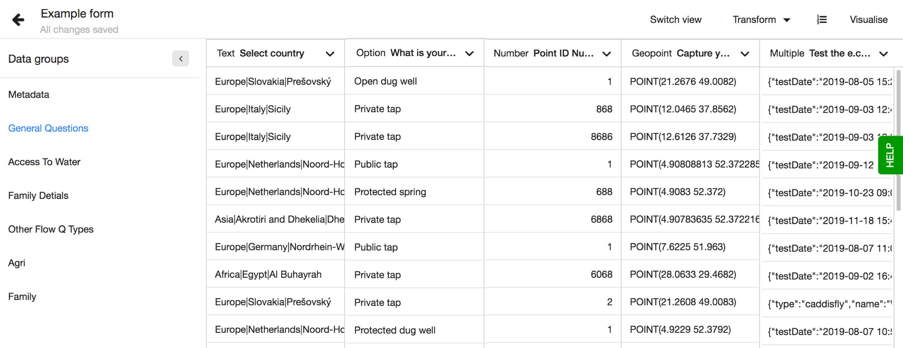
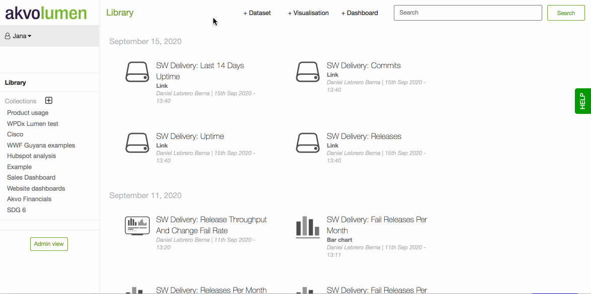
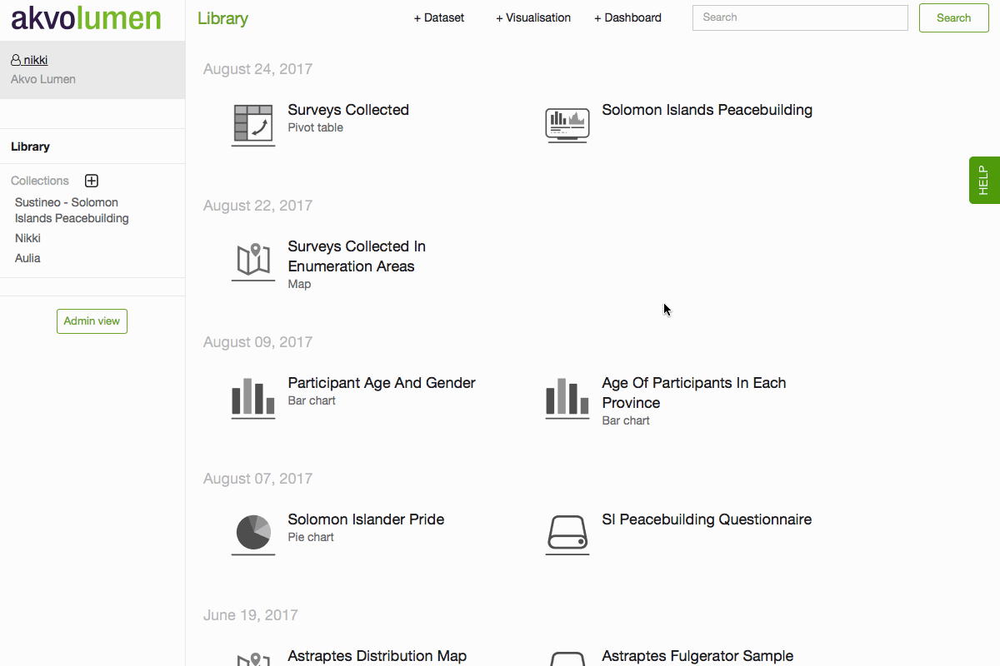
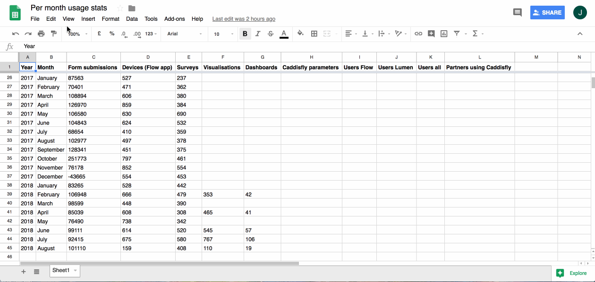
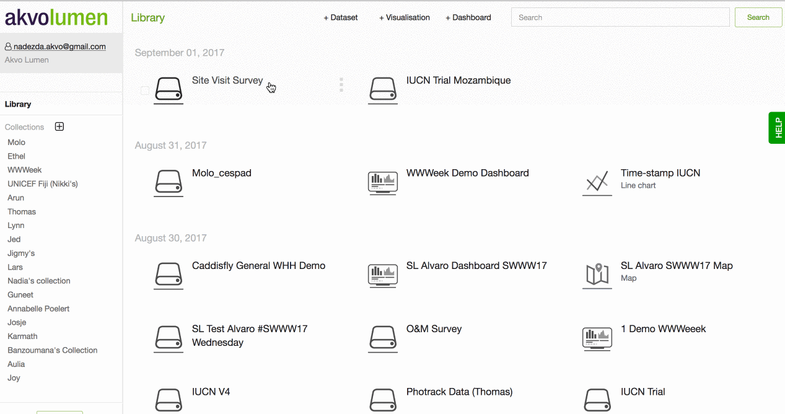

## Datasets
The first step of using Lumen for data analysis and visualisation is to prepare your data! Lumen is able to accept any of the below data sources. To upload your new dataset, click on + Dataset button from the menu at the top of the screen.  

- Akvo Flow

- Data file (.csv)

- Link

- GeoTIFF

- Geoshape (can be uploaded using 'Data File' option)

Here is an example of how a dataset looks like in Lumen. You will see the columns and rows and data groups. Data groups are based on Flow question groups, submission metadata and transformed columns. The data groups keep your dataset organised and make it easier to work with large and lengthy datasets. 

## Connecting Akvo Flow datasets
To be able to pull data from Akvo Flow, please make sure that you log in with the same email address that you use to access Akvo Flow. Once logged in, you will be able to upload data from any Akvo Flow instance that you currently have access to.

To upload your Flow data to Lumen, you will need to click on the + Dataset button. A dialogue box will open up where you can pick ‘Akvo Flow’ as a data source. You will then need to insert the URL of a Flow instance, i.e., trial.akvoflow.org. It is enough to just insert the name of your Flow instance (everything before '`.akvoflow.org'). A dropdown menu will appear, where you can drill down all the way to the dataset you wish to import. The dropdown menu follows the folder structure of the Akvo Flow instance.

Note: At this time you can only enter a single form from Flow at a time. Therefore importing an entire monitoring survey with multiple forms at once is not possible.

Once you have located your survey form, select Next. You will be prompted to give the dataset  a name, and press import. 

## Connecting data files
Before uploading your data, you will need to save your spreadsheet as a comma separated value (.csv) file. You can create a .csv file in Excel by using 'saving as' option and selecting csv.

Please note that for the upload to happen smoothly, your csv file needs to have UTF-8 encoding and have comma as a separator.

To add your .csv data file to Lumen, click on the + Dataset button. A dialogue box will open up, where you can pick ‘Data file’ as a datasource.

You will be prompted to select, or drag and drop your csv file from your computer. A green bar will appear with your file upload progress.

You will need to name your data file clearly. Remember that there may be other people using the same dashboard as you, so make sure file name will make it easy for you to find it again. Now you are ready to ‘Import’ your data!

Once done, your data will appear on the front page. 

## Connecting geoshape files
If you have a custom shape file you wish to load to Lumen, you can do so via the Data file uploader. There is one pre-condition for working with shape files in Lumen – it has to be converted to CSV file format first.

Lumen uses [Well Known Text CSV](http://www.opengeospatial.org/standards/wkt-crs) for geographical datasets. To create such file you can follow the following steps while using QGIS:

1. Open the original shape file (it usually comes in .shp format)
2. Navigate to layers> save as> format comma separated value
3. At Geometry, make sure the Z dimension is not included
4. Under Layers Options > Geometry> Select "AS_WKT"
5. Select the following CRS: (EPGS:4326, WGS 84)
6. Save the file

When converting a shape file to CSV format, please make sure that you save GEOMETRY as WKT (well known text) and not as XY or XYZ.  

After you upload your geoshape dataset to Lumen, please inspect it and make sure that the WKT column was automatically identified by Lumen as geoshape.

If you have any further questions about working with shape files in Lumen, please reach out to your contact person at Akvo or get in touch via our support channel.
## Connecting raster data file
Raster data can be used as one of the layers in Lumen maps. Raster data is good for showing data that changes continuously across the map surface, for instance, population density or temperature. Raster is a digital image that contains a data grid, where every cell in the grid represents a certain value.

Lumen reads raster data saved in **GeoTiff** format. To upload a file with raster data to Lumen, click on the + Dataset button you’ll find at the top of the screen. In the new dialog window, choose GeoTIFF as a data source. Next step would be to pick a file from your computer that you wish to upload. You can also use drag-and-drop file upload option. Click on Next and give your raster file a name. When done, click on Import and wait for a few moments until the raster data appears in your library. Please note that Lumen has a limit on the size of raster files. The upper limit at the moment is **100MB**.

You can preview the raster by clicking on its icon in Lumen library. You should be able to see raster image on a map surface.  It’s now ready to be used in building a map.

## Connecting data via a link
You can upload a dataset via a link pointing to a file in .csv format.

To upload data from a link, click on the +Dataset button at the top of the screen . A dialogue box will open up, where you can pick ‘Link’ as a data source. You will then need to insert the URL pointing to the csv file you wish to upload, and select Next. You will be prompted to give the dataset a name and press import. Once completed, your dataset should appear in your Lumen library.

## Connecting data from Google sheets
Lumen allows you to bring data in from different sources. Do you have data in a Google Sheet you like to visualise in Lumen or merge with some other data? Here we share how to connect your dataset in a Google sheet to Lumen. 

Connecting
To connect your Google sheet to Lumen make sure your sheet does not hold any formulas or merged cells. 

1. In the sheet go to File and hit Publish to web
2. In this screen make sure you select not as web-page but as Comma-separated values (csv) 
3. Publish and copy the url. 
4. In Lumen, select '+ Dataset' and Link. 
5. Add the url and then name your file. Now Lumen will import the dataset from your Google Sheet.

Updating 
The benefits of connecting your dataset via a link to Lumen, is that you can update your datasetusing the update button. If you have added new data to your sheet, hit update in Lumen and then your visualisations will also reflect the latest data. 

## Connecting IATI Data
It is possible to import data from IATI Data Store directly into Akvo Lumen.

Go to the IATI Data Store web page, and specify the data that you wish to import. Based on your query, IATI Data Store will generate a link, which you can copy and use to import data into Akvo Lumen. For more information on importing datasets via links, see this article here.

After some time, you might want to update your IATI data, in order to pull the new data in. It can be done by clicking the 'Update' button next to IATI dataset in your Akvo Lumen library. For more information on Updating existing data sets please see this article here.

## Updating a dataset
It is possible to update a dataset imported from Akvo Flow or via a link. By 'updating a dataset' we mean pulling new data from a source dataset. For instance, if data collection is ongoing, you might want to update your dataset when new data comes in, so that existing visualisations and dashboards reflect the most recent situation.

When updating a dataset, all pre-existing transformations will be applied to new data automatically.
Visualisations and dashboards created from that dataset will reflect the change automatically as well, so no action is required from your side.

To update a dataset, click on a three dot symbol next to a dataset you wish to update and click on 'Update'. Depending on how much new data has been submitted, this could take a few moments to update. 

If a dataset was imported from Akvo Flow, please make sure that your user has access to that Akvo Flow instance where the dataset is coming from. Otherwise, you won't have rights to update a dataset. 

Please keep in mind that if a source dataset has drastically changed its structure since it was last updated or uploaded into Akvo Lumen, the update process will fail. In the original dataset you can change the column name (question name in your Flow form), add a new column, move columns around and the update in Lumen will work ensuring your defined transformations apply on the new rows as well. 

Finally - please note that the update functionality does not apply to files imported from your computer.

If you have any further questions about working with shape files in Lumen, please reach out to your contact person at Akvo or get in touch via our support channel.

