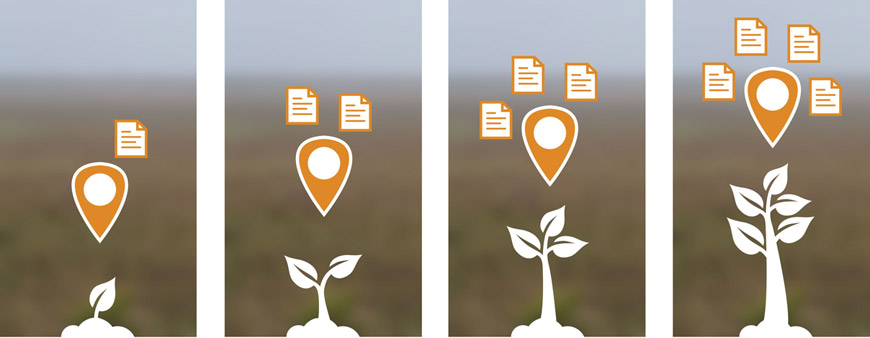
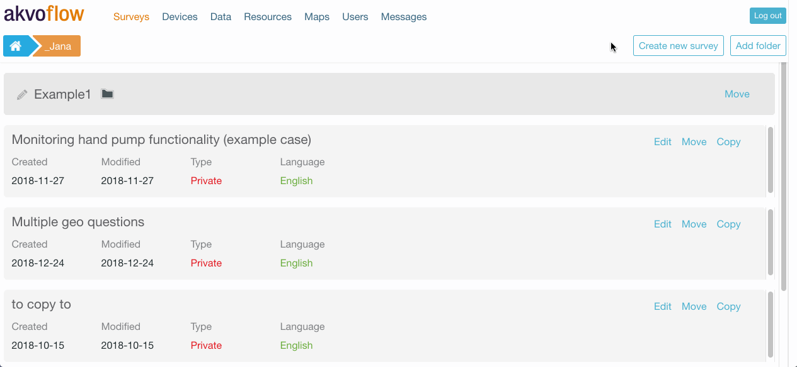
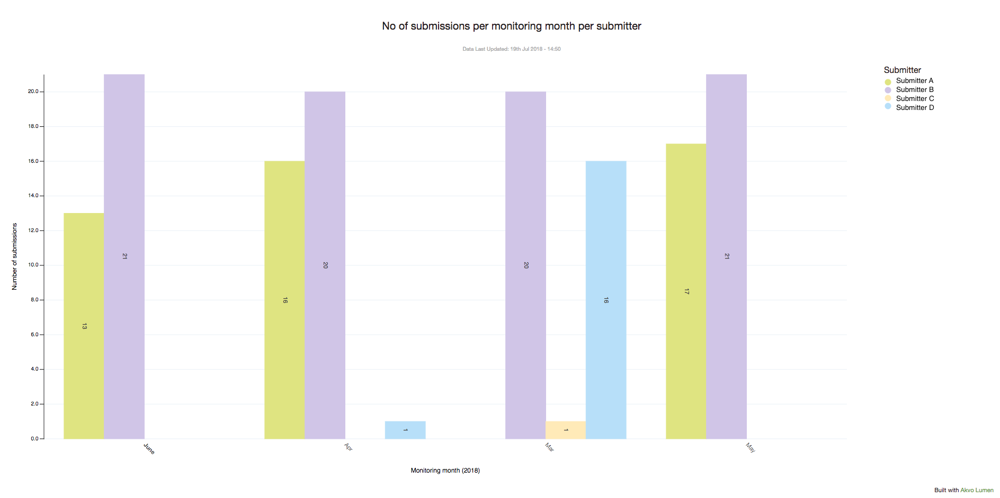
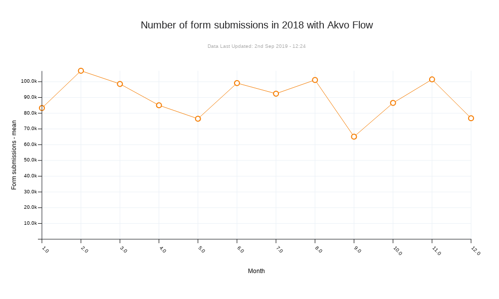
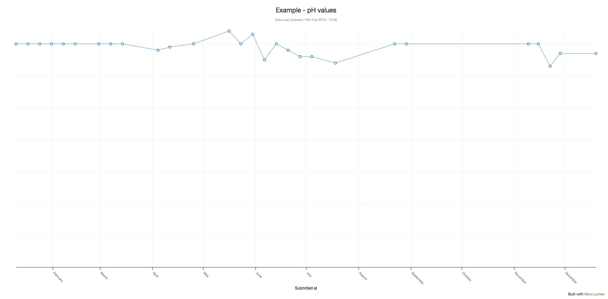
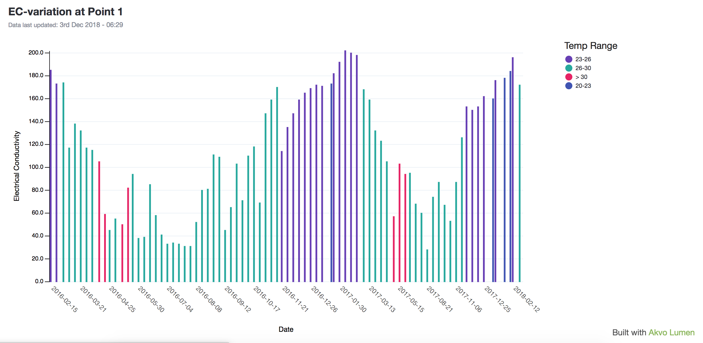
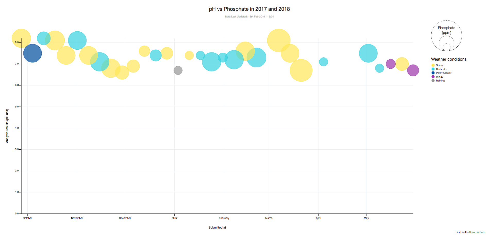

## Introduction to tracking change over time
With Akvo Flow, we are committed to accelerating the progress of sustainable development goals by supporting you in making the best use of data. To achieve this, we believe that working with data does not have to only be a one-time event, but that you should be able to go back at a later date and follow up. 

In Akvo Flow we call this monitoring: observing facts about something over time. With monitoring, you can go back and check: is the water pump still working? Has the quality of the water at this household improved? Has the farmer changed how she uses fertilisers? How much has the tree grown since the last visit?



## Monitoring  
Akvo Flow's monitoring consists of two main components: 

- What you are monitoring, the subject of your data collection. We call this a data point.
- Time. 

The core idea of the monitoring feature in Akvo Flow is to create ‘data points’ to which information can be added over time through one or more monitoring forms. You can create multiple forms in a survey on the online space. These forms then together capture different aspects of a data point. One form is used to create the data point with attributes that are unique to the point and which will not change over time. The other forms are used to add additional information to an existing data point that may change over time. Every time you return to the data point you can submit more data with the monitoring forms. 

Flow's monitoring supports collaboration. Often the initial monitoring round in done by a group of enumerators, who might not be available for the following rounds. In Flow's app, you can simply download existing data points for your monitoring (even if created by another enumerator), and add additional information to the points by filling out the monitoring forms. To make it easy to work with many data points on the app, you can search for a specific point by ID, or data point name, or sort the list by distance seeing the closest points to you first. 

All data submitted to a data point is connected with the data point ID. When analysing the data you can visualise the latest status of your points, or show change over time for all your points or a for a specific one of your interest. 


How to use monitoring with Akvo Flow and Akvo Lumen
Akvo's data platform guides you through all steps of your data journey, also when it comes to using the monitoring feature. You can find on Akvo Flow's support page articles focused on the Design and Capture stages. Akvo Lumen's support page guides you on how to Understand the data. 

Below are all the articles and links to those that you cannot find here:  

Design 

- Flow: Design your monitoring survey

Capture 

- Flow: Capture data for monitoring surveys with Akvo Flow app
- Flow: Capture data for the right data point on the Flow app 

Understand 

- Flow: View your monitoring survey data
- Flow: Export your monitoring survey data
- Merging registration and monitoring form data
- Handling time in the dataset
- Visualise change over time

Are you interested in using our monitoring feature? Contact us for more details and support.

## Design and capture monitoring data
Akvo Flow's monitoring consists of two main components: what you are monitoring, the subject of your data collection, a data point; and time. The core idea of the monitoring feature in Akvo Flow is to create ‘data points’ to which information can be added over time through one or more monitoring forms. Read more here on how to best set up your forms using Akvo Flow. 





## Capture monitoring data 
Akvo Flow app is the tool you capture your data with. Once your monitoring survey is ready for data collection and published you can assign it to the devices that will capture the data. In this article we share how to capture data for the two forms types and more. Secondly, when monitoring it is important to make sure you are collecting more data for the right data point. Here we share to to ensure you have selected the right data point to add more data to over time. 


## Merge registration and monitoring forms
When merging datasets in Lumen the main requirement is that the datasets you wish to merge have at least one column in common, for instance, an ‘Identifier’ or a ‘Country code’. Based on this common column, Lumen will be able to piece those datasets together.    

In case of Flow, datasets coming from one monitoring survey, have the 'Identifier' column in common. This column holds the data point ID that connects registration form data with monitoring forms data. Lumen automatically marks this column as unique to make it easier for you to merge the datasets. 

When handling Flow monitoring data you have two possibilities to  merge registration form data into a monitoring form dataset, or to merge monitoring form data into a registration form dataset. When new data comes in, you can update a merged dataset the same way as with other Akvo Flow datasets. In the case of merged datasets you need to update both datasets. This will trigger automatic updates in all associated visualisations and dashboards.  


## Merge registration form data into a  monitoring form dataset
If you want to see the change over time for a specific data point or for all data points, you merge the registration information into a monitoring from dataset. This way you add information that defines the datapoint that you can use in your analysis. Because your monitoring dataset may hold multiple submissions per data point (one data point has data on more rows), the registration form data you merge in will be copied to each row point to the data point.


To start the merge transformation, open the dataset containing monitoring data and click on the +Transform button. You’ll see ‘Merge datasets’ option in the dropdown. Clicking on it will open up a new window, where you need to make a few choices for the merge to happen.  

- In Dataset 1 Make sure the common ‘Merge column’ is correct. In Akvo Flow datasets, Lumen automatically defaults it to ‘Identifier’
- Choose Dataset 2 you want to merge data from (this is your registration form). ‘Merge column’ will be defaulted to ‘Identifier’ here as well
- Choose columns you want to merge from Dataset 
- Click on the ‘Merge’ button
  
The history on merge transformation will be recorded in the transformation log, showing a list of columns that were merged.


## Merge monitoring form data into the registration form 
If you want to see the latest status of your datapoint, or the status of the datapoint when you started your data project, you merge the data from the monitoring form into the registration form. In this case, in the registration form dataset one row is one data point and you will be adding, for example, the latest value for each data point to the rows.  


To start the merge transformation, open the dataset containing registration data and click on the +Transform button. You’ll see ‘Merge datasets’ option in the dropdown. Clicking on it will open up a new window, where you need to make a few choices for the merge to happen.  

- In Dataset 1 Make sure the common ‘Merge column’ is correct. In Akvo Flow datasets, Lumen automatically defaults it to ‘Identifier’
- Choose a Dataset 2 you want to merge data from (this is your monitoring form). ‘Merge column’ will be defaulted to ‘Identifier’ here as well
- Choose the aggregation strategy. Since monitoring form contains repetitive data and registration form – unique data, you need to choose which data from monitoring form should be selectively pulled into the registration form. The most common strategy is to join the latest monitoring values. To do that, choose a date column in ‘Aggregation strategy’, for instance ‘Submittted at’. Then pick ‘latest'
- Choose columns you want to merge from Dataset 2 
- Click on the ‘Merge’ button

The history on merge transformation will be recorded in the transformation log, showing a list of columns that were merged.

## Handle time in the dataset
When monitoring, you want to see how a value changes over time. With Flow data, time is represented by the submission date of each submission made to your data point. In Lumen the submission date is shown in the column 'Submitted at'. The default data type is date and the values are in a standard ISO format. 

In some cases this format might be useful, in some not. This depends on how often you monitor the data point and which visualisation type you will use (not each visualisation type works with the date data type).

*Example: Let's take the case of collecting data to track the functionality and water quality of your well. The 1st time you visit the well you register it and create the data point. At this point in time, you also submit the monitoring form asking about its functionality. You also measure the water quality parameters your are interested in with the 2nd monitoring form. Every time you visit the well in the future, you will be tracking is functionality and water quality status.*


## Monitoring on a monthly basis
If you visit the water well once a  month, you want your visualisation to use months to show time, instead of the detailed timestamp you now have in the 'Submitted at' column.  

To change the submission date to show only months you need to derive a new column in the dataset in Lumen. To do so:

1. Leave the data type for ‘Submitted at’ set as ‘date’ data type.
2. Under ‘+Transform’ select ‘Derive column’.
3. Set the new column title as ‘Month’.
4. Set the new column type as text.
5. Decide what to do if the transformation fails. We suggest to ‘leave cells empty’ as you can quickly evaluate if everything went well.
6. Use this formula for the javascript code: 

```
["January", "February", "March", "April", "May", "June", "July", "August", "September", "October", "November", "December"][new Date(Number(row['Submitted at'])).getMonth()]
```

At the end of your dataset, you will see a new column holding the month text. This is the column you use when setting up the visualisation.



## Merge monitoring form data
Example: Number of submissions per month per enumerator
If you want to use this new Month text column in a line chart, you need to change the Month text column to a number data type. To do so: 

1. Under '+Transform' select Derive Category column. 
2. Select the Month column. 
3. Create new categories for each month, where January = 01, February =02, etc. 
4. Derive the new column. 
5. Now you have a column holding number representation of months. This column is still of the data type TEXT. 
6. Click on the datatype and change it to Number. 
7. Now your column is ready to be used in a line chart, in the x axis where each month is represented. 



## Monitoring on a daily or weekly basis
If you monitor the data point weekly, then the hour and minutes are not important for analysis. You only want to see the year, month and date values. To do so use split column transformation:

1. Change the data type for ‘Submitted at’ from ‘date’ to ‘text’.
2. Under ‘+Transform’ select ‘Split column values’.
3. Select ‘Submitted at’ in the column dropdown.
4. As we only want to work with ‘2019-09-15’ we need to split the values by ‘space’. In the‘Separator’ text field add a space (empty space).
5. Set the ‘New column prefix’ to for example Date
6. Hit Extract.

At the end of your dataset, you will see two new columns, one holding the YYYY-MM-DD values called ‘Date-1’ and the other, ‘Date-2’, the hours and minutes. You can rename the 'Date-1' column and use this column when visualising change over time for your water well. 


*Example: Monitoring the levels of Electrical Conductivity at a water point.*


## Monitoring on an hourly basis
If you are monitoring your water point on an hourly basis, then simply just change the ‘date’ data type to ‘text’. The answers will change from ‘2018-09-15T12:51:10+02:00’ to ‘2018-09-15 10:51:10+00’. This is format will ensure each time has its own bar in the visualisation.

## Visualise change over time
Monitoring form datasets hold all the data submitted over time for all your data points. You can visualise how a certain value changes over time for the entire dataset (see this article) or you can only look at a specific data point. 


## Working with all data or one data point
Often you look at a dataset as a whole. When visualising change over time, you look at how an variable changes across your monitoring period for all data. In this case, you need to make sure to set up the 'Aggregation type' correctly. To see the average values select mean. This is the method you will use the most. On the other hand it might be interesting to see the highest values collected by selecting max as your aggregation method. Lumen's visualisation types provide multiple aggregation types for you to work with. To make your visualisation easy to understand, add the aggregation method to the axis label, or to the title of your visualisation. 

The monitoring functionality links each submission to a data point via the data point ID making it possible to examine change over time for a specific subject of your data collection. To visualise change over time for a specific data point, we need to filter out all the other data points for the visualisation and work with the data relevant for our data point only. To do so:

1. In the Monitoring form dataset note down the ID of the data point you want to analyse. You will find it under the column ‘Identifier’. Simply highlight the value in the cell and copy it.
2. Now open a new visualisation. To set up any chart in Lumen, you can go directly from the monitoring dataset to the visualisations editor, or open the visualisations editor and select chart and your dataset.
3. Under the Dataset open ‘Advanced’. Here you can add filters to the visualisation. Click on ‘New filter’.
4. Under ‘Filter operation’ select ‘Keep rows in which’. This means the visualisation will only be based on the rows meeting the condition you set next.
5. For ‘Column to filter by’ select ‘Identifier’.
6. For ‘ Filter match method’ select ‘exactly matches’
7. Add the data point ID you copied to the last box, ‘Filter match value’.
8. Save the filter.


## Different visualisation options 
With Akvo Lumen you can use different visualisation types to showcase change over time. We will look at the option to use bar charts, line charts and scatter plots and the benefits of using these visualisation options. Furthermore, once new data is submitted and you update the dataset in Lumen, the visualisations for the data set will automatically reflect the new data. 

To best show how to set up the visualisations and which one to choose, we will use the example case below.

*Example: Let's take the case of collecting data to track the functionality and water quality of your well. The 1st time you visit the well you register it and create the data point. At this point in time, you also submit the monitoring form asking about its functionality. You also measure the water quality parameters you are interested in with the 2nd monitoring form. Every time you visit the well in the future, you will be tracking is functionality and water quality status.*


## Line charts
When working with time series data, line charts are the first ones that come to mind to use. They are very handy to show how a variable evolves in time. Furthermore, Lumen's line charts read date data types, meaning you do not need to extract, derive or change the 'Submitted at' values at all. Just use it. 



### Setting up a line chart with monitoring data
Because line charts work also with date data types, to indicate time you do not need to transform the submission date values. Once you select the date column, Lumen will transform the time stamp to a user friendly value like the month or month and date, depending on how frequently you monitored the data point. 

Now you need to define the line chart. For the ‘X-axis’ select the time value, 'Submitted at'. For ‘Y-axis’ select the column with the variable you want to monitor, in our case the pH values. To change the colour of the line, click on it an pick from the colour picker the colour of your preference. 

### Setting up a line chart not using a date column
Not all datasets hold a timestamp based on which you can see change over time. Some datasets may have a Month column. This column holds the name of the month as is of the TEXT datatype. In this case, you cannot use the column for the x-axis in your line chart. You need to transform the column first:

1. Under '+Transform' select Derive Category column. 
2. Select the Month column. 
3. Create new categories for each month, where January = 01, February =02, etc. 
4. Derive the new column. 
5. Now you have a column holding number representation of months. This column is still of the data type TEXT. 
6. Click on the datatype and change it to Number. 
7. Now your column is ready to be used in a line chart, in the x-axis where each month is represented. 


## Bar charts
When working with time series data, visualising it in a bar chart might not be the 1st choice. On the other hand, bar charts are very handy as you not only can show how the value changed over time, but you can also colour code the bars based on a third value making the visualisation much more informative. 




### Setting up a bar chart with monitoring data
Because bar charts only work with number or text data types, you cannot use the date data type in the 'Submitted at' column to indicate time. To handle time, split the 'Submitted at' column to get the YYYY-MM-DD into a separate column as a text data type. Check more info here. 

Now you need to define the bar chart. For the ‘X-axis’ select the time value. In our case we have extracted the YYYY-MM-DD as we are monitoring on a weekly basis into a separate column, called ‘Date-1’. Under ‘Advanced’ you can change the ‘X-axis’ label to only show ‘Date’ in the visualisation. To colour code the bars based on the derived temperature ranges, split the bars under 'X-axis' selecting the column with ranges. By clicking on a column you can choose the colour you want for each range. 

For ‘Y-axis’ select the column with you EC values. For the aggregation type set ‘Max’, if you are visualising data for one specific data point. This is because we are not aggregating an average for more than one answers per date, but want to show the value captured for each date. 


## Scatter plots 
Scatter plots are great for understanding relationships between different variables and visualising distribution of your data. As you can use date data types in a scatter plot, as with line charts, working with monitoring data is easy and does not require to transform the time values. The largest benefit of scatter plots is that you can not only see how your values change over time but also check if there are any correlations with other variables you monitored.




### Setting up a scatter plot with monitoring data
Because scatter plots work also with date data types, to indicate time you do not need to transform the submission date values. Once you select the column, Lumen will transform the time stamp to a user friendly value like the month or month and date, depending on how frequently you monitored the data point. 

Now you need to define the scatter plot. For the ‘X-axis’ select the time value, 'Submitted at'. For ‘Y-axis’ select the column with the variable you want to monitor, in our case the pH values. Now you can already see how the pH evolved over time. 

But you also want to know what affect the weather had on the values. As weather is a text data type, you can colour code the bubbles based on this value. Go to 'Category' and select the weather column. The bubbles now have a colour per weather value. You can change the defined colour simply by clicking on the bubble. 

Furthermore, you want to see if there is any relationships with the values of Phosphate found in the water as well. Under 'Size' select the phosphate column. The size of the bubbles depend now on the phosphate value and the aggregation method you selected. 
