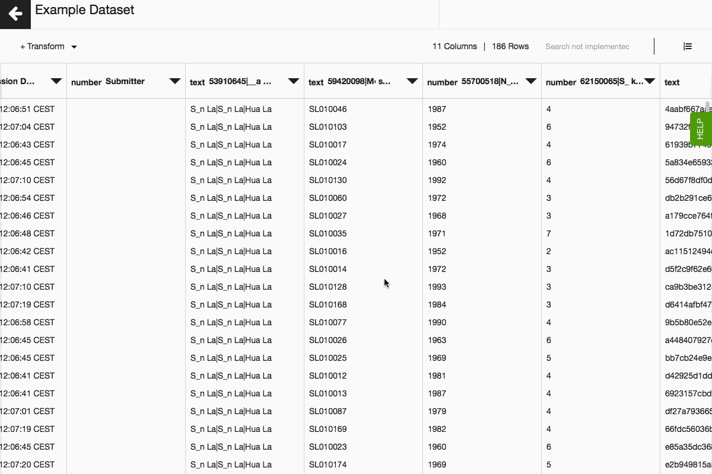
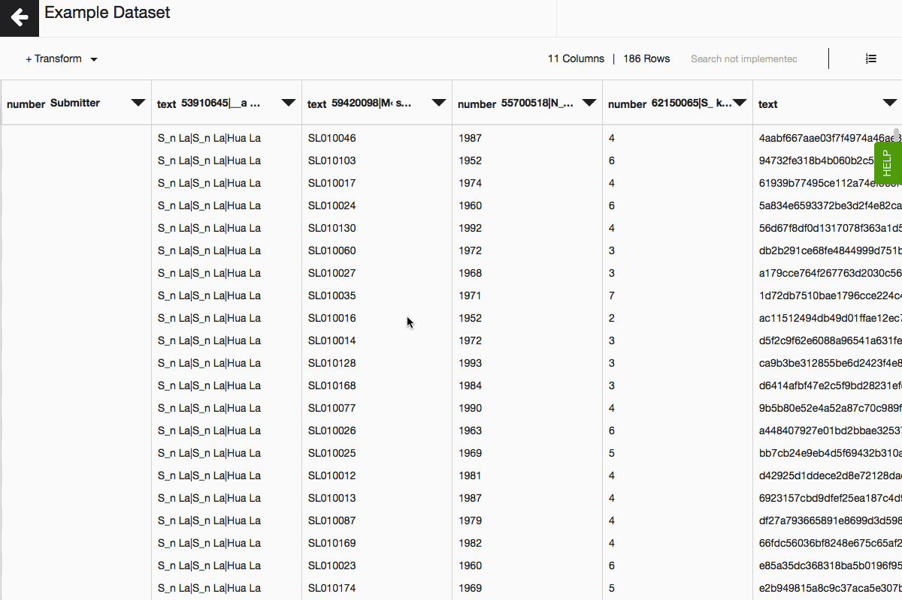
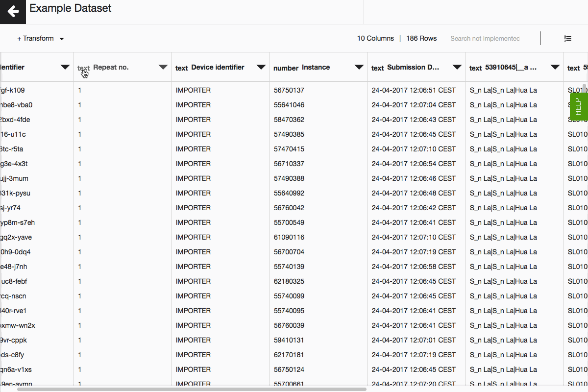
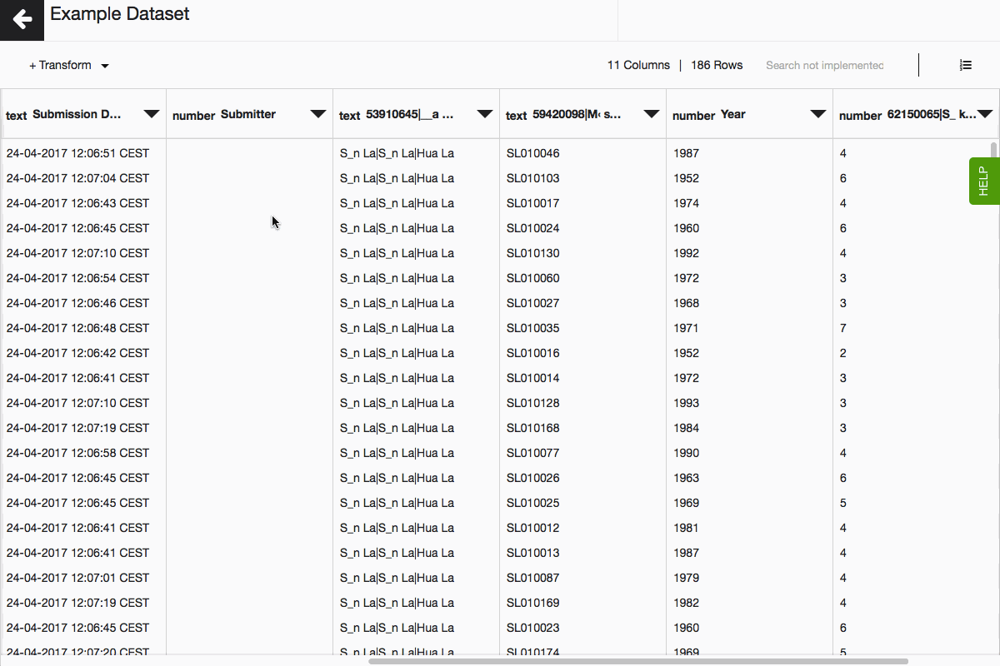
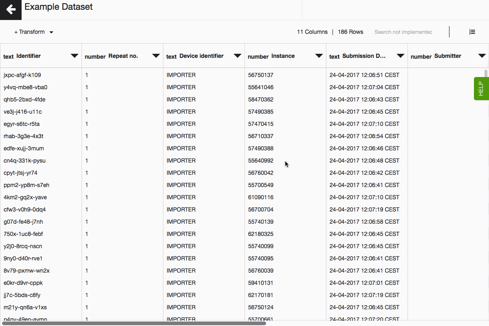
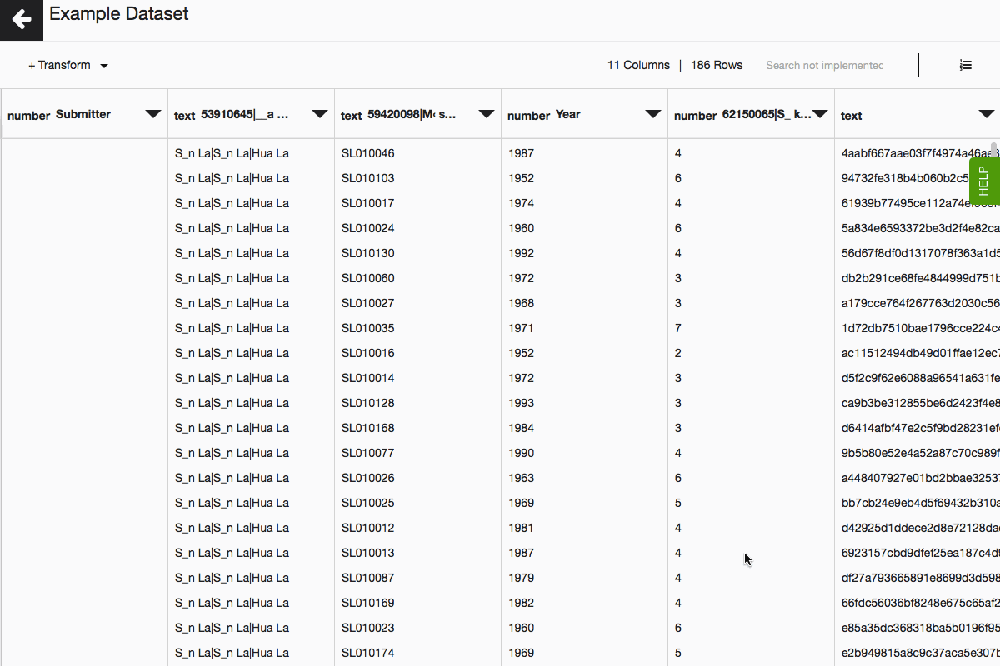

In Lumen there are a number of column functions that can help you with cleaning your data. Some of these are similar to what you may have previously used in programs such as Microsoft Excel or Open Refine.

## Sort column data

Choose to sort each column of your data by ascending or descending value.

## Rename column

This function will allow you to rename your column. This is particularly useful for columns with long headers. When analysing and visualising your data it is easier to work with shorter column headers. 

## Edit data types
Lumen has been designed to automatically identify data types of Flow and most of CSV data when it is imported. However there may be times when you wish to manually change the data type. In Lumen each column can be one of the following data type, Number, Text, Date, Multiple, Option, Geopoint, Geoshape. 

You can change the data type for Number, Text and Date. To change them you will need to click on the text next to the column header stating the current data type, and select the type you wish to change it to. A panel will then appear on the left hand side of your screen. You will need to confirm the data type you wish to change the column to. You will also be given a number of options for when cell format is invalid - these include:

- Leave empty

- Pick a default value

- Abort transformation

- Delete row

**Note:** When selecting the format for data being changed to Date format, your will need to select the format that data is currently in, not what you wish it to be changed to.

If you're working with CSV data, read here how to generate a geopoint data type from columns containing latitude and longitude. If you're working with data coming directly from Akvo Flow, Lumen will generate geopoints for you automatically.

## Delete column

This will remove the entire column from your dataset.

## Filter data

Like a filter in Excel, this will allow you to only include rows that exactly match, or contain a certain value. Currently, you can only filter data of the data type - TEXT. 

## Edit whitespaces

Whitespace is an unnecessary empty space that appears before or after the column value. It is often a result of human error during data collection. Data values with and without whitespace will be treated as two different data values. Since it complicates data analysis, whitespace should be removed from your dataset.

With Lumen you can remove whitespace located before date values (leading whitespace), located after data values (trailing whitespace), or you can remove double spaces. 

## Change case

With this option you will have the choice of UPPERCASE, lowercase, Title case. This can be particularly useful where a similar names have been entered but with a slightly different format, for example if different data collectors have written ‘UNICEF’, ‘Unicef’, and ‘unicef’. Changing case will unify your data.

