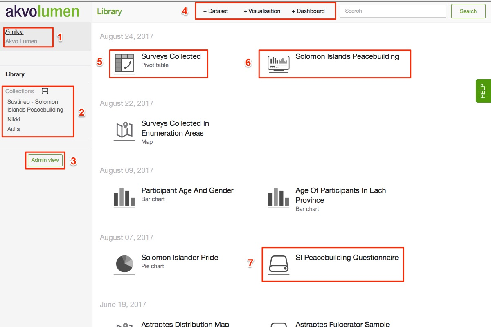
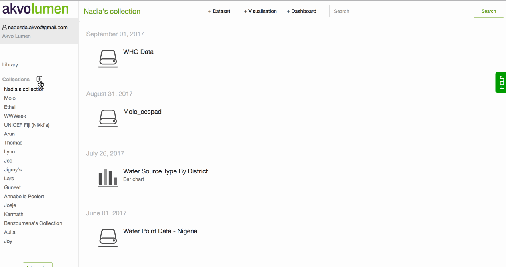
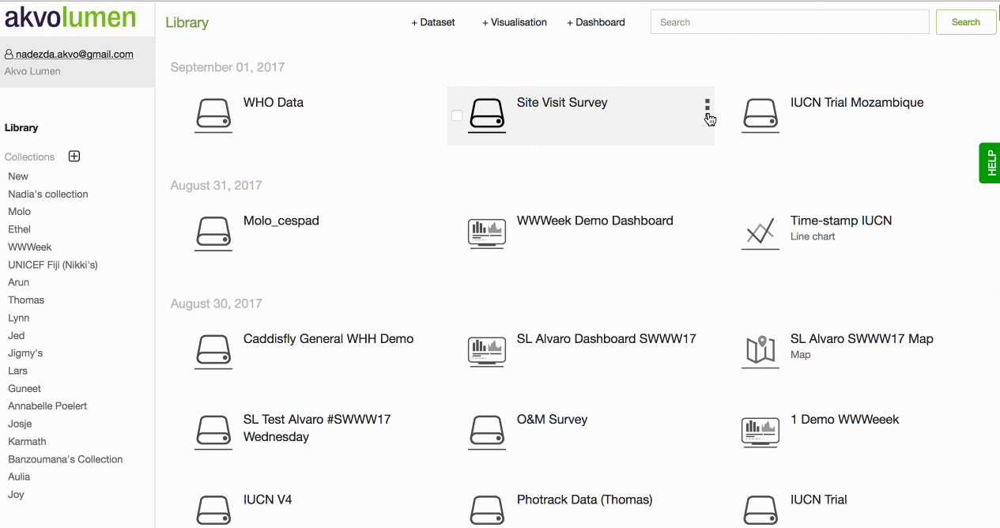

## Lumen in a nutshell
<!-- -->
 

## Glossary of terms for Lumen
**Aggregation** - a process of expressing data in a summary form, for instance, an average or a sum of several values.

**Aggregation type** - different ways of expressing data in a summary form: mean, median, maximum, minimum, count, count unique, sum, lower quartile, upper quartile

**Collection** - a group of datasets, visualisations and dashboards. After having been added to a Collection, datasets, visualisations and dashboards will still appear in the Library view.

**Count** - the number of times a certain number of category occurs

**Dashboard** - an online board containing a number of visualisations and narrative about them, which, combined, tell a story about your data.

**Dashboard canvas** - an area in the Dashboard Editor where visualisations and text elements are arranged together to tell a story about your data.

**Dashboard editor** - an interface for creating a dashboard and fine-tuning it to your needs. That’s where you would pick visualisations and text elements that should appear in your final dashboard.

**Data source** -  a place where data is coming from. It could be your computer, if a dataset is stored locally, a link, Flow instance, etc.

**Dataset** - a table containing data.

**Dataset filter** - in the context of visualisation editor, a feature that allows you to filter out data values that are not relevant for that particular chart or map

**Data type** - one of the characteristics of your data. Data types include text, date, numeric, geopoint, geoshape

**Derived column**- a new column containing calculations using values from other column(s) in the dataset

**Embed code** - is a block of code used for inserting (or in other words, embedding) a visualisation or dashboard onto an external website. 

**Geo shape** - is an object that represents a polygon on a map surface. It's often used for showing administrative divisions of a country or a region on a map.

**Instance** - an online workspace where you land after logging into Lumen. This holds all of your datasets, visualisations and dashboards. 

**Library** - all the datasets, visualisations and dashboard that belong to an instance. A library can consist of collections and standalone items.

**Map layer** - data that you add to a map so that it appears as data points, raster data or geoshapes. Data should be uploaded to Lumen instance beforehand.

**Maximum** - the highest number or amount recorded

**Mean** - is a statistical term for the average number from a number series

**Median** - is the middle number in a number series

**Minimum** -  the lowest number or amount recorded

**Raster data** - in maps terminology, it's a digital image that contains a data grid, where every cell in the grid represents a certain value. Raster data is good for showing data that changes continuously across the map surface, for instance, population density or temperature.

**Reverse geocoding** - is the process of transforming geographical coordinates (in Lumen - geopoint data type) into a readable location name, for instance county or district name.

**Shapefile format** - is a file format containing geospatial vector data, for instance, polygons that represent administrative boundaries of a village, county or country.

**Sum** - Total of all number in a number series.

**Transformation** - a change introduced to a dataset, for instance, replacing some values or removing whitespace

**Transformation log** - a list of past transformations applied to a dataset, which can be undone in case an error creeped in. Can be found in dataset view.

**Visualisation** - a visual representation of your data, which can be a chart, a map or a pivot table.

**Visualisation editor** - an interface for creating a visualisation and fine-tuning it to your needs. That’s where you would pick what data points should appear on a map or which columns should be mapped to X and Y axis on a chart

**WKT** - stands for well known text. It represents vector geography in maps. For instance, it can represent polygon type shapes in Lumen maps.

## User interface Overview

1. Current user that is logged in

2. An overview of the available collections

3. Admin view - this button will only appear if you have administrative rights for this instance

4. Adding a new dataset, visualisation, or dashboard 

5. A visualisation with its type shown under the title, e.g. pivot table

6. A dashboard

7. A dataset

## Using Collections
Organise your Akvo Lumen library by creating Collections. Collections let you group datasets, visualisations and dashboards in one place for better overview and easier management of your Lumen 'resources'.

To create a new collection, click on a plus sign next to 'Collections' on the left hand-side panel. Give a new collection a name and hit Create. A new collection will appear at the top of the Collections list.

To delete a collection, click on a little cross next to your collection's name on the left hand-side panel.

To add a dataset, visualisation or dashboard to a collection, go to the Library and click on the three dots sign next to an item you wish to add. A dropdown menu will appear, where you will need to choose which collection to add it to.

To remove a dataset, visualisation or dashboard from a collection, go to your collection and click on the three dots sign next to an item you wish to remove. Choose 'Remove from collection' and hit enter.

