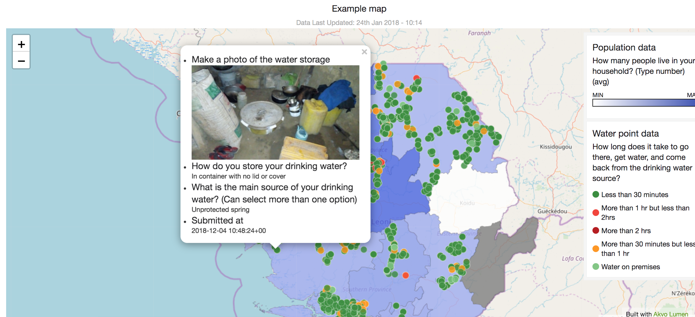
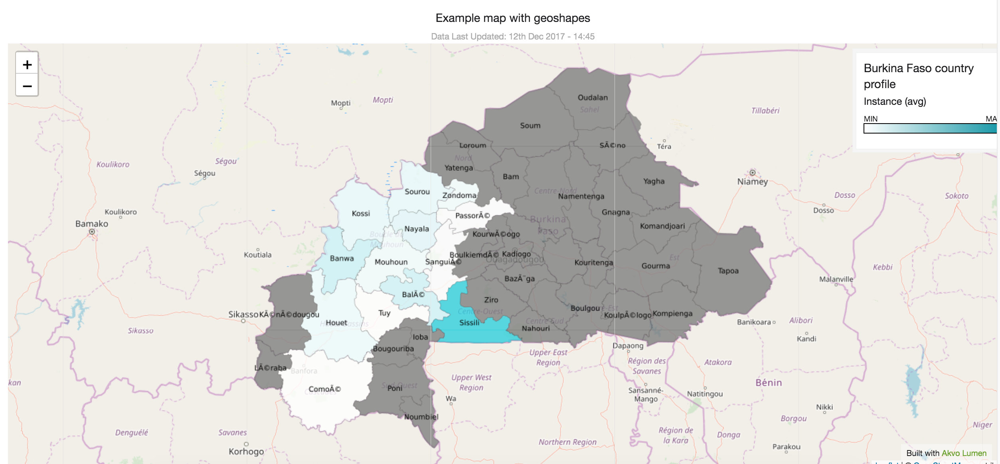
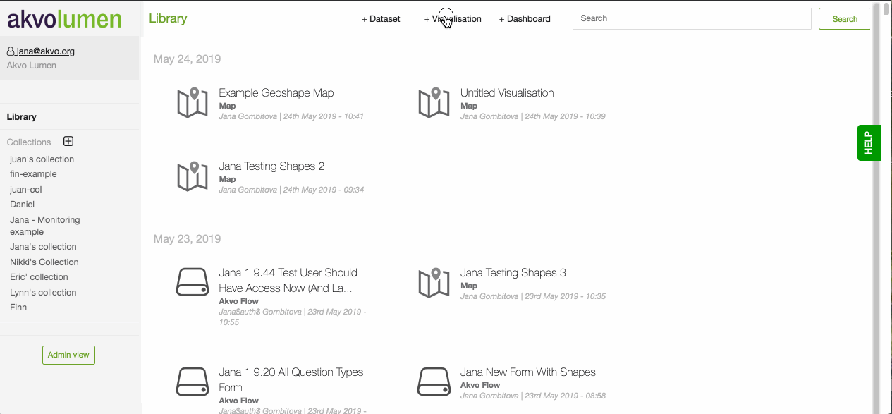
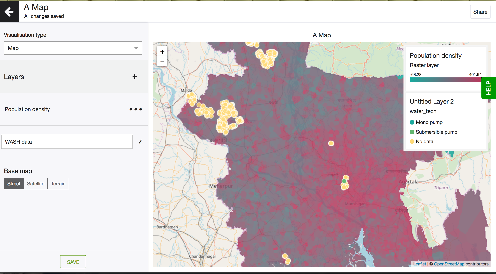
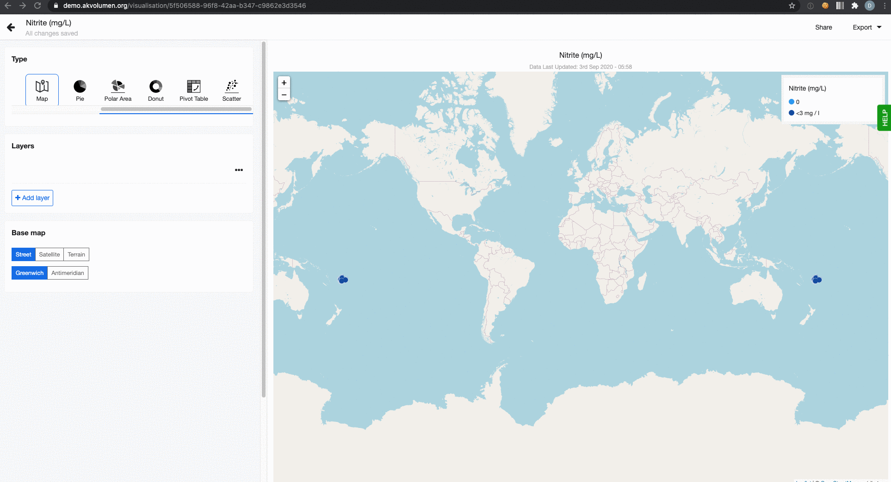

## Create a map
Visualising data on a map can be a very powerful way to share insights. By being able to see outliers in the context of regions or even villages you can target you interventions better. If your dataset contains geolocation data, it’s very easy to create a custom map using Lumen. Furthermore, you can add more than one layer of data to a Lumen map, to compare more variables and tell a powerful story. With Lumen you can visualise points, geographic shapes and raster data on a map. 

### How to 
To create a map, click on + Visualisation button at the top of your screen and select ‘Map’ from the selection of available visualisation types.  Now you’re in the map editor. To create a basic map with geopoints follow these steps: 

1. Add a map layer and give it a name. If you do not want to map layer to show in the legend you can also leave it empty. 
2. The base map is set to ‘Street’ by default but you may also choose ‘Satellite’ or ‘Terrain’ if that works better with your data. You will find the choice of base layer types underneath your data  layer. 
3. Select the dataset you want to visualise. 
4. By default, Geo point is selected as your layer type. You can also choose to visualise Geo shapes or Raster data.
5. Pick the column containing geo points (here's a quick tutorial about how to generate geo points). Points will now appear on your map. 
6. Set up the colour-coding system for the data points on your map. For instance, you can colour-code gender of respondents or the functionality of water points. Just select a column that should be used for colour-coding in the field ‘Color coding column’.    
7. Under the Legend tab, you can decide whether you want to show the legend on the map. You can also define the order of the different values in the legend. By default they are sorted alphabetically. To define the order, click on 'Custom' and drag-n-drop the values based on the order you prefer. 
8. Popup allows you to select what other data you want to show on the map when you click on a specific data point. Pop-up is a small window that opens up when you click on a data point on the map. This tab will show a list of columns from your source dataset. Click on those that you would like to have in the map. If you have a link to a photograph in your source dataset, you can add it to the pop-up window as well.
9. The Theme tab allows to add some final styling touches to your map. Choose the size of map points and adjust colours for your colour-coded data points.   
10. Each Lumen map can be shared online (link or embed code) or offline (.png or .pdf). If underlying data changed or is updated as new data points are added to the source dataset, your map will update automatically.

## Create a map with a geoshape layer
Geoshapes are great for showing different administrative structures, farmer plots, water pipelines, etc on the map. Showing how your data is distributed across the map enriches data analysis and helps target interventions locally. 

There is data openly available on the internet on administrative areas for most of the countries, which you could use. To import these datasets to Lumen, check for tips here. You can also capture geographic shapes (as points, lines and areas) with Akvo Flow and analyse and visualise them in Lumen. 

### How to 
Lumen map layers can be of different types: Geo Location, Geo Shape and Raster. If you want to display shapes on your map to represent, for instance, administrative areas, choose ‘Geo Shape’.  With Lumen you can add multiple layers to your map to tell a more rich story with your data. 

To add a geoshape layer to your map follow these steps: 

1. Add a new layer and give it a name. If you do not want to layer names to show in your map, you can also leave them empty. 
2. Select the dataset with the geoshape column. 
3. Pick the column holding your geoshape data. 
4. You can label your admin shapes on the map by ticking the ‘Geo shape label’ option. This helps you to identify areas on the map more easily. 5. Just select a column from the shape dataset that contains names you want to show with the shapes. Adding labels is not mandatory, so you can skip this if it’s not adding any value to your analysis.
6. Go to the field ‘Styling dataset’. This can be your dataset holding the geoshape or another one you want to use to colour code the shapes. It’s important that the dataset has a geo location column, otherwise, it wouldn’t be possible to display it on the map. 
7. Select a geopoint column from your styling dataset. 
8. Pick it in the field ‘Styling indicator geopoint column’. Styling indicator represents a column that you wish to style (or to be more precise colour) your admin shapes by. 
9. Now decide how you want the styling data to be aggregated. Since, every geoshape on your map can contain several values from different, say, water point locations, we want to aggregate them. Available aggregation options are: average, sum, min, max, count.
10. You can also customise if you want the legend to show, if you want data to show in a pop up, or select a different colour.
11. Each Lumen map can be shared online (link or embedded) or offline (.png or .pdf).

## Create a map with a raster layer

You may add raster image as one of the layers on a map. Read about how to upload raster data to your Lumen instance [here](connect.md).  

Once raster data is uploaded to your Lumen library, you can start building a custom map. To do so, click on + Visualisation button at the top of your screen and choose Map. Once you’re in the map editor, you’ll see a section called Layers with a + button next to it. Click on + to create a new layer. Read about how to create and manage map layers here.

To set up a raster layer, choose a raster file you uploaded earlier from the Source Dataset dropdown. Now go down a bit to the options for Layer Type and select Raster. The map preview on the right hand-side will automatically zoom in to the area where you have raster data. It’s possible to choose a custom start and end colour for your raster data by going to the Theme tab. If you choose contrasting colours for start and end of the colour ramp, the difference in raster values will be more straightforward.

Example map with a raster layer:

After you have a raster layer set up, you can add a few other map layers. For instance, you could add a layer containing geolocation of data points representing water and sanitation facilities, or any other data. Read about how to create a custom layer containing geolocation facilities here.

## Create a new map layer
It is possible to create maps with multiple layers.

When you’re in the map editor, you’ll see ‘Layers’ panel with a + next to it. Clicking on the + creates a new layer.  

A new layer gets a default title ‘Untitled Layer 1’, ‘Untitiled Layer 2’, etc, in the order you created them. For your own convenience, it’s recommended to give layers a custom title. You can do so by clicking on the three-dot sign next to the layer and renaming it.  

Now the layer is ready to be configured. Click on the layer and you’ll be taken to the layer editor, where you can configure Data, Legend, Pop-up and Theme. 

In the event when a layer needs to be deleted, click on the three-dot sign next to the layer and choose Delete.  

The order of layers can be changed by clicking on up or down arrow next to the layer title.

Read how to create a basic custom map here.

## Base map settings
Lumen maps can hold multiple data layers. This way you can show a comprehensive story of the data. But regardless of how many data layers your map has, it base is defined. You can select what map type you want to use and how you want to centre the map. 

We support three different map types: street, satellite and terrain. Choose the map that best works with your data, keeping colour contrast and the details of the map in mind. 

The second setting allows you to centre the world around the antimeridian (the 180th meridian). With this setting creating maps for the Pacific could not be easier. 

