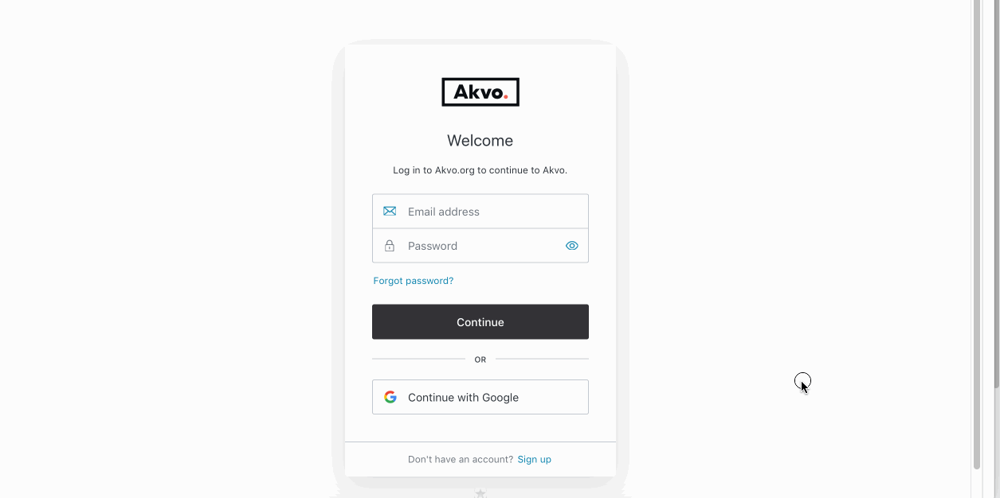

## Login
We are currently working hard to create a more connected user experience for you across Akvo Flow and Akvo Lumen. In the next weeks, we will launch a unified login to both products. This change will not only streamline the workflow across the products but also allow you to use other email accounts than Google to access Flow and Lumen. 

Today we you can start using the new login in Akvo Lumen! 

Below you can find out: 

- How to log in with your current user account 
- How to change your current user account (if you want to use another email than Google) 
- How to get started for new users 

Please keep in mind that your user needs to be created in Flow and Lumen first, before you can access the products. To be able to use Flow data in Lumen, you need a user account in Flow and also in Lumen based on the same email address.

To see how this change affects logging in to Akvo Flow, check this article. 

## Log in with your current user account
When accessing our products today, you must have a user account set up with a Google email. You can still use this account with our new login: 

1. Go to Lumen. 
2. Click 'Continue with Google'.
3. Fill in your account details (your Google email and Google password).
4. Log in.  

## Change your existing user account to another email 
With this change you can have your organisational admin change your email to another one, sign up and login using that newly added email address. This allows you to use other email providers than Google to manage users. For example, you can use your organisational email instead.

### Changing your user email in Lumen 
User management in Lumen works differently than in Flow. If you want to use a different email to access Lumen, your organisational admin needs to: 

1. Delete your existing user account in Lumen. 
2. Invite you to Lumen with the new email address. 
   
Accessing Lumen for the 1st time with your newly invited email:

1. Go to your email inbox. 
2. Open the link in the email. 
3. Select Sign up at the bottom of the login page. 
4. Add your email (which is registered in Lumen) and enter a password you want to use. 
5. Verify your email by clicking in the link sent to your account. Now your user account is all set. 
6. Access Lumen.
7. Next time you go to Lumen to analyse and visualise your data, simply log in. 

## New to Akvo Flow and Lumen
Are you new to Akvo Flow and Lumen. Before you can access the tools your organisation admin needs to add you to them. Below you can find out how to get access to Flow and Lumen and how to sign up. 

### New to Akvo Lumen
To be able to access Lumen, your organisation admin needs to first invite you to Lumen. To be able to work with your Flow data in Lumen, make sure to use the same email address in both tools. 

Once you are invited: 

1. Go to your email inbox. 
2. Open the link in the email. 
3. Select Sign up at the bottom of the login page. 
4. Add your email (which is registered in Lumen) and enter a password you want to use. 
5. Verify your email by clicking in the link sent to your account. 
6. Access Lumen.
7. Next time you go to Lumen to analyse and visualise your data, simply log in. 

## Managing users
If you have admin rights to Lumen, you can manage users. This means, you can: 

- See the list of users and their details (name, email and role) 
- Edit a user's role
- Delete existing users
- Invite new users to join Lumen and revoke pending invitations  

The user management space can be accessed via the Admin View button on the left hand side navigation bar. If you don’t see it, it means you don’t have admin privileges.  

### Users and their details 
After clicking on the Admin view you will see the list of users on Lumen. Each user has a name, email and a role. You cannot edit a users email or name. You can on the other hand, edit a user's role or delete an existing user. 

## Editing a user's role
There are two user roles in Lumen: admin and user. The difference is in the ability to see and manage the list of users. All users with admin privileges will be listed at the top of the list. 

As an admin, you can revoke or enable admin privileges depending on if user is an admin or not an admin yet. 

To revoke admin privileges: 

1. Go to the Admin view. 
2. For the user you want to change, click on Actions. 
3. Select Revoke admin privileges.
4. Confirm. 

To enable admin privileges: 

1. Go to the Admin view. 
2. For the user you want to change, click on Actions. 
3. Select Enable admin privileges.
4. Confirm. 

## Deleting a user
As an Admin you can also remove users from Lumen. Once a user is removed, they will no longer be able to access your organisation's Lumen. If this user is a Lumen user for a different organisation (another Lumen tenant) then he/she still will be able to access Lumen for that organisation. 

To delete a user: 

1. Go to the Admin view. 
2. For the user you want to change, click on Actions. 
3. Select Delete user.
4. Confirm. 

## Invite new users to join Lumen 
For any user to be able to access Lumen, he/she needs to first be invited to Lumen. This means that you cannot simply sign up to any organisation using Lumen and get started. You need your Lumen organisational admin to invite you. 

To be able to invite a new user to Lumen, you need to be an Admin. To invite a new user to join your Lumen instance: 

1. Go to the Admin view. 
2. Click on Manage Invitations button. It will take you to the list of users who have been recently invited to your instance. 
3. Click on the Invite User button. 
4. Provide an email address of a new user. 
5. Click on Send Invitation. 
6. When inviting a user to Lumen, use the same email address this user uses in Akvo Flow. This will allow the new user to use Flow data in Lumen. 

You can also also possible to revoke an invitation, unless a user has already accepted it.

## User roles
Lumen has two user roles available, User or Admin. The difference between a User and an Admin is in managing users. Admin can invite new users, delete existing users and revoke a user invitation. Furthermore, Admin's can see the overall usage - number of visualisations and dashboards created.  

The actions permitted for each of these roles is outlined below.

| Permitted actions     | User | Admin |
| ----------- | ----------- |-----------|
| Invite users     | &#x2610;  | &#x2611; |
| Edit a user role   |  &#x2610; | &#x2611;|
| Revoke user invitation or delete users     |   &#x2610;    | &#x2611; |
| Add, edit and delete datasets      |   &#x2611;    | &#x2611;  |
| Create, edit and delete visualisations      |  &#x2611; | &#x2611;  |
| Create, edit and delete dashboards      |  &#x2611;    | &#x2611; |
| Share dashboards and visualisations     |  &#x2611;     | &#x2611;  |
| Create collections     |   &#x2611;    | &#x2611;  |

## Inviting new users to join Lumen
For any user to be able to access Lumen, he/she needs to first be invited to Lumen. This means that you cannot simply sign up to any organisation using Lumen and get started. You need your Lumen organisational admin to invite you. 

To be able to invite a new user to Lumen, you need to be an Admin. To invite a new user to join your Lumen instance: 

1. Go to the Admin view. 
2. Click on Manage Invitations button. It will take you to the list of users who have been recently invited to your instance. 
3. Click on the Invite User button. 
4. Provide an email address of a new user. 
5. Click on Send Invitation. 

When inviting a user to Lumen, use the same email address this user uses in Akvo Flow. This will allow the new user to use Flow data in Lumen. 

You can also also possible to revoke an invitation, unless a user has already accepted it.

## Accessing Lumen for the 1st time
Are you new to Akvo Lumen? To be able to access Lumen, your organisation admin needs to first invite you to Lumen. To be able to work with your Flow data in Lumen, make sure to use the same email address in both tools. 

Once you are invited: 

1. Go to your email inbox. 
2. Open the link in the email. 
3. Select Sign up at the bottom of the login page. 
4. Add your email (which is registered in Lumen) and enter a password you want to use. 
5. Verify your email by clicking in the link sent to your account. 
6. Access Lumen.

Next time you go to Lumen to analyse and visualise your data, simply log in. 

## Checking usage statistics
Akvo Lumen users who have admin privileges, can view usage statistics. Usage statistics show how many visualisations, dashboards, and external datasets you have in Lumen. 

To view usage statistics for your Akvo Lumen instance, click on the **‘Admin view’** button on the menu pane on the left. When in the Admin view, click on **‘Resources’** button on the menu pane to the left and you will see the page with usage statistics. When you are ready to go back, click on ‘Workspace’ button.

If you don’t see the **‘Admin view’** button, it means you do not have admin privileges for this Akvo Lumen instance.