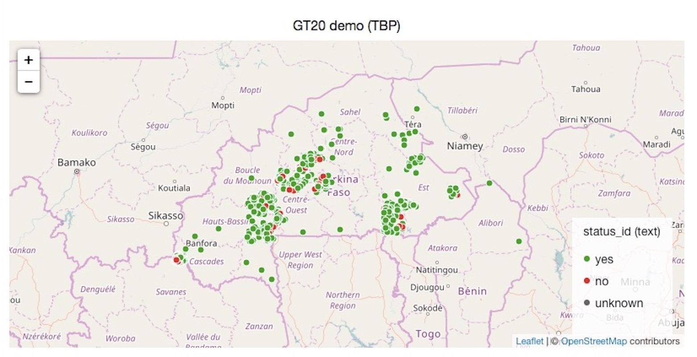
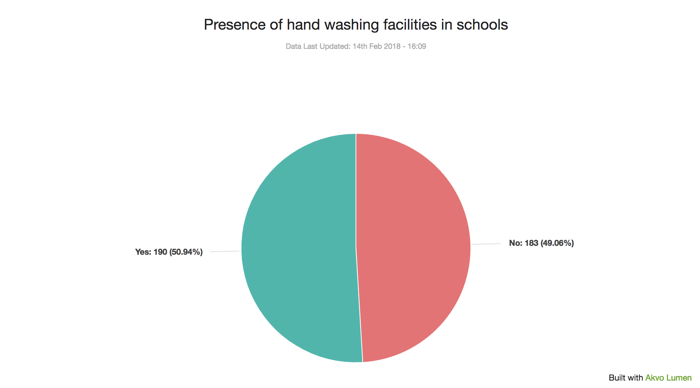
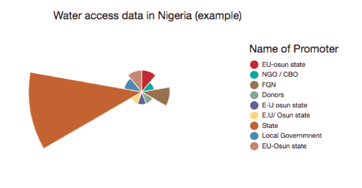
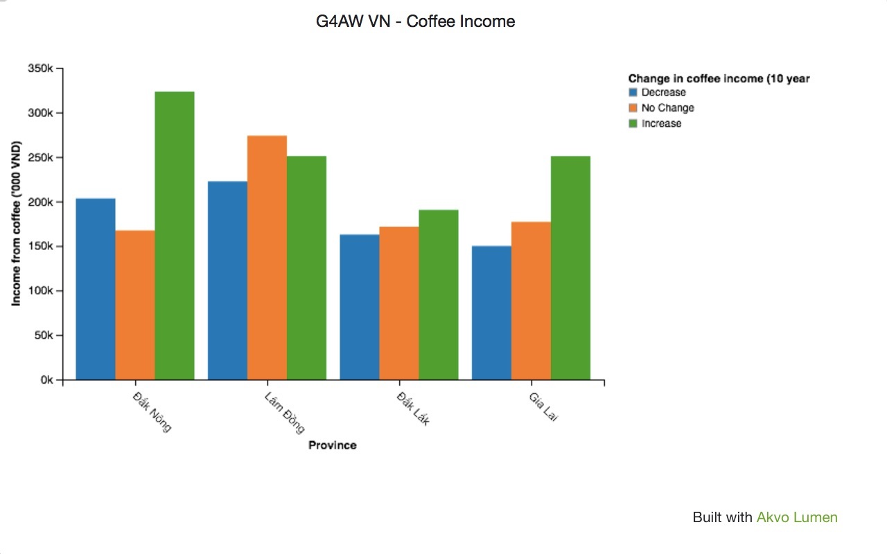
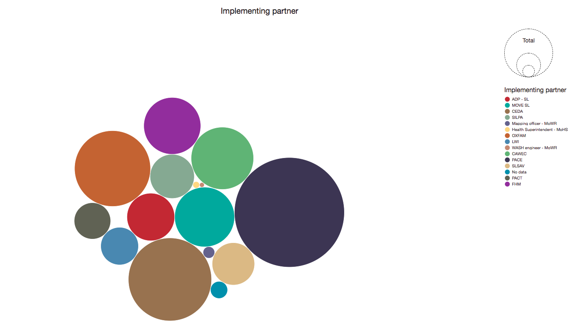
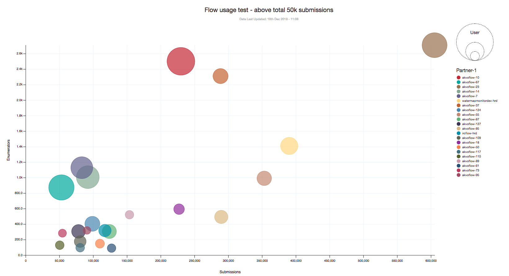
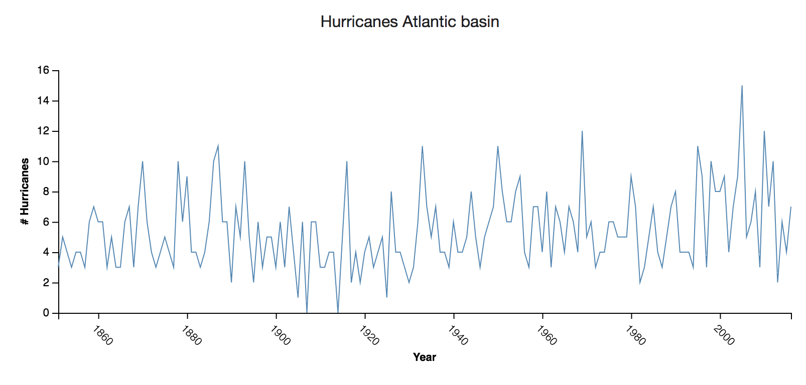
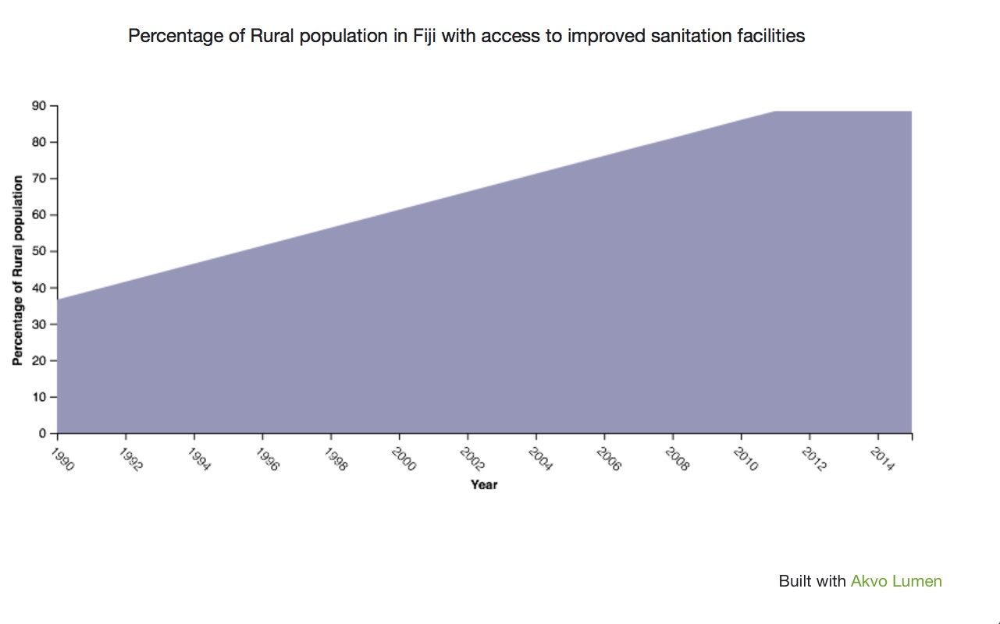
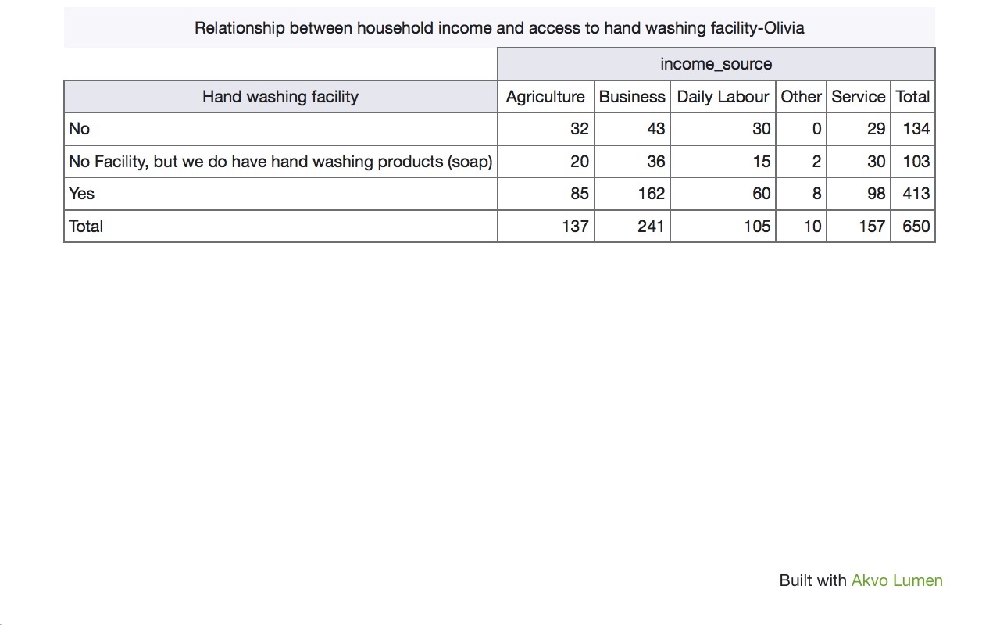

## Visualisation Types
Within Lumen there are a number of different visualisation types available. Most often you show your data in the context of space, on a map, or you compare the distribution of values with bar charts, or you check the composition of elements with pies. But there are more ways to showcase your data and find patters. Below you can find the currently available visualisation types in Lumen. 

## Maps
Maps are ideal for showing the geographic distribution of data. Further value can be added by using colour coding to answer specific questions from your data. For instance, if each point represents a different water point, you can colour code these by whether or not it is functioning. This way you can quickly build up a simple, but effective overview of water point functionality across a geographic area.

## Pie and Donut Charts
Pie and donut charts are probably the most commonly used charts as they are simple to read. They are great to show relation (proportion) between data, as you compare data ‘slices’ in relation to the whole. The chart is divided into slices and the arc of slice shows the proportional value of each piece of data. Each pie chart slice represents a % and all of them together always equal to 100%. 

## Polar Area Charts 
Polar area charts are similar to pie charts, but each segment has the same angle. What differs is the radius of the segment depending on the value. So the longer the slice the larger the value. 

This type of chart is often useful when you want to compare variables, but also show a scale of values for more context.

## Bar Charts
Bar charts are great for comparing values, for instance, total number of functioning water wells across different geographical regions. They provide a way of showing data values represented as vertical or horizontal bars. These charts can be used to compare values or show trend data. 

If there is a need to see a composition of something, split or stacked bar charts are ideal for that. It allows you to see, for example, what types of water wells in every region are functioning and how many of them.

## Bubble Chart
Bubble chart, similarly to bar charts, are handy to showcase the distribution of values. They provide a way of showing data values represented as bubbles and give you an alternative to the well known bar charts. The size of each bubble depends on the metric column you select. They are especially handy if you have many values to show. 

## Scatter Plots
Scatter plots are great for understanding relationships between different variables and visualising distribution of your data. For instance, you will be able to check if there is any relationship between the number of people using a hand-wash facility and its functionality status. Scatter plots work best for identifying outliers in your data as well. By outliers we mean data points that stand out from a group of other data points that have more or less similar qualities.

## Line charts
Do you want to compare values, especially in time series? A line chart is a way of plotting data points on a line. Often, it is used to show trend data, change of values over time, or to compare data variable. With line charts you can identify trends in your data, for instance, the amount of hurricanes in the Atlantic Basin the last hundred years. 

## Area charts
Area charts are quite similar to line charts in that they can show trends in data over time. In addition to that, area charts can show part-to-whole relationship. For instance, an area chart can be used for visualising a share in volumes of CO2 emissions by different countries over time.

## Pivot tables
Pivot tables can provide a concise summary of large datasets. It also allows to perform various aggregations on your summarised data, for instance, quickly identify maximum or minimum values.

