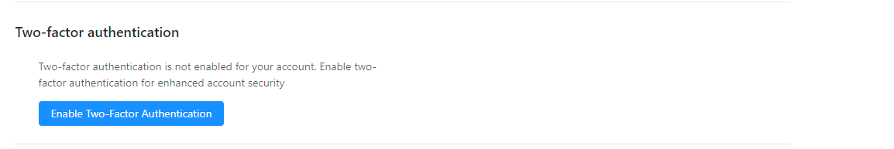
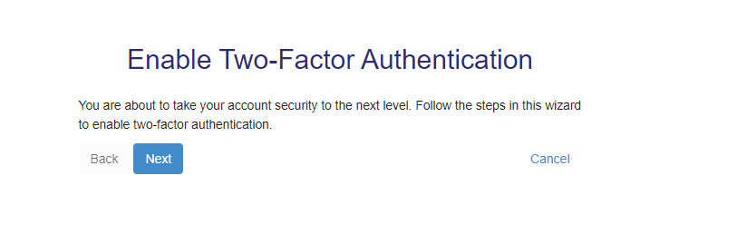
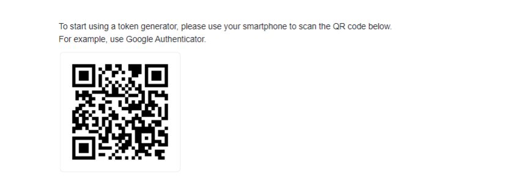
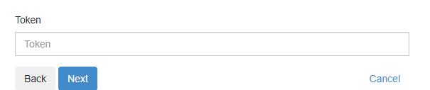
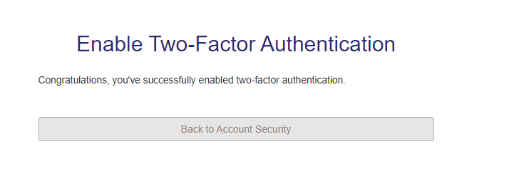
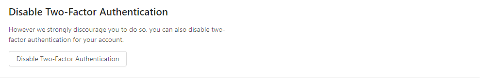
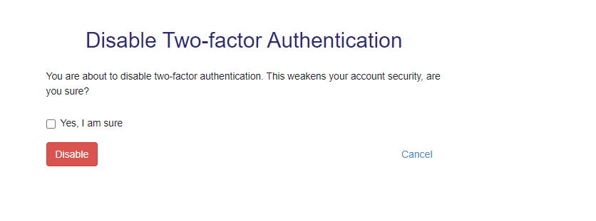

## Registering as a user on RSR
Registering as a user for RSR is easy, simply go to the [registration page](http://rsr.akvo.org/en/register/) and complete the details as shown below:

After filling in the correct information, you will automatically see a confirmation screen. The next step is to confirm your e-mail address via the e-mail we sent you.

Activate e-mail
By clicking on the link in the e-mail you will activate your account. If you still have not received an e-mail after 5 minutes, please check your spam folder.

Requesting to join an organisation
After the initial registration is completed as shown above, the new user needs to select the organisation it is part of. This will enable the user to view the projects of the specific organisation(s) and add RSR updates to these projects. Note, without being a part of an organisation, you will 

The steps are shown below.

1. Connect with your employer in the My organisation section;
2. Type the name of your organisation(s), country (optional) and job title (optional). As several organisations are already listed in the RSR database, the names may be autocompleted;
3. Press Request to join. 

## Accessing RSR
To access RSR you must have an active account or have received an invitation email from your project administrator to join and activate the account.

1. If you don’t have an active account but have received the activation email, click on the activation link on the email that you have received.

2. Provide name and password to activate account. Remember to follow the password guidelines as you choose a password to set.

3. Once you complete the process successfully, you should then receive a confirmation email. The email also contains a link to RSR.

4. To log in go to the [login page](https://rsr.akvo.org) and click the **‘Sign in’** button. 

Provide your login credentials that you selected and click on **“Login”** to proceed. If you’ve forgottend your password, follow the **‘Forgot my password’** link.

## Enabling two-factor authentication

Two-factor authentication (2FA) is an identity and access management security method that helps safeguard information by requiring two forms of identification to access resources and data. Enabling two-factor authentication means that RSR will ask for an additional code, in addition to email and password, when authenticating. This code will be generated by an authenticator app (e.g. Google Authenticator, Microsoft Authenticator) that you can install on your phone.

To enable 2 FA on RSR got to Go to [My details page](https://rsr.akvo.org/my-rsr/my-details/) and find the section **Two-factor authentication**

Click on **Enable Two-factor authentication** to start the process

Select **Next** to proceed

To start using a token generator, for example To use Google Authenticator; download and install Google authenticator on your device.

Open the app and scan the QR code that is displayed on your screen

The authenticator will generate a token for you to use. 

To proceed, enter the token generated by the app and click on **Next**. If all has gone well, you should see a message that Two-factor authentication is now enabled.

**NB:** Please remember to back up your token. This will allow you to access your account using backup tokens if you don't have your device with you.

## Disabling two-factor authentication

To disable 2FA on RSR got to Go to [My details page](https://rsr.akvo.org/my-rsr/my-details/) and look for the **Disable Two-factor authentication** section

Confirm that you want to disable two-factor authentication by selecting the **Yes, I am sure option** and clicking o the **Disable** button

Your account should now stop using two-factor authentication

