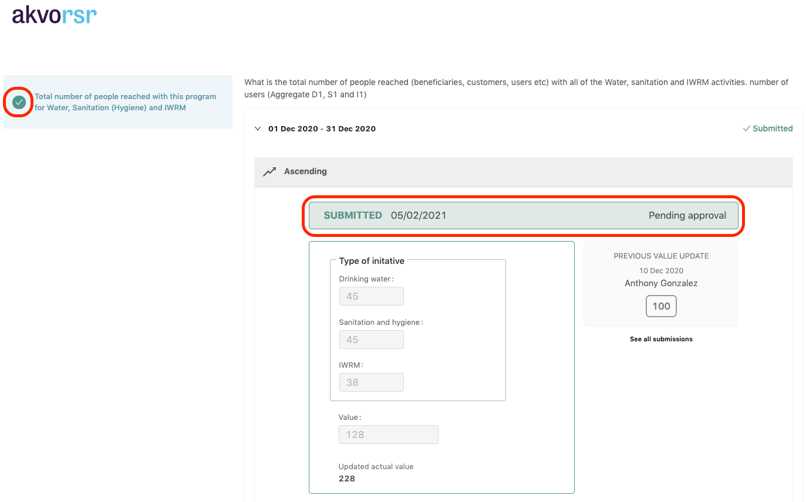

## Adding an Enumerator to a Project
Before assigning specific indicators to an enumerator you need to first add the required enumerator(s) as user

Go to the Editor and from the menu on the left, go to **section 3. Partners & User Access**.

Scroll down the page until you see User Access. Ensure the user access is set to Restricted. Then click Add User.

Once you've clicked Add user, a pop-up menu will appear. At the top, you can enter the mail address of the enumerator you would like to add. 

The system will recognise if it is a new user. After you entered a name for the new enumerator, click on the arrow next to Add as, from there select Enumerator. Once done click Send Invite.

After the invite is sent you can choose to either invite another enumerator by clicking on Invite Another, or click Close. 

Now the required enumerator is added as a user, you should inform the enumerator that an invite to RSR should will be received via email. Ask the enumerator to open the invite and follow the instructions to ensure the enumerator gets registered.

The video below shows the above steps in one glance:

## (Un)assigning indicators to an enumerator
**Important:** To be able to assign indicators to an enumerator, please first ensure the required enumerator is already a registered user in RSR.

To start assigning indicators, go to the Enumerators tab of the project. On the right hand side of the page you will see the Enumerators List, i.e., all users that have been registered as Enumerator for your project. 

To assign indicators, there are two options:

- You manually click on the checkbox next to the preferred indicator(s), or; 
- You click on the square, next to the search bar, and select ‘All indicators’ or ‘All unassigned indicators’ to select multiple at once.
Once you have selected the required indicators, you can assign an enumerator on the right where Indicator Assignment has appeared. Select the enumerator(s) and then click Assign. You can add multiple enumerators at once.

Now that the enumerator has been assigned indicators, you can go back by clicking on Full List (next to Indicator Assignment) to access the full Enumerators List again.

In the Enumerators List, if you click below the name of the Enumerator on the arrow (next to the number of indicators) a list will appear. From here you can see which indicators have been assigned to that enumerator and you can also Unassign an indicator if needed. 

To finalise the process of assigning indicators, you need to click the blue Send Assignment button. The enumerator will then receive an e-mail asking them to report on the assigned indicators. 

The video below shows the above steps in one glance:

## Report an assigned indicator (Enumerator)
When you need to report on an indicator that has been assigned to you as and enumerator, you will receive an e-mail.

As described in the text of the e-mail, there is a link which you need to click.

A webpage will open, listing the indicators that have been assigned to you.  Here you can enter the required value(s) for the first indicator. You can also see the previous value for this indicator.

Scroll down if you also want to add a Value comment or Internal private note or Attach a file.

Once you have entered the values (and if needed, added additional comments or files), you can submit by clicking on the blue Submit button. If the submision has gone well, you will see a check icon in front of the indicator on the left. A message will then appear stating the date and that your submission is pending for approval. 

If the submission has gone well, you will see a check icon in front of the indicator on the left. A message will then appear stating the date and that your submission is pending for approval.

