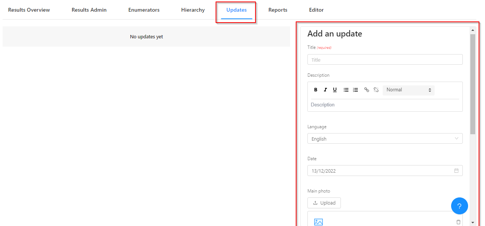
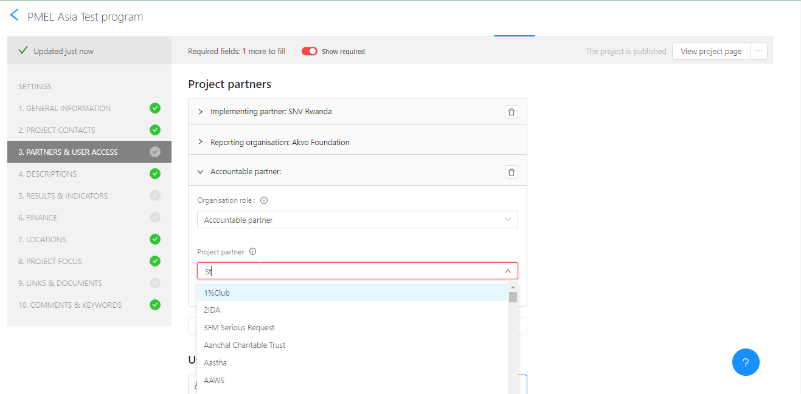
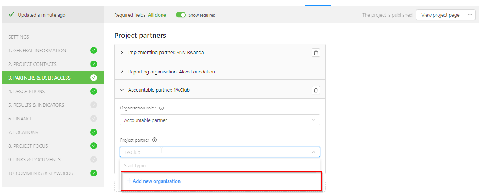
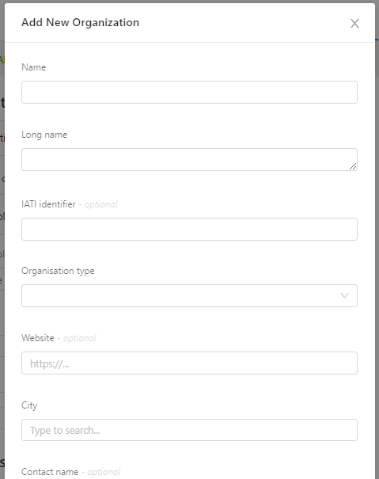
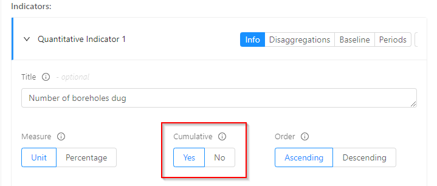
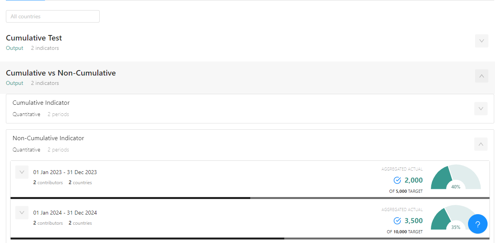
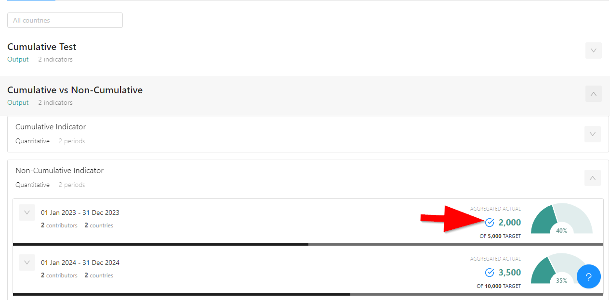
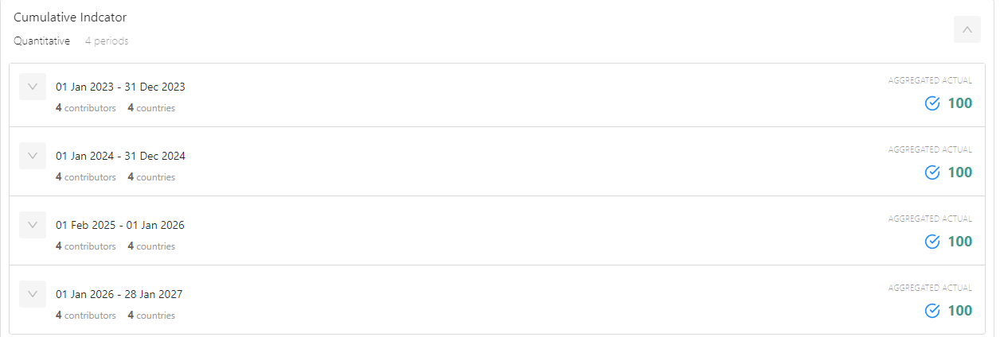
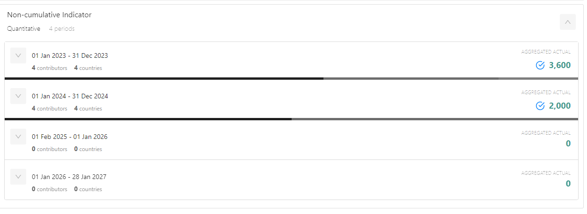

## Adding an update via the website
How to add an RSR update via the website:

Follow the steps below to add an update to your online project page in Akvo RSR:

1. You can access your project(s) [here](https://rsr.akvo.org) or via your Akvo Page.
2. Use the 'Advanced filter' to search for your organisation and active projects.
3. Once you've opened your project from My projects and depending on the role that has been assigned to you find and open the Updates tab
4. From  here you can Add an update on the left side of the screen. Updates can include photos and videos. The recommended maximum file size is 2MB. We can recommend using https://compressor.io/ in case you want to compress your image.

## Can I register a colleague and or send an invite to a colleague to RSR?
If you are a User Manager or Admin in RSR, you are able to invite new users to create an Akvo RSR account. If you log in to RSR you will see the User Manager button in the top left corner of the page that will open a dialog to invite users. See this [articles](enumerators.md) for instructions step by step.

## I registered but I cannot do anything in RSR
This most likely means that you are not yet connected to your employer. In the My Details page you can request to connect with your employer. After this request is approved, you will be able to start working on your projects.

More information about the registration process can be found [here](access.md).

## What type of partners can I involve in my project?
In each RSR project you can link to multiple partners that are involved in your project. An organisation can have multiple roles within a project. We differentiate between the following partner types:

- **Funding partner:** an organisation, government or company that provides funds to your project. For each funding partner you can indicate the funding amount.
- **Accountable partner:** the organisation that is responsible for oversight of the project activity and its outcomes.
- **Extending partner:** the organisation that manages the budget and direction of an activity on behalf of the funding organisations.
- **Implementing partner:** an organisation that physically carries out the activity or intervention.
- **Reporting partner:** the organisation that is responsible for issuing the report. This can be a primary source if the organisation is reporting on its own activity or a secondary source if the organisation is reporting on the activities of another organisation.

## How do I create a new project?
RSR users with an Admin account for partners that have a contract with Akvo will see an *+ add a new project* button when they login to MyRSR and go to My Projects. Read the full article [here](project_editor.md).

If you do not see this button, please contact the administrator of your organisation.

## How can I delete a project?
It is not possible to delete a project. However, there are five different project statuses:

- Needs funding: this project still needs funding and implementation has not yet started.
- Active: the implementation phase has begun.
- Completed: the project has been completed.
- Cancelled: the project never took place or work stopped before it was fully implemented.
- Archived: projects are archived when the reporting partner no longer uses RSR.

## How can I publish my project?
If you want to show your project portfolio online, your organisation needs to sign a contract with Akvo. Administrators of such an organisation can create an RSR user account that can be used to add, edit and publish new projects.

With this user account you can log in to My RSR. In My projects you manage your projects. Before you start filling in all details about your project, you can choose a ‘progress bar’. By choosing a progress bar, information fields become visible that belong to that bar.

The progress bar shows you when your project is ready to be published. When you fill in the mandatory fields, indicated by a red asterisk, you will see that the progress bar increases. When the bar is green, it means all mandatory fields are filled in and your project is ready to be published. To be able to publish a project to RSR, a set of mandatory fields always need to be completed, regardless which project bar you choose.

More detailed information can be found [here](project_editor.md).

## Why does my photo upload very slow / does not come through
This is often caused by the photo being too big in size. The recommended maximum file size is 2MB. We can recommend using [https://compressor.io/](https://compressor.io/) in case you want to compress your image.

## How do I add an organisation?
You need to login to MyRSR and add or edit a project. When you are selecting partners who are involved in the project, you will see suggestions after you start typing.

If the organisation you want to add does not show up in the list you will be given the possibility to add this organisation.

After clicking **add new organisation** you will see a screen where you can add the new organisation. Please always make sure you are not creating a duplicate.

## Changing information for an Organisation page
When you want to change information on your Akvo RSR organisation page, please contact our [support team](../contact.md) with the following information:

- URL of the page that you would like to change 
- The new text

## How do I show my projects on my website?
Many organisations using Akvo RSR for visualising their projects also choose to have their data displayed in a more personalised format. By utilising Akvo Pages, organisations can create their own set of pages that contain lists of only projects they are working on along with the partners that are involved in these projects.

Please get in touch with your contact person within Akvo to explore the possibilities.

## Can I have all my projects private?
Akvo RSR was designed to show your project portfolio to the world and to boost transparency in the development aid sector. We encourage all of our partners to join us in this mission.

However, sometimes there instances when a project involves working with highly sensitive data. In those instances you may want to have the project in RSR but only in private mode, which means it will only be visible and accessible to RSR users within your organisation. As of 2016, this is possible via the Project Editor.

## What is cumulative reporting and how do I enable it?
Also called to-date reporting is when you report the current value and not the accumulated value. The value reported as 'cumulative' is considered inclusive of the previous periods value and is reported as is.

To enable cumulative reporting, you first need to set the **'cumulative'** flag for each indicator as needed.

This is done from the project editor on the results and indicators section. The different sections of the project editor has been discussed [here](project_editor.md)

Once that is done, as you update your indicator values the aggregation to the programme will check whether the indicator is cumulative or not.

To confirm this - check the results overview tab on your program page.

You can confirm whether the aggregation job has run successfully by checking the icon next to the reported value.

For an indicator flagged as cumulative the value value is reported as is.

While for the non-cumulative the indicator is reported a a sum of all values.

**Please note:** For existing indicators,  on the project editor the *'cumulative'* flag is disabled if the indicator already has updates associated with it. 