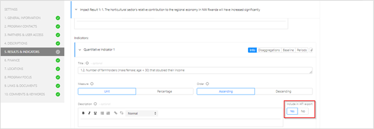
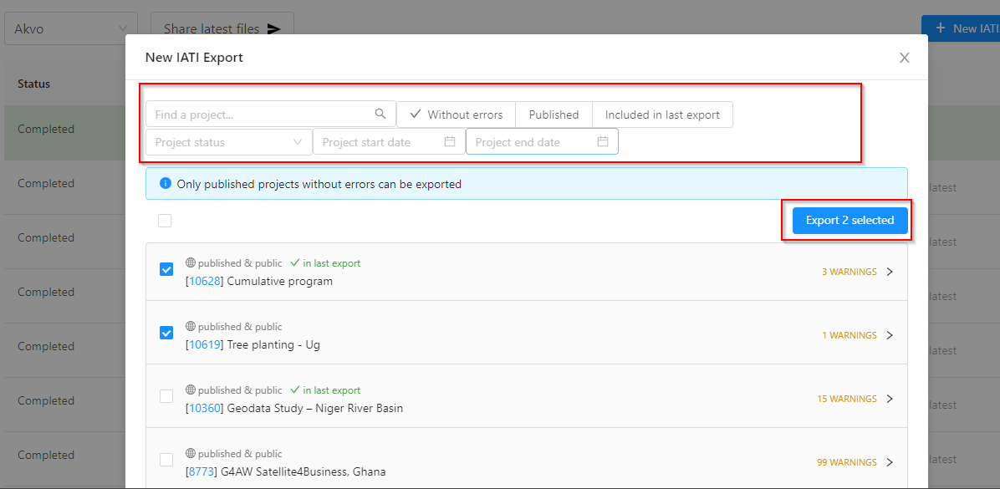
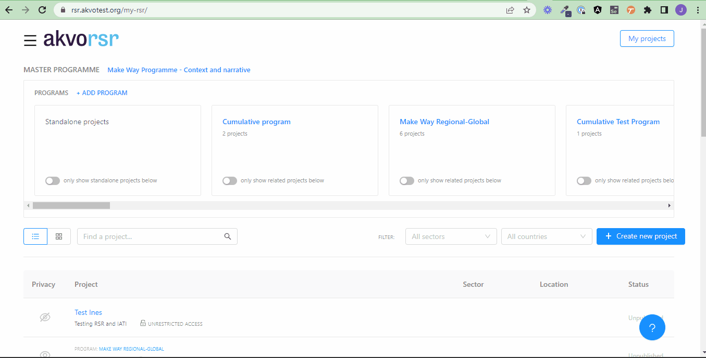

## How can I create and publish IATI xml files?

### What is IATI?

In short, the International Aid Transparency Initiative (IATI) is an international set of rules for publishing and sharing of information about development aid. To allow for automatic processing of data from various source, a common technical format is used called 'xml'. For more information see the IATI website [website](https://iatistandard.org/en/)

### Steps to create an IATI activity xml file in Akvo RSR

1. Add projects or update project data via the project editor and make sure you have one of the validations sets enabled which show the mandatory IATI fields (e.g. DGIS IATI or IATI)

2. In section 5., Results and Indicators, you can select which specific indicators you want to include in your export:

3. Click on the IATI link (top, left-side of the page) in My Projects and press: *'New IATI export'*. It is important to agree in your organisation who is responsible for creating and publishing (see below) these files:

4. Select the projects you want to include and press perform checks. In case there are errors, please edit the projects in the project editor. Links are provided to guide you to the correct fields. If everything is set you can generate the IATI xml file and it will be visible in the export overview

### IATI export overview

In the IATI export overview you can see all the IATI xml files that are being or have been generated previously. When the generation of new file is taking place, the progress is shown. The file highlighted in green is the current IATI activity file for the organisation. By pressing **“set as latest file”** you can change your current IATI file to an older version if needed. By default it is the latest file. By ticking the box 'Show latest activity file on the organisation page of [organisation name]' the latest file is shown on your organisation's page in Akvo RSR. For example for Akvo is it is visible [here](http://rsr.akvo.org/en/organisation/42/).

### Publish data via the IATI registry

Akvo RSR makes it extremely easy to add and regularly update your IATI files in the [IATI registry](http://iatiregistry.org/). This involves two steps:

1. Set up our organisations' account by [registering as a new user](http://iatiregistry.org/user/register) and [follow the steps](http://iatiregistry.org/help) in the registry. When you do so, you need to use the standard IATI link that RSR provides. In the case of Akvo [this is it](http://rsr.akvo.org/organisation/42/iati/). You can find the link specific for your organisation's activity file on the [IATI page](https://rsr.akvo.org/my-rsr/iati). Using this link means that you can manage the IATI file updates in Akvo RSR without having to logon to the IATI registry. Note, that you cannot upload any data in the IATI registry, the link to the data suffices.

2. To update the dataset, create a new IATI file as indicated above. Via the link you used in step 1, the data is automatically up-to-date in the IATI registry. This is because the link refers to latest data as hosted on Akvo RSR.

### Checking your IATI data

There are requirements to the file format and data in IATI xml files. A simple example is that every IATI activity (project) must have a [unique IATI identifier](http://iatistandard.org/203/activity-standard/iati-activities/iati-activity/iati-identifier/#definition), which you can enter in the Akvo RSR project editor. You can check your file by using the [IATI validator tool](http://validator.iatistandard.org/index.php). You can use **'fetch file from web'** and paste the IATI activity link from Akvo RSR. Then you can test 

1. if the xml code is well structured and (important to also click):

2. validate the file against the IATI schema. Any issues need to be solved in the Akvo RSR project editor or in the Results tab. 

When you are obliged to publish IATI data for the Netherlands Ministry of Foreign Affairs, you can check your compliance using a [custom dashboard](http://public.tableau.com/views/METIS2/Publisheroverview?amp%3B%3AshowVizHome=no&%3Aembed=y&%3Atabs=yes&%3Arender=false) which includes if the files loaded correctly and what the last date of changes were. The data is loaded once a day and only when data is validated successfully (see validation above) it will be loaded. 

**NB:** The publication guidelines by the Netherlands Ministry of Foreign Affairs can be found [here](http://www.government.nl/documents/publications/2015/12/01/open-data-and-development-cooperation).

### IATI Organisation file

Next to the activity file containing the project data, there is an IATI file format for the organisation data: the IATI organisation file. The link to the file can be found also in the IATI section of Akvo RSR. From there,you can view the file or copy a link to it.

For example the link for Akvo is: [https://rsr.akvo.org/organisation/42/iati-org/](https://rsr.akvo.org/organisation/42/iati-org/).

To change or add data for your organisation, please contact the [Akvo RSR support desk](../contact.md).

## How can IATI data files be imported?

IATI files can be imported once or can be scheduled to be imported automatically at a regular interval. Please [contact us](../contact.md) to make use of this feature.

### Field mapping

The extensive overview of the field mapping from IATI to RSR can be found [here](https://github.com/akvo/akvo-rsr/wiki/IATI-Import-mapping).

### Requirements
The current implementation of the IATI import allows any IATI file to be imported into Akvo RSR, just as long as the following requirements are met:

1. The IATI file is a valid IATI XML file, and has a correct IATI version specified
2. The reporting organisation as specified in the IATI file is an existing RSR organisation that is allowed to import projects.