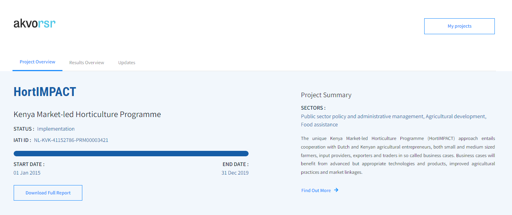

## RSR in a nutshell
Akvo Really Simple Reporting (RSR) is where all your planning, monitoring, evaluation and learning (PMEL) processes come together. Increasing collaboration and transparency, improving decision making, and sharing the results of your projects with the people who need to see them.

Explore the full portfolio of RSR projects [here](https://rsr.akvo.org) 

## Rich data shared
Akvo RSR gives each of your projects its own searchable mini web site, offering an overview of your work and the chance to dive down to specifics. Each project page contains detailed information about what's happening, where and who's involved, as well as who the funders are - so your entire network of collaborators is visible.

Project updates from project teams, including photos and video, keep everyone informed about the latest activities of your projects and bring to life the work of those involved. The RSR homepage map shows the world precisely where you're working.

When you enter project information RSR can help you meet your [IATI standard](http://iatistandard.org/) reporting requirements. This allows to you fulfill your own reporting and communication needs as well aspublish your work via IATI all in one go, simply.

## Any setting, web or mobile
RSR is designed to be used anywhere, on any device running a modern web browser.

A simple, intuitive, screen-responsive user interface lets you enter and view information and updates easily via a smartphone, tablet or computer.

## Report, collaborate, scale
Monitor the results of all your projects in one platform, in a shared format that everyone understands. Define indicators at programme and project level. Align dispersed teams from the start. Create reports at the click of a button or customise your reports based on your needs. Publish your results to the International Aid Transparency Initiative (IATI).

## Technical specifications
Easy to use and compatiblee
Akvo RSR is a content management system hosted in Europe. It is web based tool, i.e. it requires no onsite software installation and no dedicated hardware. Administrators and users log into the system with a username and password and anyone with modest office computer skills can normally learn to use the system quickly.
Akvo RSR works on any modern web browser. We actively test and up-to-date web browsers for compatibility: Firefox, Internet Explorer (IE), Safari, Chrome, Opera and Brave. 

## Developer-friendly
Akvo RSR is [open-source](http://akvo.org/blog/open-data-content-and-software-at-akvo) and you can collaborate with us on improving the system over at our [Github repository](https://github.com/akvo/akvo-rsr). 

Akvo RSR has a [read and write API](https://github.com/akvo/akvo-rsr/wiki/RSR_Partner-API-Read). The read-only part of the API is public and open. Please respect our [API code of conduct](https://akvo.org/policies/). If you are a partner using the system you can integrate with the write API, for example for easy loading of projects. 

## Getting to know Akvo RSR
Akvo Really Simple Reporting is a web and Android-based system that makes it easy for development aid teams to bring complex networks of projects online and instantly share progress with everyone involved and interested. Explore the full portfolio of RSR projects online at rsr.akvo.org.

In order to use RSR, you must choose a way to both enter and manage your information within RSR.

We have developed several ways for you to interact with your information, allowing you to select the process that most closely suits your organisation’s needs.

- Direct entry using My Projects
- Automated Entry using Write API

All projects in RSR need to be communicated within the pre-defined project text fields that are created in MyRSR to provide a clear and transparent view of aid projects. To find out more about what data must be supplied, please check out our Akvo RSR Data Requirements page.

### Communicating
Once your information is stored within the RSR Database, it is ready to be shared with the public. All published information will be displayed at rsr.akvo.org, but we also offer several different visualisation options that allow a more customised and controlled experience for your users.

- Website Enhancement using Akvo Pages
- Complete Custom Website using Akvo Sites
- Distributed Promotion using Akvo Widgets
- Automated System Integration using Akvo Read API

### Reporting
Of course the world does not stop once you have all of your information in RSR. So we have developed tools to assist in reporting on your project's progress.

Add narratives with photo and video to communicate the progress of your project via RSR Updates.
Share the progress of reaching your project targets and goals via a RSR results frameworkRSR results framework.
Export reports containing project information.

### IATI
IATI is the International Aid Transparency Initiative. The IATI XML standard lets computers understand and exchange information about development aid organisations and activities. This increases the availability and usefulness of that information exponentially. It means that your work is published in ways that allow it to be studied, transferred, assimilated, used and built-on in new forms of reports or visualisations.

When you enter project information into Akvo RSR, it gives you the opportunity to let your report fit the IATI standard. It goes further by letting you attach much richer forms of data to project and programme work such as short videos, photo streams and status updates. You can also use RSR to prompt people to provide relevant kinds of updates at any given time. So you can fulfil your own reporting and communication needs and publish your work via IATI all in one go.