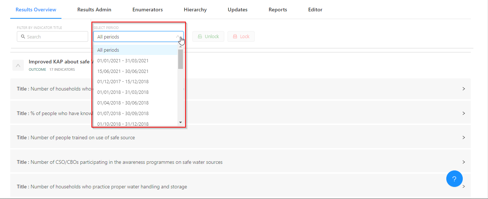
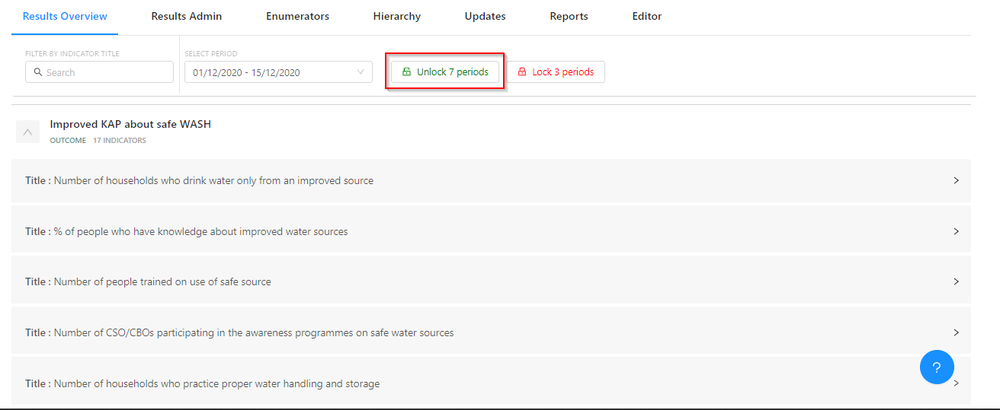
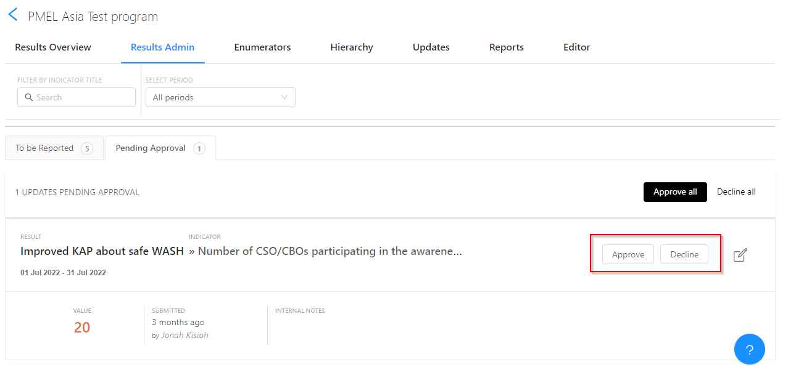
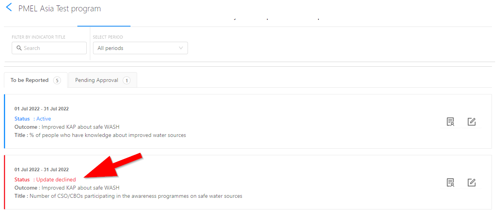
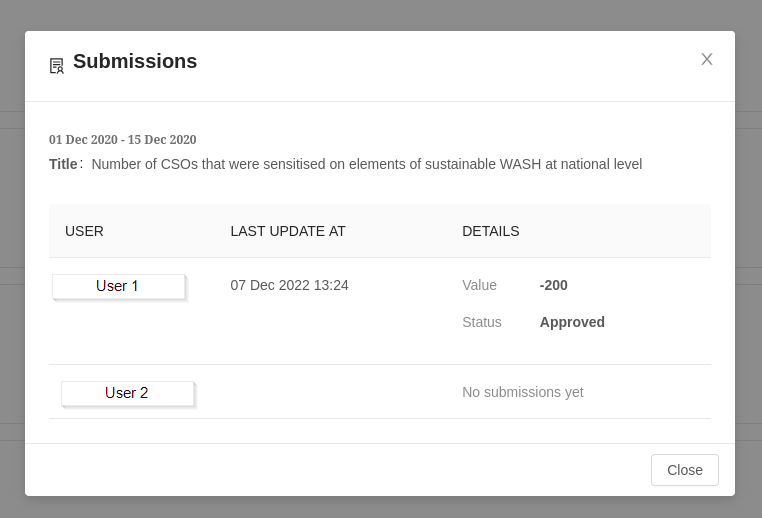
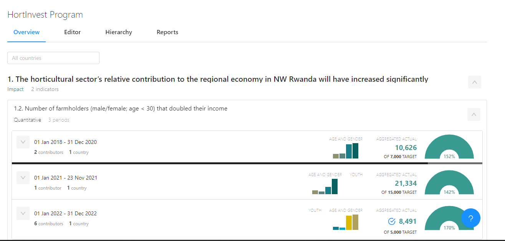

## Unlocking reporting periods
You can review the number of results and indicators you have already added - per result type - by glancing at the Results Overview tab. If you want to start collecting indicator updates, you first need to make sure that you unlock the reporting period.

<!--  -->

From **‘All periods’** select the appropriate reporting period for which you want unlock results.

The default setting checks all results, so if you want to unlock the all indicators for that reporting period, simply click **‘Unlock’**. This is very helpful for those projects working with results frameworks that contain many indicators.

Once the reporting period has been unlocked, the project team can begin entering indicator results data.

## Entering indicator results data
## Review indicator updates submitted by Project Officers
### Pending approval
To ensure data quality, organizations that want to use indicator reporting updates for results reporting need to have an appointed an M&E manager in RSR. As an M&E manager, you are required to approve the indicator reporting updates that are submitted by the officers for your project(s). While Project Officers (who have been assigned the role of **‘Project Editor’** in RSR) will focus their attention for indicator reporting on the **‘To be Reported’** tab, M&E Managers begin their review of indicator reporting updates, submitted by their team, in the **‘Pending Approval’** tab.

The **‘Pending Approval’** tab is where M&E managers can see which indicators have been reported on, and review the results data submitted with each update. If the M&E manager has no questions on the results data submitted, she/he simply clicks **‘Approve’**.

However, when you would like the Project Officer to have a second look at the results they reported, you click **"Decline"**. This sends the update back to the Project Officer, and it will once again (re)appear in the **‘To Be Reported’** tab for them. The status is also marked as ***Declined**.

### To be Reported
Once an indicator reporting update has been approved, the update is moved back to the **'To be Reported'** tab. From here M&E managers will lock the reporting period for each indicator after all updates for each indicator has been approved. When an indicator reporting period has been locked, additional indicator updates for that period are not possible; the indicator update will no longer appear in the **‘Pending Approval’** tab. Results data for indicator updates that have been approved and locked will be included in the aggregated overall results for that particular indicator and the results data of the update become publicly visible.

From this view the M&E Managers can also track the submissions and get to see the officers who have made submissions for an indicator and those who have not by clicking the **"Submissions"** icon  next to the indicator name.

### Overview
For a quick snapshot of all of your indicators, including your progress to date (Actual vs. Target or Baseline vs. Target) you can use the **‘Overview’** tab. From here you can see your target (result) vs. actual (result) per each indicator reporting period.

For a more high-level view, you can use the overall progress via the **‘progress doughnut’**, which tells your percentage of completion related to the overall target set for the indicator.

