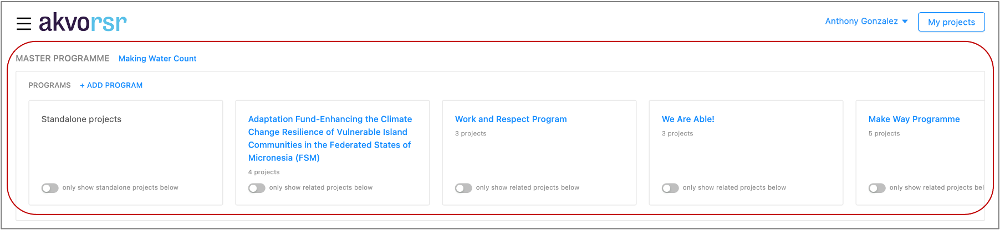
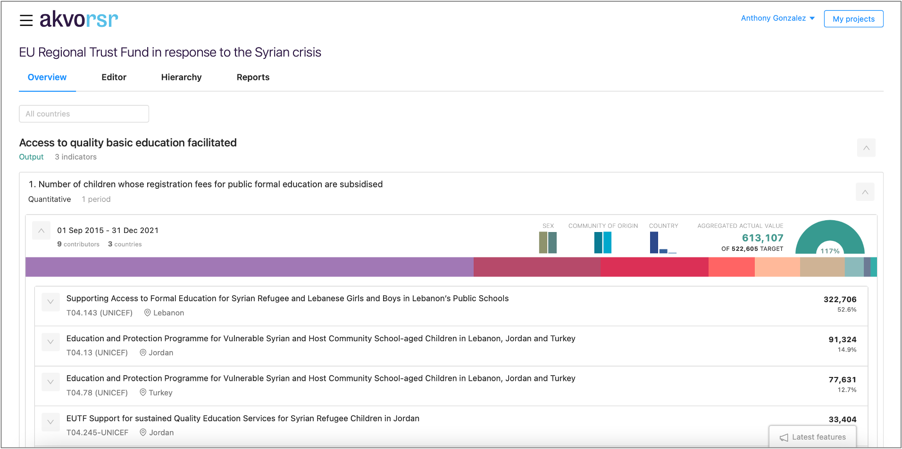
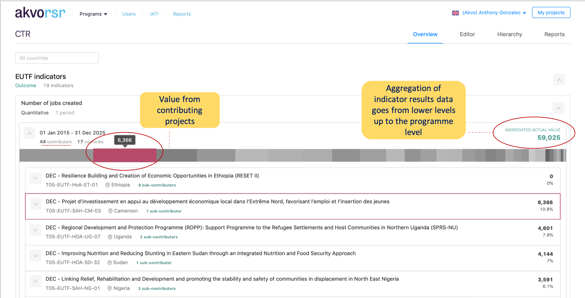
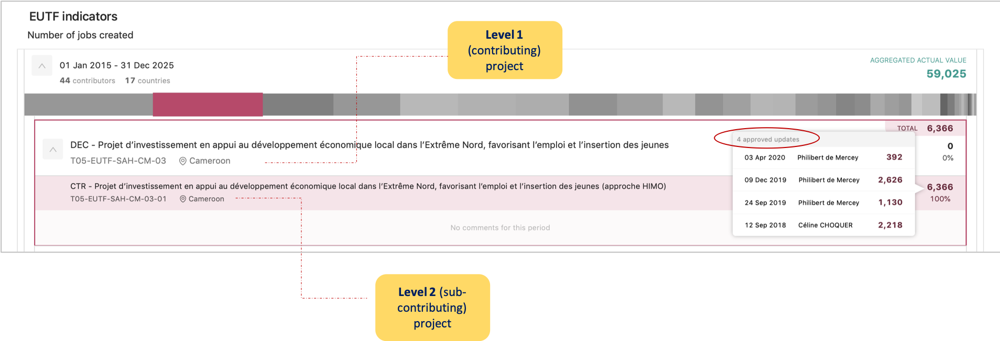
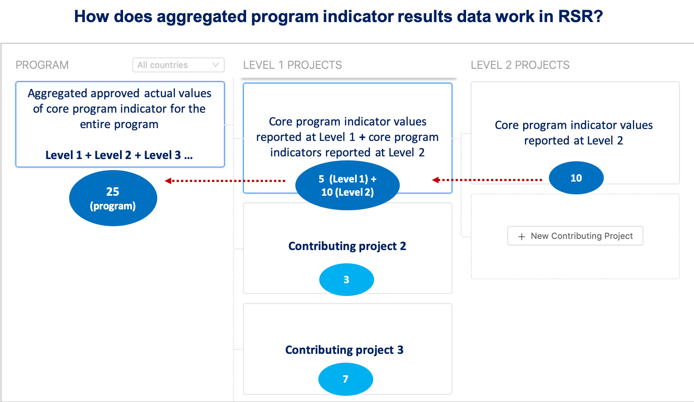
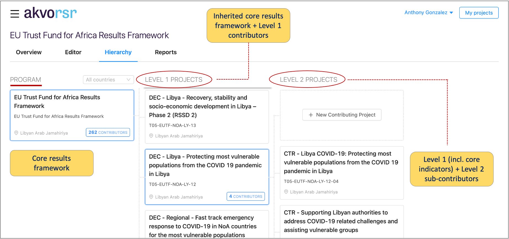
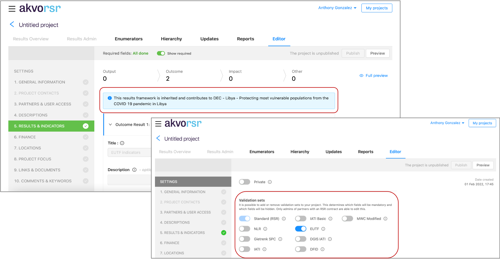

## What is a 'Program' in RSR?
A ‘Program’ in RSR can be defined as a collection of individual projects that share a core or master results framework. 

A common example is a multi-year, multi-country program, led by a group of reporting organizations that enable, via direct funding, local NGOs to implement activities which contribute to core objectives, as outlined in the program’s proposal and as measured by the program’s results framework. 

A program is first set up, with its core/master results framework before contributing projects are to be added. Once a program has been set up, new projects can be added. These projects are known as ‘contributing projects’ and ‘sub-contributing projects’. 

A program can have multiple levels of projects (i.e. Level 1, Level 2, etc)  depending on the implementation and funding structure of the program. For example, a program may focus on three core regions; projects at the regional level (e.g Horn of Africa) would be Level 1. Smaller projects, funded by individual regions and implemented in local municipalities (e.g. Juba) would be Level 2. 

If a project is added to the program, the core/master results framework is automatically inherited. Additional indicators can be added per level (e.g. contributing and sub-contributing) but only core/master indicators, i.e. those indicators inherited from the program, are aggregated upward to the Program Overview. 

**NOTE:** core/master indicators can also be removed at each level depending on individual projects objectives within a program.

Once a program has been established in RSR, a hierarchy is automatically established for the program. As new projects are added the program’s hierarchy is built out. This can be clearly seen from the ‘Hierarchy’ tab of the program. 

New projects to a program are added directly from the Hierarchy tab.

## Program Overview Feature
The Program Overview feature allows you to have a comprehensive view of approved aggregated indicator results data. The feature has been designed to give PME managers and program managers a quick overview of how their program is performing in relation to their results framework. 

Note: Indicator results data (i.e. actual values) cannot be added from the Program Overview page. It is a ‘view only’ feature. 

## Contributing projects
From the overview you can see approved actual value results data from contributor and sub-contributor projects. 

## Aggregated indicator results data for programs
Aggregated indicator results are based on a program’s core results framework. Once the core results framework has been set up contributing and sub-contributing projects inherit the framework as they are added to the program’s hierarchy. 

As implementation progresses indicator results data for core indicators entered and approved for contributing and sub-contributing projects are aggregated upward to the program level. These aggregated results can then be viewed in summary via the Program Overview feature.

## Program Hierarchy
The hierarchy feature of the Program Overview is where you can view all of the contributing (Level 1) and sub-contributing (Level 2, 3 …) projects.

## What's inherited when you add a new project to a program?
When you add a new contributing project to a program, vie the hierarchy feature, the project automatically inherits to important components: 

1. The program's validation set 

2. The program's core results framework 

