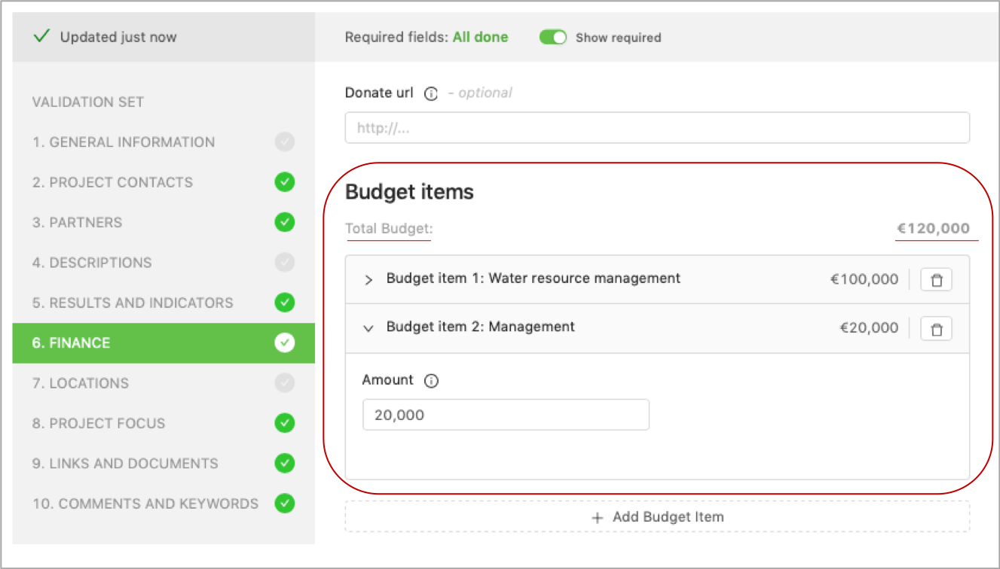
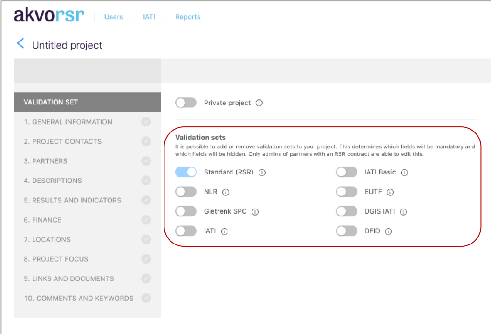

## My Projects
When you connect to RSR as described in our accessing RSR guide, you should have access to the **'My Projects'** page.

On the **'My projects‘** page you will find an overview of all of you projects, either in draft or already published. 
From here you can easily access these projects.

On the **'My projects'** page  and depending on your access level you will to add a program. The description of what a program is and how to add one can be found here

The search bar allows you to filter your assigned projects either by name or by project id

Additional filters are provided to filter the projects listed. The filters allow you to search by sector or country.

With the right level access, you should be able to add a new project from this page. 

The projects page includes privacy settings (6) of the projects. Projects can be flagged as either **‘public’** or **‘private’**. 
Private projects do not appear in any public lists, and can only be viewed in **‘My Projects’** if a user has the permission to edit the project. 

## Creating a new project
**Note:** To show your project portfolio online, your organisation first needs to have a signed contract with Akvo. Administrators (see: Roles & permissions) from contracted partners can add, edit and publish new projects. 

From the My projects page, where you manage your projects and see an overview of all projects that are linked to you and your organisation, you can create a new project by first clicking **‘Create new project’**. 

There are two options when creating a new project: **‘Stand Alone’** and ‘Contributing’. 

Simply put a **‘Stand alone’** project is one that is not part of a program hierarchy; it will not inherit a core results framework for a lead project. 

A **‘Contributing’** project is part of program and will inherit the core results framework.

To create your new project you will use the Project Editor, filling in all required information in each section. 

Before proceeding to fill in details about your project, you first choose the appropriate **‘validation set’**. For example, when you want your projects to meet IATI reporting requirements, you select one of the IATI validation sets. 

The project information that you need to fill in is divided into sections. As you fill in each section, the green checkmarks indicate that all required fields for that section have been correctly entered. Required fields are indicated by a red outline on the particular field along with a text prompt letting you know how many more required fields remain for that section. 

The RSR project editor has an auto-save feature. Every few seconds, as you’re updating new information, the system automatically saves new data. 

To be able to publish a project to RSR site, the complete set of mandatory fields (i.e. all sections) for the selected validation set need to be populated. 

## The standard sections of the RSR project editor
The RSR project editor is divided into 10 standard sections:

### 01 General information
In this section you can fill in the core details of your project, e.g. start/end dates, project status, project photo. 

Here you can also link a ‘Contributing’ project (aka ‘child’ project) to a ‘Lead’ project (aka ‘parent’ project) for aggregation of indicator results in a project hierarchy.

### 02 Contact information
Here you can provide contact information for a primary contact of the project. When entering contact information, please keep in mind that contact details will be publicly visible, so be careful providing personal details.

### 03 Partners
Here you can indicate which partners are involved in your project and what their role is in the project. Collaborating organisations can be easily selected, simply start typing the name of the organisation in the ‘Project partner’ field. If you’re unable to find an organisation after searching, your Akvo programme manager or your organisation’s RSR administrator can add the organisation.

An organisation can have multiple roles within a project: 

- **Funding partner:** an organisation, government or company that provides funds to your project.
- **Accountable partner:** the organisation that is responsible for oversight of the project activity and its outcomes.
- **Extending partner:** the organisation that manages the budget and direction of an activity on behalf of the funding organisations.
- **Implementing partner:** an organisation that physically carries out the activity or intervention.
- **Reporting partner:** the organisation that is responsible for issuing the report. This can be a primary source if the organisation is reporting on its own activity or a secondary source if the organisation is reporting on the activities of another organisation.

### 04 Project descriptions

This section gives you the opportunity to provide detailed project information on your project such as a summary of your project and its goals. 

### 05 Results and indicators
In the results and indicators section you build the results framework for your project, i.e you add your results and indicators that will be used to measure progress, including baseline values, target values, and how often it will be measured. 

There are three main types of results: 

- **Impact:** Long term influence of a project.
- **Outcome:** Usually relates to the project goal or aim. This is the second level of results associated with a project and refers to the medium-term consequences.
- **Outputs:** The direct results associated with a project. Usually what the project has achieved in the short term.

**Examples:**

| Example | Output | → | Outcome | → | Impact|
| ----------- | ----------- | ----------- | ----------- | ----------- | ----------- |
| 1. | The number of community awareness meetings about safe drinking water that were done | | The percentage of children suffering from diarrhea | | Reduced cases of child deaths |
| 2. | Number of sanitation services at public places| | Increased hygiene and sanitation practices| | Sustainable sanitation for all |
| 3. | Provision of fertilizer | | Increased production | | Reduced poverty |

**Indicator types:**Indicators help us to measure progress on these various types of results. They are usually easy to determine for outputs (e.g. 9 training sessions), harder for outcomes (e.g. number of policy documents written) and hardest (or near to impossible) for impacts.

**Indicator reporting periods:** You can indicate for which period you want to measure a specific indicator. Especially for longer projects this is helpful to track progress during the project. For example, you can set a target of 3 training sessions per year for a 3-year project. When you don’t add a period for an indicator, it is assumed that the indicator (and the target and actual values) applies to the full project period. 

**Target Value:** Besides that you can set a target value (e.g. 9 training sessions) and later add the actual value (e.g. 8 training sessions took place). This gives you progress information against set targets for monitoring and evaluation purposes. Sometimes baseline values are used to measure against (e.g. average income level at project start).

**Cumulative option:** You can select if indicators report a running total so that each reported actual includes the previously reported actual and adds any progress made since the last reporting period. When an indicator is set to *'cumulative'*, the value for the latest period will be carried over and used as a base for the next period. For an indicator set as *'non-cumulative'*, the values of all periods are summed up as the end-value. 

A full example:

*Result: 'Organise training sessions for staff'*

*Indicator: 'Organise 10 training sessions'*

*Indicator period: 01-01-2019 - 31-12-2019 (Target: 10 / Actual: 5)*

### 06 Finance

In this section you specify individual budget items, indicating the amount for each item.

### 07 Locations

Here you add the location(s) of your project and also the recipient country. 

By adding information about the geographic area(s) in which your project is being carried out, the locations will be visible on a map at your project page.

### 08 Project focus

Here you can define the sector in which your project is working, e.g. water and sanitation, agriculture, SDG Goal, OECD DAC, poverty reduction, etc.

### 09 Links and documents

In this section you can add documents or links to your project’s page that you would like to share with a broader audience: annual reports, your organisation’s or a project partner’s website, brochures, baseline surveys or any other contextual information that relate to your project and help project page visitors understand more about the project’s activities.

### 10 Comments and keywords

This section is for internal use, i.e. content from this section is not publicly visible. Here you can add comments about a project, for example to share amongst your other colleagues also working with RSR.

## Flagging a project as private
If needed, for example if your project will contain highly sensitive information/data, you can select for your new project to be ‘private’. Private projects do not appear in any public lists, and can only be viewed in **My Projects** if a user has the permission to edit the project. 

**Note:** Akvo promotes transparency and the private project setting is meant for projects that contain sensitive information only.

## Project hierarchy
In RSR a hierarchy is established once a project has inherited a core results framework. By building a project hierarchy you see the relationship of projects that are related, i.e. contributing and sub-contributing projects. 

A hierarchy can consist of as few as two projects and as many as required by a program, i.e a hierarchy consists of two or more projects with a shared core results framework. 

The primary, and preferred, way for adding a new project to a hierarchy is from the [Program Overview feature](program_vs_project.md) 

A project hierarchy is created by first creating a program, including the program’s results framework, then building out your hierarchy by adding new projects to the program as needed. 

However, you can establish a relationship between two projects, contributing projects, via the RSR project editor. From section 1 (General Information) select the appropriate project for the **‘Contributes to’** field:

<!-- On the public project page, the hierarchical relation between your lead and contributing projects will also be visible.  -->

## Using RSR validation sets
It's possible to add new projects to RSR according to your donor's and/or organisation's IATI reporting requirements. 

To do so, we've added validation sets that determine which fields in the project editor are mandatory and which fields should be hidden according to the donor's IATI reporting requirements. 

In the Project editor, for those with administrator rights, you will find the section 'Project settings' from which multiple validation sets that can be chosen: 

Every project in RSR is required to have at least the basic information, such as a title and a project photo. Therefore the standard RSR set is the default validation set and it can't be removed.

In addition, there are two donor specific validation sets: 

- [DGIS (Dutch Ministry of Foreign Affairs)](https://www.government.nl/documents/publications/2015/12/01/open-data-and-development-cooperation) 

- [DFID (UK Department for International Development)](https://www.gov.uk/government/publications/dfid-iati-guideline)

There are also two IATI standard validation sets (i.e. not donor specific): 

IATI (complete) 

- This set includes all standard IATI fields, i.e. both mandatory and optional fields. 

IATI (basic) 

- This set includes only the mandatory IATI fields. 

If your organisation wishes to report according to different IATI requirements, you can get in touch with your RSR account manager. 