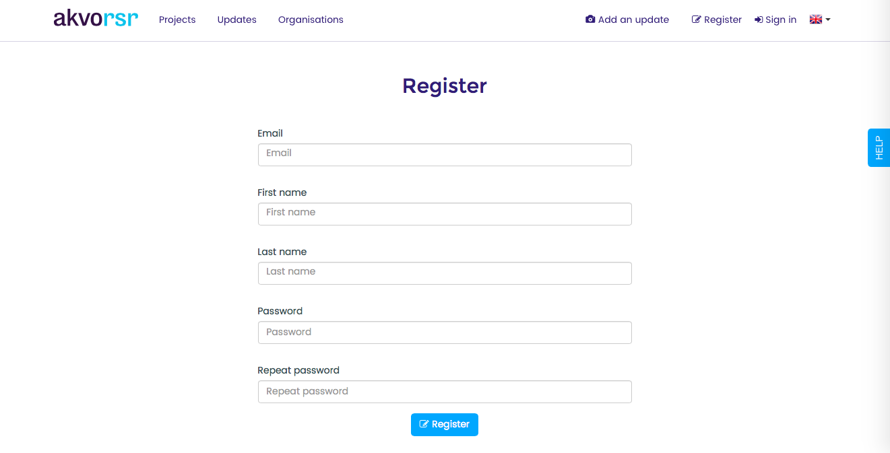
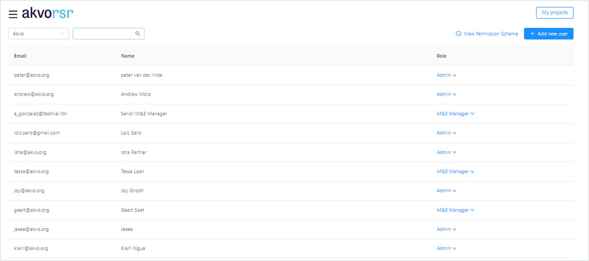
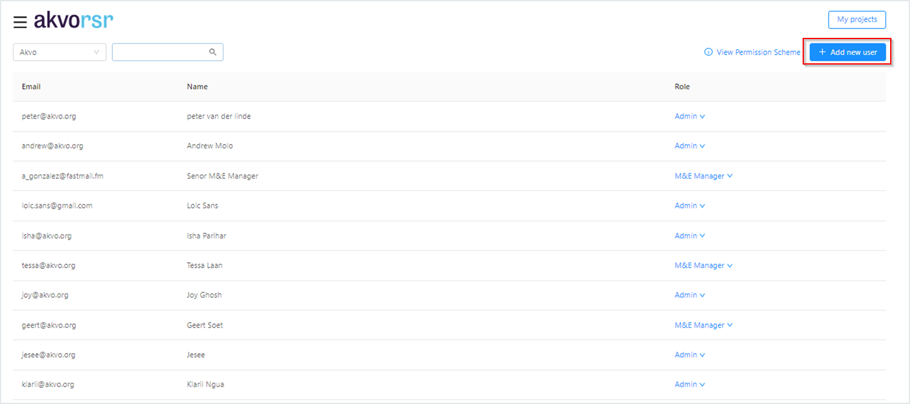
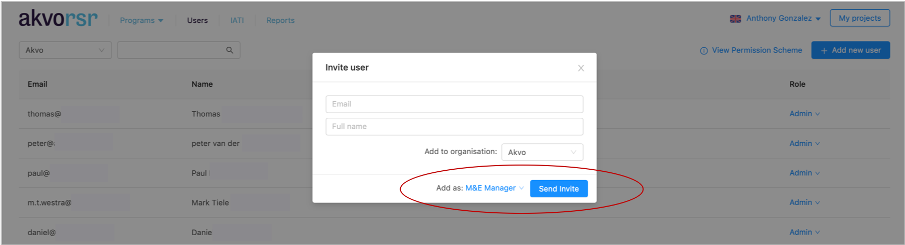
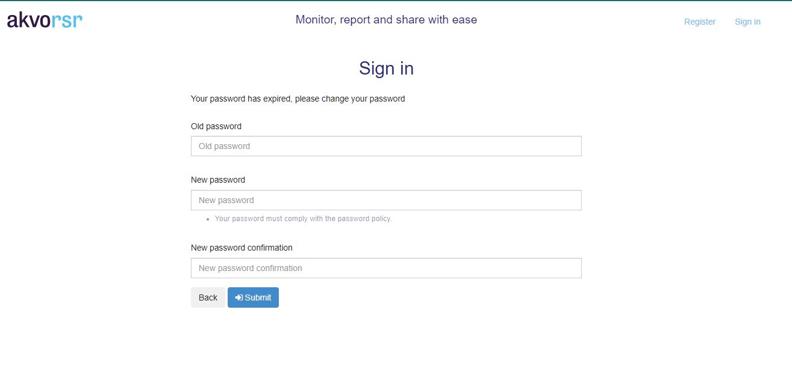

## Request to join an organisation

## Registering as a user on RSR
Go to the [registration page](http://rsr.akvo.org/en/register/) and complete the details as shown below

After filling in the correct information, you will automatically see a confirmation screen. The next step is to confirm your e-mail adres via the e-mail we sent you.

## Activate e-mail
By clicking on the link in the e-mail you will activate your account. If you still have not received an e-mail after 5 minutes please check your spam folder.

Requesting to join an organisation
After the initial registration is completed as shown above, the new user needs to select the organisation it is part of. This will enable the user to add view the projects of the specific organisation (s) and also add RSR Updates to the same The steps are shown below.

1. Go to connect with your employer in the my organisation section
2. Type the name of your organisation (s) and Country. As several organisations are added to the RSR database already, the names will be autocompleted
3. Press request to join

### Final
Your organisation user manager will receive a notification regarding your request to join. After approving your request you will get an update on this via e-mail.
## Managing users
When you enter the Users page you will see an overview of all users. From here you can:

1. Approve users who want to join your organisation
2. Edit the role of a specific user
3. Remove a user from your organisation (this means this user will not be able to add updates to any of your projects in the future).

A person can have multiple roles. Akvo staff, user managers and admins can invite an existing user to add a new role. 
<!-- How you do this, can be read here. -->
## Approving a user request
If you are a user with the Admin or Support role for your organisation, you will see a Users link on the hamburger menu on the top left of the screen.

The Admin will see the new user requests lined up and can approve requests based on different roles.

To approve a request, select the appropriate role and press the green tick. To delete a request, press the red cross mark. Once completed, the specific user receives an email notifying that their request has been accepted.
## User roles and permissions
The following roles are supported within RSR. Adding RSR updates, adding or editing projects and approving users apply to all projects/users linked to your organisation.*The creator of a Project Update can edit or delete their update. 

A person can have multiple roles. Akvo staff, user managers and admins can invite an existing user to add a new role. How you do this, can be read here.

## Invite new RSR users
If you are a User Manager or Admin in RSR, you are able to invite new users to create an Akvo RSR account ánd to give one person multiple roles. If you log in to My RSR you will see a Users link on the hamburger menu on the top left of the screen.

You will now see a window in which you can invite a new user. You add an email address, assign the appropriate role for the user and select the organisation. Then you press the 'Send Invite' button.

An email will be automatically sent to the email addresses you added. Once the invitations have been sent, RSR will check if the user is already active in RSR. If so, the user will be added to the organisation to which the user is invited and the user will receive an email about this. If the user is new or not active yet, he will receive an activation email with an activation link. This link will lead the new user to a page where he will need to fill in additional details (first and last name, and a password) and then activate the account. Once the new user has activated her account, you as the inviter will receive a notification by email.

For more information regarding the registration process we invite to have a look at this article.
## Using the Project Access Restrictions (PAR) feature
The Project Access Restrictions (PAR) feature allows an organisation's administrator to restrict and/or grant users access to projects in the organisation's project portfolio. 

The feature is accessible via User Management page, which is found by navigating to the upper left corner of the page. Click 'User Management'. 

Once on the User Managment page search for the appropriate user: 

When the user has been found click *'Restrict access'*. 

From this page you can see you which projects the selected user has access to (in black) and which projects have access restricted (in red). 

If you want to grant the user access to all projects, simply uncheck the top box: 

To grant or restrict access to a project for a user that has had the PAR already enabled, find the user by searching in User Management and click *'Edit access'*: 

Once on the PAR page, check the box next to the project you wish to grant or restrict access to: 

## Fine Access Control (FAC)
The Fine Access Control (FAC) feature has been designed to allow RSR administrators to limit access to a project to only the implementing project team. By activating this feature an administrator helps ensure only those users who should have access to a project do. This can be helpful for large organisations who have many RSR users and many projects as not all users work on all projects for an organisation, i.e. users have particular project portfolio. 

Similarly, programmes with many partners (e.g. large programmes) can mean that there are many RSR users, from different organisations, that can have access to a project(s) in which they are actually not directly involved. By using FAC an administrator of a large, multi-project, multi-partner programme can ensure that only those users that should have to a project, do.

**Step 1:** User Access for a project is done via section 3 of the Editor

**Step 2:** From section 3, scroll down to go to User Access section and click *‘Restricted Access’*

**Step 3:** Once you activated the feature, add users that should have access to the project by clicking *‘Add user’*

**Step 4:** You can search for registered users for your organisation and also users for the project’s partners.

**Step 5:** Users added to a project retain the role assigned to them by their RSR administrator when they’ve first registered with RSR. However, a user's role can be changed for particular projects. For example, a user can have a *‘default’* role of M&E Manager, but a for a particular project they could be assigned the role of *‘Enumerator’*.

**Step 6:** Review and confirm the users granted access for your project directly from section 3

**Step 7:** You can also see which users have access to a project directly from the ‘My Projects’ page. 

## Password policy
In RSR it is now possible to set a password policy for your organization. A password policy is a set of rules that dictate the requirements for creating and using passwords by users. The purpose of a password policy is to enhance the security of user accounts and sensitive data by encouraging users to create strong and unique passwords. The password password policy on RSR allows us to define:

- **Password Length:** The minimum and maximum number of characters a password must have to be considered valid.

- **Complexity Requirements:** Guidelines about including a mix of different character types, such as uppercase and lowercase letters, numbers, and special symbols.

- **Password Expiration:** The time interval after which a user is required to change their password. This prevents the prolonged use of the same password.

- **Password History:** Ensures that users cannot reuse a certain number of previous passwords, preventing them from cycling through a limited set of passwords.

If you wish to use this feature, please get in touch and we shall enable it for your organization.

### Password expiration
Password expiry is a security measure designed to enhance the protection of your account. Regularly updating your password helps safeguard your information and sensitive data from potential breaches. When enabled, users will be required to change their passwords after a period specified on the password policy, ensuring that unauthorized access is minimized. 

On RSR you can set passwords to expire after a certain number of days between 1 and 999 or you can specify that passwords never expire by setting the number of days to 0. Once the time elapses and a user attempts to login they will be redirected to the password setting page.

To set a new password the user is expected to provide:

- their old password

- a new password

- confirm the new password: enter the new password twice to avoid typographical errors.

Upon successful submission of the new password and update the user's password, the user is redirected to the **'My RSR'** page

**Please note** that the password should meet the criteria as defined in your organizations policy